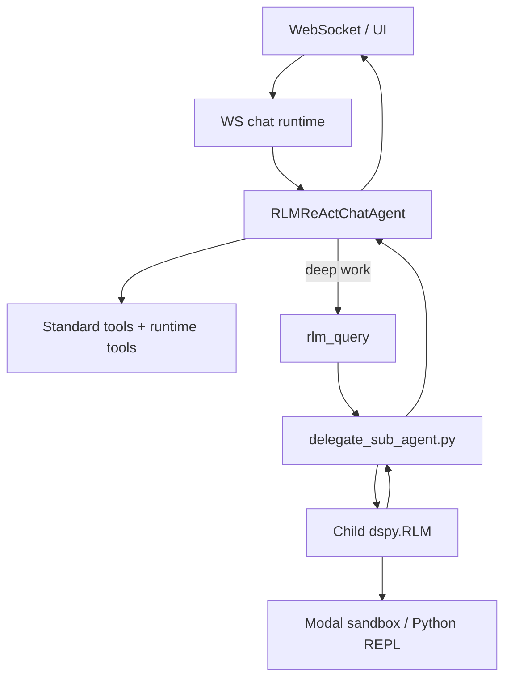
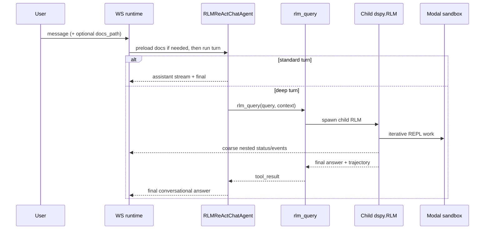

# `DECISION.md` Content: Review of Plan A vs Plan B

## Summary
My recommendation is **Plan B+**.

Why: it removes the duplicated **top-level root-RLM chat path** while keeping the useful part of recursion where it already fits well today: `rlm_query -> child dspy.RLM`. It is the best simplification path because it matches the current worktree, avoids deleting shared runtime infrastructure by mistake, and preserves the existing WebSocket/frontend event contract with the least churn.

Implementation outcome:
- top-level chat is now ReAct-only
- child RLM remains the deep-work escalation path
- `docs_path` is preload-only
- `chat_execution_mode` and the root chat orchestrator path are removed

This decision was evaluated against the branch state that still contained the root chat orchestrator path. At that decision point:
- `chat_orchestrator.py` had already been thinned down and switched to `dspy.streamify(...)`.
- [`delegate_sub_agent.py`](/Volumes/StorageBackup/_RLM/fleet-rlm-dspy/src/fleet_rlm/react/delegate_sub_agent.py) already launched a bounded child `dspy.RLM`, not a second ReAct loop.
- [`rlm_runtime_modules.py`](/Volumes/StorageBackup/_RLM/fleet-rlm-dspy/src/fleet_rlm/react/rlm_runtime_modules.py) was already shared runtime infrastructure, not just chat glue.

## Review of Plan A
### Review
Plan A has the right instinct, but it is built on stale assumptions and deletes the wrong layer.

### Pros
- Strong simplification goal: one top-level chat runtime.
- Better default product mental model: chat is conversational first, deep work is tool-driven.
- Removing `chat_execution_mode` would reduce config/test permutations.

### Cons
- It misstates current reality: `rlm_query` no longer launches a second ReAct loop; the current child path is already a child `dspy.RLM`.
- It over-deletes: removing all of `rlm_runtime_modules.py` would break non-chat runtime modules still used via the runtime factory.
- It understates blast radius: [`runners.py`](/Volumes/StorageBackup/_RLM/fleet-rlm-dspy/src/fleet_rlm/runners.py), [`chat_runtime.py`](/Volumes/StorageBackup/_RLM/fleet-rlm-dspy/src/fleet_rlm/server/routers/ws/chat_runtime.py), [`config.py`](/Volumes/StorageBackup/_RLM/fleet-rlm-dspy/src/fleet_rlm/server/config.py), orchestrator tests, and WS/frontend adapters all need updates.
- Its streaming promise is too strong. DSPy-native streaming supports status messages, streamed fields, and final predictions, but not a guaranteed free chat trace of every REPL phase without extra plumbing.

### Verdict
Reject Plan A as written.

## Review of Plan B
### Review
Plan B is much closer to the real code and keeps the right recursion boundary, but it needs tightening.

### Pros
- It preserves the useful child-recursion path: `rlm_query -> delegate_sub_agent -> child dspy.RLM`.
- It removes duplicated top-level orchestration instead of deleting recursion entirely.
- It keeps shared runtime-module infrastructure intact.
- It fits the product better: ReAct-first chat, deep symbolic work as escalation.

### Cons
- It should explicitly call out that deleting `ChatOrchestrator` is a **product behavior change**, not just an internal refactor.
- It should not promise exact nested REPL phase chat events.
- It should keep `rlm_runtime_modules.py` and remove only the root-chat-specific pieces.

### Verdict
Adopt Plan B, but revise it into **Plan B+**.

## Final Decision: Plan B+
### Decision
- Remove the **top-level root-RLM chat mode** and delete [`chat_orchestrator.py`](/Volumes/StorageBackup/_RLM/fleet-rlm-dspy/src/fleet_rlm/react/chat_orchestrator.py).
- Make `RLMReActChatAgent` the **only** top-level chat runtime.
- Keep child recursion as the only recursive path:
  - `rlm_query`
  - `spawn_delegate_sub_agent_async(...)`
  - `build_recursive_subquery_rlm(...)`
- Keep shared runtime modules, but remove only root-chat-specific pieces:
  - `IntentRouterSignature`
  - `RoutedChatTurnSignature`
  - `build_root_chat_rlm(...)`
- Remove `chat_execution_mode` from server config, websocket bootstrap, fixtures, and tests.
- Treat `docs_path` as **preload/reload only**. It should no longer force root-RLM mode.
- Keep the frontend `StreamEvent` schema stable.

### Why this is my suggestion
This gives the biggest simplification with the smallest conceptual regression:
- one top-level chat brain instead of two
- recursion kept where it is actually useful
- no accidental deletion of shared runtime infrastructure
- fewer runtime/config/test branches
- a realistic, implementation-safe path instead of a risky rewrite

## Workflows, User Flow, and Diagrams
### Target architecture


### User flow


### Streaming model
Do **not** promise exact live `Think -> Write Python -> Execute -> Read Output` chat events.

Do promise:
- DSPy-native nested status streaming where available
- final child `trajectory` surfaced back through existing payloads
- stable event kinds: `status`, `tool_call`, `tool_result`, `trajectory_step`, `final`

Durable low-level execution visibility should stay with the existing websocket execution path and REPL hook bridge, not be reinvented in the chat path.

## Expected Outcome and Expected Tree
### Expected outcome
- one top-level chat runtime instead of ReAct vs root-RLM branching
- root-RLM chat mode removed
- child RLM preserved for deep symbolic work
- simpler bootstrap and config surface
- realistic net reduction around **600-750 LOC**, not the more aggressive estimate in Plan A

### Expected tree
```text
src/fleet_rlm/
├── react/
│   ├── agent.py
│   ├── delegate_sub_agent.py
│   ├── rlm_runtime_modules.py      # keep registry + child builder; remove root-chat builder
│   ├── signatures.py               # keep child/runtime signatures; remove root-chat routing signatures
│   ├── streaming.py
│   ├── streaming_context.py
│   ├── tool_delegation.py
│   ├── tools/
│   │   └── delegate.py
│   ├── trajectory_errors.py
│   ├── validation.py
│   └── chat_orchestrator.py        # deleted
├── runners.py                      # direct agent bootstrap
└── server/
    ├── config.py                   # remove chat_execution_mode
    └── routers/ws/
        ├── chat_runtime.py         # direct agent runtime
        └── streaming.py            # stable event contract
tests/
├── unit/
│   ├── test_chat_orchestrator.py   # deleted
│   ├── test_rlm_state.py           # add nested callback/event coverage
│   ├── test_tools_sandbox.py       # keep child-RLM assertions
│   └── test_react_agent.py
└── ui/ws/
    └── test_chat_stream.py         # remove root-routing expectations
```

## Validation and Assumptions
### Validation
- `uv run pytest -q tests/unit/test_tools_sandbox.py tests/unit/test_rlm_state.py tests/unit/test_react_streaming.py tests/ui/ws/test_chat_stream.py tests/ui/ws/test_session_isolation.py tests/ui/server/test_server_config.py`
- `uv run ruff check src tests`
- `uv run ty check src --exclude "src/fleet_rlm/_scaffold/**"`
- `cd src/frontend && bun run test:unit src/features/rlm-workspace/__tests__/backendChatEventAdapter.test.ts src/features/rlm-workspace/__tests__/ChatMessageList.ai-elements.test.tsx`

### Assumptions
- This decision is based on the **current worktree**.
- Removing top-level root-RLM mode is an acceptable product change.
- `docs_path` becomes preload-only.
- Frontend event schema stays compatible.
- Child nested progress can be **coarse DSPy-native status + final trajectory**, not a bespoke per-phase protocol.
