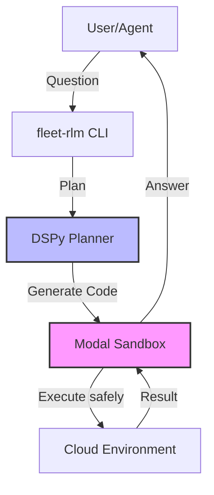

# fleet-rlm

**Secure, cloud-sandboxed Recursive Language Models (RLM) with DSPy and Modal.**

Allow your LLMs to write code that explores massive datasets or long documents in the cloud, without downloading them locally.

[Documentation](https://fleet-rlm.readthedocs.io/) | [Paper](https://arxiv.org/abs/2501.123) | [Contributing](CONTRIBUTING.md)

---



## What is this?

**fleet-rlm** gives your AI agent a secure "computer" in the cloud. Instead of trying to shove 10,000 pages of text into a prompt, the agent writes Python code to:

1.  **Search** and filter data in a remote sandbox (Modal).
2.  **Read** only what matters.
3.  **Synthesize** the answer.

This approach, called **Recursive Language Modeling**, mimics how humans solve research tasks: we don't memorize the library; we look things up.

## Quick Start: Claude Code Integration

### 1. Install & Initialize

Install the package and register the RLM skills with your local Claude Code agent (`~/.claude/`).

```bash
# Install fleet-rlm
uv pip install fleet-rlm

# Install skills, agents, and prompts to ~/.claude
uv run fleet-rlm init
```

### 2. Configure Cloud Runtime

Authenticate with Modal to enable the sandboxed execution environment.

```bash
uv run modal setup
uv run modal secret create LITELLM DSPY_LM_MODEL=openai/gpt-4o DSPY_LLM_API_KEY=sk-...
```

### 3. Use with Claude

Now your Claude Code agent has "superpowers". You can ask it to perform deep research tasks that require running code.

**Example Prompts:**

> "Use the `rlm` skill to analyze the latest papers on linear attention mechanisms."
> "Run the `rlm-batch` agent to parallelize data extraction for these 50 files."

**Available Skills:**

- `rlm` - Core recursive research capability.
- `rlm-batch` - Parallel processing.
- `rlm-memory` - Persistent storage.

## Standalone Usage

You can also run fleet-rlm directly without Claude Code:

**Interactive Chat (TUI)**
Chat with the RLM agent in your terminal using the OpenTUI interface.

```bash
uv run fleet-rlm code-chat --opentui
```

**API Server**
Start a FastAPI server to expose RLM capabilities over HTTP.

```bash
uv run fleet-rlm serve-api
```

## Features

- 🔒 **Sandboxed Execution**: Code runs in isolated Modal containers, not on your laptop.
- 🧠 **DSPy Powered**: Uses advanced prompt engineering pipelines for reliable code generation.
- 💬 **Interactive TUI**: Chat with the agent in your terminal (`fleet-rlm code-chat`).
- ⚡ **Production Ready**: Includes a fastapi server and MCP integration for Claude Desktop.

## Documentation

- **[Tutorials](docs/tutorials/index.md)**: Step-by-step lessons.
- **[Installation Guide](docs/how-to-guides/installation.md)**: Detailed setup instructions.
- **[Skills & Agents](docs/how-to-guides/managing-skills.md)**: Enhance Claude with RLM capabilities.

## Contributing

We welcome contributions! Whether it's reporting a bug, suggesting a feature, or writing code, your input is verified.

1.  Check out our [Contribution Guide](CONTRIBUTING.md).
2.  Fork the repo and create a branch.
3.  Run tests with `uv run pytest`.
4.  Submit a Pull Request.

## Acknowledgments

This project is built upon the innovative research by **Alex L. Zhang** (MIT CSAIL), **Omar Khattab** (Stanford), and **Tim Kraska** (MIT).

> Reference: [Recursive Language Models](https://arxiv.org/abs/2501.123) (Zhang, Kraska, Khattab, 2025)

## License

This project is licensed under the MIT License - see the [LICENSE](LICENSE) file for details.
