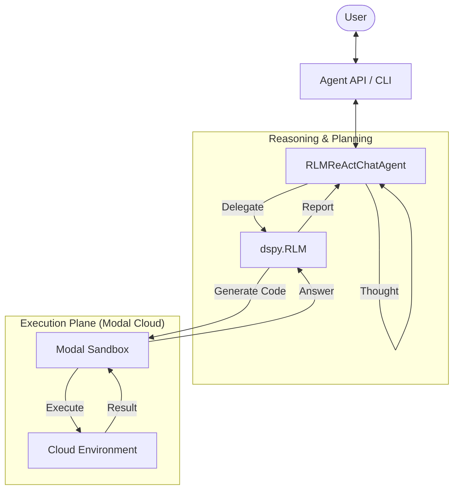

# fleet-rlm

**Secure, cloud-sandboxed Recursive Language Models (RLM) with DSPy and Modal.**

`fleet-rlm` provides a robust, production-ready implementation of **Recursive Language Modeling** aligned with the [DSPy RLM API](https://dspy.ai/api/modules/RLM/). It gives your AI agent a secure "computer" in the cloud to read, search, and analyze massive datasets without local resource constraints.

[Documentation](https://fleet-rlm.readthedocs.io/) | [Paper](https://arxiv.org/abs/2501.123) | [Contributing](CONTRIBUTING.md)

---



## Features

- **Interactive Agent**: `RLMReActChatAgent` combines fast, interactive chat with deep, recursive task execution.
- **DSPy Aligned**: Fully implements `dspy.RLM`, `dspy.Module`, and `dspy.Tool` interfaces for compatibility with DSPy optimizers (`BootstrapFewShot`, `MIPROv2`).
- **Secure Sandbox**: Code runs in isolated **Modal** containers with persistent storage volumes and sensitive data redaction.
- **Recursive Delegation**: Large tasks are broken down into sub-tasks handled by specialized RLM instances.
- **Observability**: Real-time streaming of thoughts, tool execution, and sandbox outputs.

## Quick Start

### 1. Install

```bash
uv pip install fleet-rlm
```

### 2. Configure

Set up your Modal and LLM credentials:

```bash
uv run modal setup
uv run modal secret create LITELLM DSPY_LM_MODEL=openai/gpt-4o DSPY_LLM_API_KEY=sk-...
```

### 3. Run Interactive Chat

Start the terminal user interface (TUI) to chat with the agent:

```bash
uv run fleet-rlm code-chat --opentui
```

**Example Commands:**

> "Load the file `README.md` and summarize it."
> "Analyze the logs in `/var/logs` for error patterns."
> "Refactor `src/server.py` to use FastAPI."

### 4. Run API Server

Start the production-ready FastAPI server:

```bash
uv run fleet-rlm serve-api
```

## Documentation

- **[Concepts](docs/concepts.md)**: Core architecture (Agent, RLM, Sandbox).
- **[User Flows](docs/user_flows.md)**: Interaction diagrams (Chat, Tools, Delegation).
- **[Architecture](docs/architecture.md)**: System components and hierarchy.
- **[Tutorials](docs/tutorials/index.md)**: Step-by-step lessons.

## Architecture

This project implements the [Recursive Language Modeling](https://arxiv.org/abs/2501.123) paradigm:

1.  **Agent**: A generic ReAct agent handles user interaction and tool selection.
2.  **Tools**: Provide capabilities like `load_document`, `list_files`, and `rlm_query`.
3.  **RLM**: When `rlm_query` is called, a dedicated `dspy.RLM` module is instantiated.
4.  **Sandbox**: The RLM generates Python code which is executed in a secure Modal sandbox (the `ModalInterpreter`).

## Contributing

We welcome contributions! Please see our [Contribution Guide](CONTRIBUTING.md) and run tests before submitting:

```bash
uv run pytest
```

## License

MIT License - see [LICENSE](LICENSE).

Developed based on research by **Alex L. Zhang** (MIT CSAIL), **Omar Khattab** (Stanford), and **Tim Kraska** (MIT).
