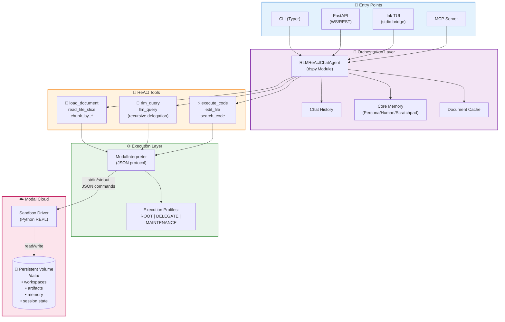

# fleet-rlm

[](https://pypi.org/project/fleet-rlm/)
[](https://pypi.org/project/fleet-rlm/)
[](LICENSE)
[](https://github.com/Qredence/fleet-rlm/actions/workflows/ci.yml)

[](https://pepy.tech/projects/fleet-rlm)

**Secure, cloud-sandboxed Recursive Language Models (RLM) with DSPy and Modal.**

`fleet-rlm` provides a production-ready implementation of **Recursive Language Modeling** aligned with the [DSPy RLM API](https://dspy.ai/api/modules/RLM/). It gives your AI agent a secure "computer" in the cloud to read, search, and analyze massive datasets without local resource constraints.

[Paper](https://arxiv.org/abs/2501.123) | [Contributing](CONTRIBUTING.md) | [Docs](docs/)

---

## Architecture


```mermaid
graph TB
    subgraph entry ["🚪 Entry Points"]
        CLI["CLI (Typer)"]
        API["FastAPI<br/>(WS/REST)"]
        TUI["Ink TUI<br/>(stdio bridge)"]
        MCP["MCP Server"]
    end

    subgraph orchestration ["🧠 Orchestration Layer"]
        Agent["RLMReActChatAgent<br/>(dspy.Module)"]
        History["Chat History"]
        Memory["Core Memory<br/>(Persona/Human/Scratchpad)"]
        DocCache["Document Cache"]
    end

    subgraph tools ["🔧 ReAct Tools"]
        DocTools["📄 load_document<br/>read_file_slice<br/>chunk_by_*"]
        RecursiveTools["🔄 rlm_query<br/>llm_query<br/>(recursive delegation)"]
        ExecTools["⚡ execute_code<br/>edit_file<br/>search_code"]
    end

    subgraph execution ["⚙️ Execution Layer"]
        Interpreter["ModalInterpreter<br/>(JSON protocol)"]
        Profiles["Execution Profiles:<br/>ROOT | DELEGATE | MAINTENANCE"]
    end

    subgraph cloud ["☁️ Modal Cloud"]
        Sandbox["Sandbox Driver<br/>(Python REPL)"]
        Volume[("💾 Persistent Volume<br/>/data/<br/>• workspaces<br/>• artifacts<br/>• memory<br/>• session state")]
    end

    CLI --> Agent
    API --> Agent
    TUI --> Agent
    MCP --> Agent

    Agent --> History
    Agent --> Memory
    Agent --> DocCache

    Agent --> DocTools
    Agent --> RecursiveTools
    Agent --> ExecTools

    DocTools --> Interpreter
    RecursiveTools --> Interpreter
    ExecTools --> Interpreter

    Interpreter --> Profiles
    Interpreter -->|"stdin/stdout<br/>JSON commands"| Sandbox
    Sandbox -->|"read/write"| Volume

    style entry fill:#e3f2fd,stroke:#1976d2,stroke-width:2px
    style orchestration fill:#f3e5f5,stroke:#7b1fa2,stroke-width:2px
    style tools fill:#fff3e0,stroke:#f57c00,stroke-width:2px
    style execution fill:#e8f5e9,stroke:#388e3c,stroke-width:2px
    style cloud fill:#fce4ec,stroke:#c2185b,stroke-width:2px
```


**Layers:**

🚪 **Entry Points** → 🧠 **Orchestration** → 🔧 **Tools** → ⚙️ **Execution** → ☁️ **Modal Cloud**


## Features

- **Interactive Agent**: `RLMReActChatAgent` (a `dspy.Module`) combines fast, interactive chat with deep, recursive task execution via `rlm_query`.
- **DSPy Aligned**: Implements `dspy.RLM`, `dspy.Module`, and `dspy.Tool` interfaces — compatible with DSPy optimizers (`BootstrapFewShot`, `MIPROv2`).
- **Secure Sandbox**: Code runs in isolated **Modal** containers with persistent storage volumes, execution profiles, and sensitive data redaction.
- **Recursive Delegation**: Large tasks are broken down via `rlm_query` sub-agents with depth enforcement to prevent infinite recursion.
- **PDF Ingestion**: Native document loading via MarkItDown with pypdf fallback; OCR guidance for scanned PDFs.
- **Session State**: Per-workspace, per-user session persistence with manifests stored on Modal volumes.
- **MCP Server**: Expose fleet-rlm capabilities as an MCP tool server via `serve-mcp`.
- **Observability**: Real-time streaming of thoughts, tool execution, trajectory normalization, and structured logging.

## Quick Start

### 1. Install

```bash
uv pip install fleet-rlm
```

Optional extras for server and MCP support:

```bash
uv pip install fleet-rlm[server]   # FastAPI server + WebSocket
uv pip install fleet-rlm[mcp]      # MCP server
uv pip install fleet-rlm[full]     # All extras
```

### 2. Configure

Set up your Modal and LLM credentials:

```bash
modal setup
modal volume create rlm-volume-dspy
modal secret create LITELLM DSPY_LM_MODEL=openai/gemini-3-pro-preview DSPY_LLM_API_KEY=sk-...
```

### 3. Run

**Interactive Chat (OpenTUI):**

```bash
# Requires OpenTUI / Bun
fleet-rlm code-chat --opentui
```

**Standalone Interactive Chat (Ink):**

```bash
# Prefers Ink UI; falls back to Python UI
fleet

# Force a specific runtime
fleet --ui ink
fleet --ui python
```

**One-shot Tasks:**

```bash
# Basic question
fleet-rlm run-basic --question "What are the first 12 Fibonacci numbers?"

# Document analysis
fleet-rlm run-architecture --docs-path docs/architecture.md --query "Extract all components"
```

**Servers:**

```bash
# API server (FastAPI + WebSocket)
uv run fleet-rlm serve-api --port 8000

# MCP server
fleet-rlm serve-mcp --transport stdio
```

`fleet` and `fleet-rlm code-chat` serve different interactive paths:

- `fleet` = standalone bridge chat launcher (Ink preferred, Python fallback)
- `fleet-rlm code-chat` = OpenTUI runtime (OpenTUI/Bun required)

## Development Setup

```bash
# Clone and install
git clone https://github.com/qredence/fleet-rlm.git
cd fleet-rlm
uv sync --extra dev

# With server/MCP support
uv sync --extra dev --extra server --extra mcp

# Build Ink frontend bundle for `fleet --ui ink`
cd tui-ink
npm install
npm run build
npm run test
cd ..

# Copy environment template
cp .env.example .env

# Quality gate
uv run ruff check src tests && uv run ty check src && uv run pytest -q
```

## Documentation

- [Concepts](docs/explanation/rlm-concepts.md) — Core architecture (Agent, RLM, Sandbox)
- [User Flows](docs/user_flows.md) — Interaction diagrams (Chat, Tools, Delegation)
- [Architecture](docs/explanation/architecture.md) — System components and hierarchy
- [Tutorials](docs/tutorials/index.md) — Step-by-step lessons
- [How-To Guides](docs/how-to-guides/index.md) — Installation, deployment, troubleshooting
- [CLI Reference](docs/reference/cli.md) — Full CLI command reference
- [HTTP API Reference](docs/reference/http-api.md) — Server endpoints and WebSocket protocol
- [Source Layout](docs/reference/source-layout.md) — Package structure guide

## Contributing

We welcome contributions! Please see our [Contribution Guide](CONTRIBUTING.md) and run the quality gate before submitting:

```bash
uv run ruff check src tests && uv run ty check src && uv run pytest -q
```

## License

MIT License — see [LICENSE](LICENSE).

Based on [Recursive Language Modeling](https://arxiv.org/abs/2501.123) research by **Alex L. Zhang** (MIT CSAIL), **Omar Khattab** (Stanford), and **Tim Kraska** (MIT).
