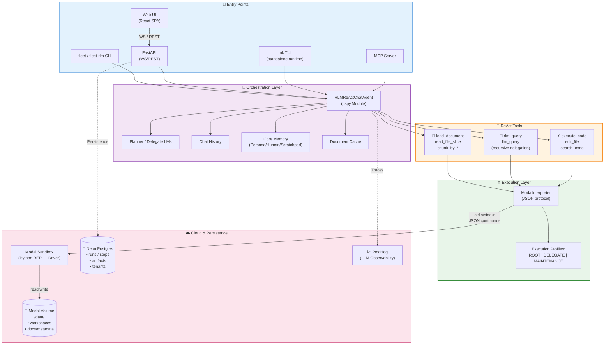

# fleet-rlm

[](https://pypi.org/project/fleet-rlm/)

[](LICENSE)
[](https://github.com/Qredence/fleet-rlm/actions/workflows/ci.yml)
[](https://pepy.tech/projects/fleet-rlm)

**Secure, cloud-sandboxed Recursive Language Models (RLM) with DSPy, Modal, and an experimental Daytona pilot.**

`fleet-rlm` gives AI agents a secure cloud sandbox for long-context code and document work, with a Web UI-first experience, recursive delegation, and DSPy-aligned tooling. The current product runtime is still Modal/ReAct-based; the repo now also includes an experimental Daytona-backed strict-RLM pilot for narrower recursive rollout experiments.

[Paper](https://arxiv.org/abs/2501.123) | [Docs](docs/) | [Contributing](CONTRIBUTING.md)

---

## Quick Start

Install and launch the Web UI in under a minute:

```bash
# Option 1: install as a runnable tool
uv tool install fleet-rlm
fleet web
```

Or in your active environment:

```bash
# Option 2: regular environment install
uv pip install fleet-rlm
fleet web
```

Open `http://localhost:8000` in your browser.

`fleet web` is the primary interactive interface. The published package already includes the built frontend assets, so end users do not need `bun` or a separate frontend toolchain.

## What You Get

- Browser-first RLM chat (`fleet web`)
- A focused Web UI with `RLM Workspace`, `Volumes`, and `Settings`
- Secure Modal-backed long-context execution for code/doc workflows
- Experimental Daytona-backed strict-RLM pilot for repo-centric recursive rollouts
- WS-first runtime streaming for chat and execution events
- `GET /api/v1/auth/me` as the canonical frontend identity/bootstrap surface
- Multitenant Entra auth with Neon-backed tenant admission when `AUTH_MODE=entra`
- Runtime configuration and diagnostics from the Web UI settings
- MLflow-backed trace correlation, feedback capture, offline evaluation, and DSPy optimization workflows
- Optional MCP server surface (`fleet-rlm serve-mcp`)

## Common Commands

```bash
# Standalone terminal chat
fleet-rlm chat --trace-mode compact

# Explicit API server
fleet-rlm serve-api --port 8000

# MCP server
fleet-rlm serve-mcp --transport stdio

# Native Daytona validation before the pilot rollout
fleet-rlm daytona-smoke --repo https://github.com/qredence/fleet-rlm.git --ref main

# Experimental Daytona-backed strict-RLM pilot
fleet-rlm daytona-rlm --repo https://github.com/qredence/fleet-rlm.git --task "Summarize the tracing architecture" --max-depth 2 --batch-concurrency 4

# Scaffold assets for Claude Code
fleet-rlm init --list
```

## Runtime Notes

- The current Web UI shell supports `RLM Workspace`, `Volumes`, and `Settings`.
- Legacy `taxonomy`, `skills`, `memory`, and `analytics` browser routes redirect to the supported surfaces.
- Product chat transport is WS-first (`/api/v1/ws/chat`).
- The main product runtime remains Modal-backed and ReAct-oriented in this release.
- The new `fleet-rlm daytona-rlm` command is an isolated experimental runner. It does not power the Web UI, MCP server, or existing terminal chat.
- Daytona setup for the pilot uses `DAYTONA_API_KEY`, `DAYTONA_API_URL`, and optional `DAYTONA_TARGET`. `DAYTONA_API_BASE_URL` is treated as a misconfiguration.
- `fleet-rlm daytona-smoke` now reports phase-aware diagnostics for `config`, `sandbox_create`, `repo_clone`, `driver_start`, `exec_step_1`, `exec_step_2`, and `cleanup`.
- The Daytona pilot is analysis-first in this release: it supports repo clone inputs, inspection helpers, host-brokered recursive subcalls, and environment-backed finalization, but not repo-editing workflows.
- Frontend identity/bootstrap is `GET /api/v1/auth/me`.
- Runtime model updates from Settings are hot-applied in-process (`/api/v1/runtime/settings`) and reflected on `/api/v1/runtime/status`.
- Secret inputs in Runtime Settings are write-only.
- In `AUTH_MODE=entra`, bearer tokens are validated against Entra JWKS and admitted only for active Neon tenants.

## Running From Source (Contributors)

```bash
# from repo root
uv sync --extra dev --extra server
uv run fleet web
uv run fastapi dev
```

For release/packaging workflows, `uv build` now runs frontend build sync automatically (requires `bun` in repo checkouts that include `src/frontend`).

Use full contributor setup and quality gates in [`AGENTS.md`](AGENTS.md) and [`CONTRIBUTING.md`](CONTRIBUTING.md).

## MLflow Workflows

`fleet-rlm` now supports MLflow as the GenAI tracing and evaluation plane on top of the existing PostHog runtime telemetry.

```bash
# from repo root
make mlflow-server

# in another shell
export MLFLOW_ENABLED=true
export MLFLOW_TRACKING_URI=http://127.0.0.1:5000
export MLFLOW_EXPERIMENT=fleet-rlm
uv run fleet web
```

- Live chat turns and offline runner entry points emit MLflow-correlated traces with `mlflow_trace_id` / `mlflow_client_request_id` on final payloads when MLflow is enabled.
- Human feedback can be recorded through `POST /api/v1/traces/feedback`.
- Contributors can export annotated traces, run MLflow GenAI evaluation, and optimize DSPy programs with the scripts documented in [`docs/how-to-guides/mlflow-workflows.md`](docs/how-to-guides/mlflow-workflows.md).

## Experimental Daytona Pilot

The experimental `fleet-rlm daytona-rlm` command is a narrow, repo-centric strict-RLM pilot inspired by Daytona's recursive-language-model guide and the RLM paper.

- Use this order for the Daytona path:
  1. Set `DAYTONA_API_KEY`, `DAYTONA_API_URL`, and optional `DAYTONA_TARGET`.
  2. Run `fleet-rlm daytona-smoke --repo <url> [--ref <branch-or-sha>]`.
  3. Only then run `fleet-rlm daytona-rlm --repo <url> --task <text> ...`.
- The pilot resolves Daytona configuration explicitly from `DAYTONA_API_KEY`, `DAYTONA_API_URL`, and optional `DAYTONA_TARGET`.
- It clones a repository into a fresh Daytona sandbox per root or child node.
- It now uses a persistent sandbox-side Python driver per sandbox instead of host-side `exec(...)`.
- Recursive `rlm_query(...)` and `rlm_query_batched(...)` calls are brokered through the host, which spawns fresh Daytona child sandboxes.
- It stays analysis-first: the model-facing helper surface is `run`, `read_file`, `list_files`, `find_files`, `rlm_query`, `rlm_query_batched`, `FINAL`, and `FINAL_VAR`.
- The smoke command returns structured diagnostics including `termination_phase`, `error_category`, phase timings, and an `error_message` when a live Daytona step fails.
- It persists a local JSON artifact under `results/daytona-rlm/` with the agent tree, iteration code, bounded prompt/response previews, execution observations, child links, finalization mode, and rollout summary.
- It intentionally does not replace the current Modal/WebSocket product runtime yet.

## Architecture Overview

Read this after the quick start if you want the full system picture (entry points, ReAct orchestration, tools, Modal execution, persistent storage).


```mermaid
graph TB
    subgraph entry ["🚪 Entry Points"]
        CLI["fleet / fleet-rlm CLI"]
        WebUI["Web UI<br/>(React SPA)"]
        API["FastAPI<br/>(WS/REST)"]
        TUI["Ink TUI<br/>(standalone runtime)"]
        MCP["MCP Server"]
    end

    subgraph orchestration ["🧠 Orchestration Layer"]
        Agent["RLMReActChatAgent<br/>(dspy.Module)"]
        LMs["Planner / Delegate LMs"]
        History["Chat History"]
        Memory["Core Memory<br/>(Persona/Human/Scratchpad)"]
        DocCache["Document Cache"]
    end

    subgraph tools ["🔧 ReAct Tools"]
        DocTools["📄 load_document<br/>read_file_slice<br/>chunk_by_*"]
        RecursiveTools["🔄 rlm_query<br/>llm_query<br/>(recursive delegation)"]
        ExecTools["⚡ execute_code<br/>edit_file<br/>search_code"]
    end

    subgraph execution ["⚙️ Execution Layer"]
        Interpreter["ModalInterpreter<br/>(JSON protocol)"]
        Profiles["Execution Profiles:<br/>ROOT | DELEGATE | MAINTENANCE"]
    end

    subgraph cloud ["☁️ Cloud & Persistence"]
        Sandbox["Modal Sandbox<br/>(Python REPL + Driver)"]
        Volume[("💾 Modal Volume<br/>/data/<br/>• workspaces<br/>• docs/metadata")]
        Neon[("🐘 Neon Postgres<br/>• runs / steps<br/>• artifacts<br/>• tenants")]
        PostHog["📈 PostHog<br/>(LLM Observability)"]
    end

    WebUI -->|"WS / REST"| API
    CLI --> Agent
    API --> Agent
    TUI --> Agent
    MCP --> Agent

    Agent --> LMs
    Agent --> History
    Agent --> Memory
    Agent --> DocCache

    Agent --> DocTools
    Agent --> RecursiveTools
    Agent --> ExecTools

    API -.->|"Persistence"| Neon
    Agent -.->|"Traces"| PostHog

    DocTools --> Interpreter
    RecursiveTools --> Interpreter
    ExecTools --> Interpreter

    Interpreter --> Profiles
    Interpreter -->|"stdin/stdout<br/>JSON commands"| Sandbox
    Sandbox -->|"read/write"| Volume

    style entry fill:#e3f2fd,stroke:#1976d2,stroke-width:2px
    style orchestration fill:#f3e5f5,stroke:#7b1fa2,stroke-width:2px
    style tools fill:#fff3e0,stroke:#f57c00,stroke-width:2px
    style execution fill:#e8f5e9,stroke:#388e3c,stroke-width:2px
    style cloud fill:#fce4ec,stroke:#c2185b,stroke-width:2px
```

## Docs and Guides

- [Documentation index](docs/index.md)
- [Explanation index](docs/explanation/index.md)
- [Quick install + setup](docs/how-to-guides/installation.md)
- [Configure Modal](docs/how-to-guides/configuring-modal.md)
- [Runtime settings (LM/Modal diagnostics)](docs/how-to-guides/runtime-settings.md)
- [MLflow tracing, feedback, eval, and optimization](docs/how-to-guides/mlflow-workflows.md)
- [Deploying the server](docs/how-to-guides/deploying-server.md)
- [Using the MCP server](docs/how-to-guides/using-mcp-server.md)
- [Frontend ↔ Backend integration](docs/reference/frontend-backend-integration.md)
- [CLI reference](docs/reference/cli.md)
- [HTTP API reference](docs/reference/http-api.md)
- [Auth modes](docs/reference/auth.md)
- [Database architecture](docs/reference/database.md)
- [Source layout](docs/reference/source-layout.md)

## Advanced Features (Docs-First)

`fleet-rlm` also supports runtime diagnostics endpoints, WebSocket execution streams (`/api/v1/ws/execution`), multi-tenant Neon-backed persistence, and opt-in PostHog LLM analytics. Those workflows are documented in the guides/reference docs rather than front-loaded here.

## Contributing

Contributions are welcome. Start with [CONTRIBUTING.md](CONTRIBUTING.md), then use [`AGENTS.md`](AGENTS.md) for repo-specific commands and quality gates.

## License

MIT License — see [LICENSE](LICENSE).

Based on [Recursive Language Modeling](https://arxiv.org/abs/2501.123) research by **Alex L. Zhang** (MIT CSAIL), **Omar Khattab** (Stanford), and **Tim Kraska** (MIT).
