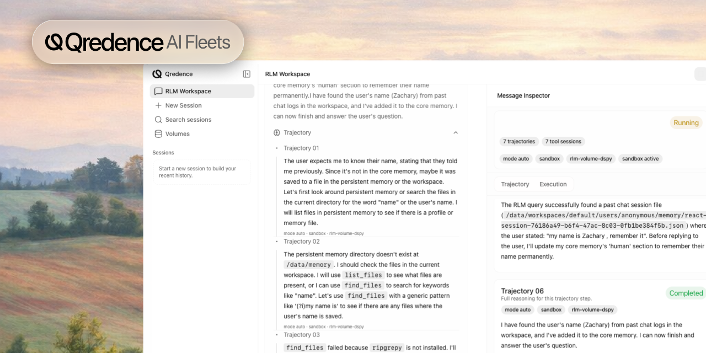

# fleet-rlm

[](https://pypi.org/project/fleet-rlm/)
[](LICENSE)
[](https://github.com/Qredence/fleet-rlm/actions/workflows/ci.yml)
[](https://pepy.tech/projects/fleet-rlm)



`fleet-rlm` is a Web UI-first recursive language model runtime for long-context code and document work. It ships a Modal-backed default runtime, an integrated FastAPI + WebSocket surface, packaged frontend assets, and an experimental Daytona workbench path that plugs into the same workspace instead of living as a separate product.

[Docs](docs/) | [Contributing](CONTRIBUTING.md) | [Changelog](CHANGELOG.md)

## Why This Repo Exists

- Use a single workspace for long-context reasoning, chat turns, run inspection, and runtime diagnostics.
- Keep the default product path Modal-backed and chat-oriented.
- Expose an experimental Daytona pilot without forking the frontend or transport contract.
- Ship both a user-facing Web UI and integration surfaces for CLI, HTTP, WebSocket, and MCP workflows.

The supported app surfaces are `Workbench`, `Volumes`, and `Settings`. Legacy `taxonomy`, `skills`, `memory`, and `analytics` routes are no longer first-class product surfaces and should fall through to `/404`.

## Quick Start

Add `fleet-rlm` to a `uv`-managed project and launch the Web UI:

```bash
# Create a project if you do not already have one
uv init

# Add fleet-rlm to the environment
uv add fleet-rlm

# Start the Web UI + API server
uv run fleet web
```

Open `http://127.0.0.1:8000`.

If you already have a `uv` project, skip `uv init` and just run `uv add fleet-rlm`.

Published installs already include built frontend assets, so end users do not need `pnpm`, `vp`, or a separate frontend build step.

## Primary Workflows

### Use the Web UI

```bash
uv run fleet web
```

This starts the main product surface with:

- `Workbench` for chat and runtime execution
- `Volumes` for runtime-backed file browsing
- `Settings` for runtime configuration and diagnostics

### Use terminal chat

```bash
uv run fleet-rlm chat --trace-mode compact
```

### Run the API directly

```bash
uv run fleet-rlm serve-api --host 127.0.0.1 --port 8000
```

### Enable MCP support

If you want the optional MCP server surface, install the extra first:

```bash
uv add "fleet-rlm[mcp]"
uv run fleet-rlm serve-mcp --transport stdio
```

## Runtime Modes

`fleet-rlm` currently has two top-level runtime modes:

- `modal_chat`: the default product path
- `daytona_pilot`: the experimental workbench path

In the shared runtime contract:

- Modal requests can include `execution_mode`.
- Daytona requests can include `repo_url`, `repo_ref`, `context_paths`, and `batch_concurrency`.
- Daytona still uses the same websocket workspace and run-workbench flow, but it intentionally remains experimental.

## CLI Surfaces

This package exposes two command entrypoints:

- `fleet`: lightweight launcher for terminal chat and `fleet web`
- `fleet-rlm`: fuller Typer CLI for API, MCP, scaffold, and Daytona flows

Common commands:

```bash
# Web UI
uv run fleet web

# Terminal chat
uv run fleet
uv run fleet-rlm chat --trace-mode verbose

# FastAPI server
uv run fleet-rlm serve-api --port 8000

# Optional MCP server
uv run fleet-rlm serve-mcp --transport stdio

# Scaffold bundled Claude Code assets
uv run fleet-rlm init --list

# Experimental Daytona validation
uv run fleet-rlm daytona-smoke --repo https://github.com/qredence/fleet-rlm.git --ref main
```

## HTTP and WebSocket Contract

The current frontend/backend contract centers on:

- `/health`
- `/ready`
- `GET /api/v1/auth/me`
- `GET /api/v1/sessions/state`
- `/api/v1/runtime/*`
- `POST /api/v1/traces/feedback`
- `/api/v1/ws/chat`
- `/api/v1/ws/execution`

When `AUTH_MODE=entra`, HTTP and WebSocket access use real Entra bearer-token validation plus Neon-backed tenant admission. Runtime settings writes are intentionally limited to `APP_ENV=local`.

The canonical schema lives in [`openapi.yaml`](openapi.yaml).

## Source Development

From the repo root:

```bash
uv sync --all-extras --dev
uv run fleet web
```

Frontend contributors should use `pnpm` inside `src/frontend`:

```bash
cd src/frontend
pnpm install --frozen-lockfile
pnpm run dev
pnpm run api:check
pnpm run type-check
pnpm run lint:robustness
pnpm run test:unit
pnpm run build
```

This repo explicitly uses `pnpm` for frontend work even though the packaged frontend is built with Vite+ under the hood.

## Maintenance

Common maintenance commands from the repo root:

```bash
# Clear caches and local generated artifacts
make clean

# Regenerate the canonical FastAPI schema after backend contract or doc-metadata changes
uv run python scripts/openapi_tools.py generate

# Validate the schema quality improvements in-flight
uv run python scripts/openapi_tools.py validate

# Sync frontend OpenAPI artifacts after the root spec changes
cd src/frontend
pnpm run api:sync
```

## Validation

Repo-level validation:

```bash
make test-fast
make quality-gate
make release-artifacts
make release-check

# Focused backend/runtime regression lane
uv run pytest -q tests/ui/server/test_api_contract_routes.py tests/ui/server/test_router_runtime.py tests/ui/ws/test_chat_stream.py tests/unit/test_daytona_rlm_config.py tests/unit/test_daytona_runtime.py tests/unit/test_daytona_interpreter.py tests/unit/test_daytona_workbench_chat_agent.py -m "not live_llm and not live_daytona and not benchmark"
```

Focused docs validation:

```bash
uv run python scripts/check_docs_quality.py
uv run python scripts/validate_release.py hygiene
uv run python scripts/validate_release.py metadata
```

## Experimental Daytona Notes

Use this order for Daytona work:

1. Set `DAYTONA_API_KEY`, `DAYTONA_API_URL`, and optional `DAYTONA_TARGET`.
2. Run `uv run fleet-rlm daytona-smoke --repo <url> [--ref <branch-or-sha>]`.

In local/default-local source checkouts, Daytona config resolution prefers repo `.env` / `.env.local` values over inherited shell exports so branch-local validation uses the checkout's intended credentials.

This repo treats `DAYTONA_API_BASE_URL` as a misconfiguration. Use `DAYTONA_API_URL` instead.

## Documentation Map

- [Documentation index](docs/index.md)
- [Installation guide](docs/how-to-guides/installation.md)
- [Developer setup](docs/how-to-guides/developer-setup.md)
- [CLI reference](docs/reference/cli.md)
- [HTTP API reference](docs/reference/http-api.md)
- [Auth reference](docs/reference/auth.md)
- [Frontend/backend integration](docs/reference/frontend-backend-integration.md)
- [Runtime settings](docs/how-to-guides/runtime-settings.md)
- [Using the MCP server](docs/how-to-guides/using-mcp-server.md)
- [MLflow workflows](docs/how-to-guides/mlflow-workflows.md)
