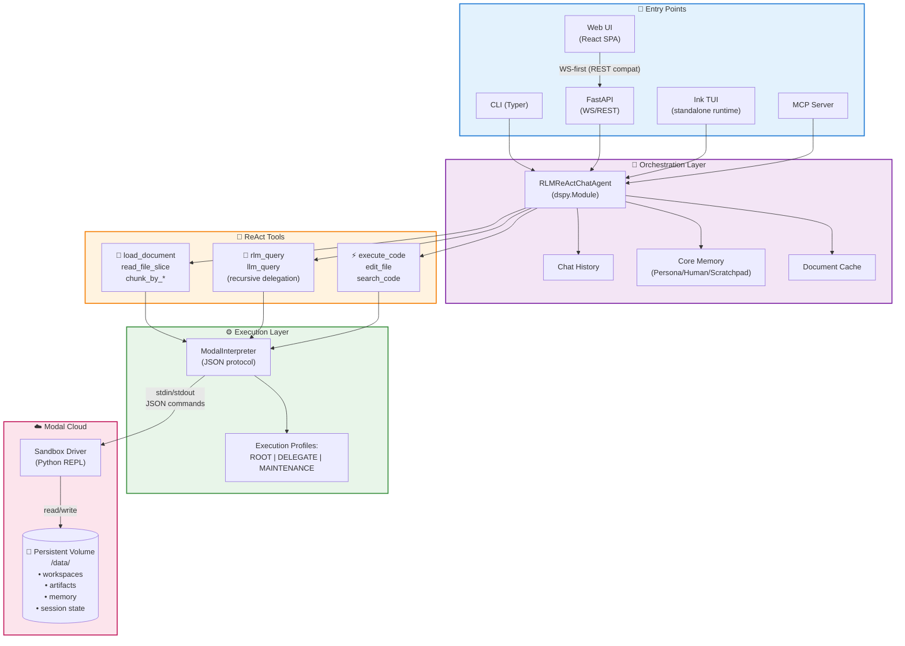

# fleet-rlm

[](https://pypi.org/project/fleet-rlm/)
[](https://pypi.org/project/fleet-rlm/)
[](LICENSE)
[](https://github.com/Qredence/fleet-rlm/actions/workflows/ci.yml)
[](https://pepy.tech/projects/fleet-rlm)

**Secure, cloud-sandboxed Recursive Language Models (RLM) with DSPy and Modal.**

`fleet-rlm` gives AI agents a secure cloud sandbox for long-context code and document work, with a Web UI-first experience, recursive delegation, and DSPy-aligned tooling.

[Paper](https://arxiv.org/abs/2501.123) | [Docs](docs/) | [Contributing](CONTRIBUTING.md)

---

## Quick Start (Web UI First)

Fastest path: install and launch the built-in Web UI.

```bash
# Install as a runnable CLI tool
uv tool install fleet-rlm

# Launch the Web UI server
fleet web
```

Open `http://localhost:8000` in your browser.

- Prefer a regular environment install instead of `uv tool`?
```bash
uv pip install fleet-rlm
fleet web
```

- `fleet web` is the primary interactive interface.
- Product chat transport is WS-first (`/api/v1/ws/chat`); `POST /api/v1/chat` is compatibility-only and deprecated (removal target `v0.4.93`).
- Plain `fleet-rlm` installs are intended to support `fleet web`.
- Runtime settings (LM / Modal) can be configured from the Web UI Settings surface in local development.
- Runtime model updates from Settings are hot-applied in-process (`/api/v1/runtime/settings`) and verified via active model fields on `/api/v1/runtime/status`.
- Secret settings inputs in the web Runtime UI are write-only; enter a new value to rotate, or use explicit clear-on-save.
- Full setup for Modal secrets, Neon DB, auth modes, and deployment is linked below.

## Why `fleet-rlm`

- Chat with an RLM-powered agent in the browser (`fleet web`)
- Run recursive long-context tasks with a secure Modal sandbox
- Analyze documents (including PDF ingestion with MarkItDown/pypdf fallback)
- Stream execution events and trajectories for observability/debugging
- Expose capabilities as an MCP server (`fleet-rlm serve-mcp`)

## Other Ways to Run It

Common commands:

```bash
# Standalone terminal chat
fleet-rlm chat --trace-mode compact

# Explicit API server
fleet-rlm serve-api --port 8000

# FastAPI CLI (uses [tool.fastapi] entrypoint)
fastapi dev
fastapi run

# MCP server
fleet-rlm serve-mcp --transport stdio

# Scaffold assets for Claude Code
fleet-rlm init --list
```

### Terminal chat surfaces

- `fleet` starts the standalone interactive chat launcher (Ink runtime path).
- `fleet-rlm chat` starts the in-process terminal chat.
- OpenTUI workflows and setup are documented in the guides (see links below) because they require additional local tooling.

## Running From Source (Contributors)

```bash
# from repo root
uv sync --extra dev --extra server
uv run fleet web
uv run fastapi dev
```

Frontend build workflow (when validating packaged Web UI assets):

```bash
# from repo root
cd src/frontend
bun install --frozen-lockfile
bun run build
cd ../..
```

Use the full contributor setup (frontend builds, env/bootstrap, quality gates) in [`AGENTS.md`](AGENTS.md) and [`CONTRIBUTING.md`](CONTRIBUTING.md).

## Architecture Overview

Read this after the quick start if you want the full system picture (entry points, ReAct orchestration, tools, Modal execution, persistent storage).


```mermaid
graph TB
    subgraph entry ["🚪 Entry Points"]
        CLI["CLI (Typer)"]
        WebUI["Web UI<br/>(React SPA)"]
        API["FastAPI<br/>(WS/REST)"]
        TUI["Ink TUI<br/>(standalone runtime)"]
        MCP["MCP Server"]
    end

    subgraph orchestration ["🧠 Orchestration Layer"]
        Agent["RLMReActChatAgent<br/>(dspy.Module)"]
        History["Chat History"]
        Memory["Core Memory<br/>(Persona/Human/Scratchpad)"]
        DocCache["Document Cache"]
    end

    subgraph tools ["🔧 ReAct Tools"]
        DocTools["📄 load_document<br/>read_file_slice<br/>chunk_by_*"]
        RecursiveTools["🔄 rlm_query<br/>llm_query<br/>(recursive delegation)"]
        ExecTools["⚡ execute_code<br/>edit_file<br/>search_code"]
    end

    subgraph execution ["⚙️ Execution Layer"]
        Interpreter["ModalInterpreter<br/>(JSON protocol)"]
        Profiles["Execution Profiles:<br/>ROOT | DELEGATE | MAINTENANCE"]
    end

    subgraph cloud ["☁️ Modal Cloud"]
        Sandbox["Sandbox Driver<br/>(Python REPL)"]
        Volume[("💾 Persistent Volume<br/>/data/<br/>• workspaces<br/>• artifacts<br/>• memory<br/>• session state")]
    end

    WebUI -->|"WS-first (REST compat)"| API
    CLI --> Agent
    API --> Agent
    TUI --> Agent
    MCP --> Agent

    Agent --> History
    Agent --> Memory
    Agent --> DocCache

    Agent --> DocTools
    Agent --> RecursiveTools
    Agent --> ExecTools

    DocTools --> Interpreter
    RecursiveTools --> Interpreter
    ExecTools --> Interpreter

    Interpreter --> Profiles
    Interpreter -->|"stdin/stdout<br/>JSON commands"| Sandbox
    Sandbox -->|"read/write"| Volume

    style entry fill:#e3f2fd,stroke:#1976d2,stroke-width:2px
    style orchestration fill:#f3e5f5,stroke:#7b1fa2,stroke-width:2px
    style tools fill:#fff3e0,stroke:#f57c00,stroke-width:2px
    style execution fill:#e8f5e9,stroke:#388e3c,stroke-width:2px
    style cloud fill:#fce4ec,stroke:#c2185b,stroke-width:2px
```

## Docs and Guides

- [Documentation index](docs/index.md)
- [Explanation index](docs/explanation/index.md)
- [Quick install + setup](docs/how-to-guides/installation.md)
- [Configure Modal](docs/how-to-guides/configuring-modal.md)
- [Runtime settings (LM/Modal diagnostics)](docs/how-to-guides/runtime-settings.md)
- [Deploying the server](docs/how-to-guides/deploying-server.md)
- [Using the MCP server](docs/how-to-guides/using-mcp-server.md)
- [CLI reference](docs/reference/cli.md)
- [HTTP API reference](docs/reference/http-api.md)
- [Auth modes](docs/reference/auth.md)
- [Database architecture](docs/reference/database.md)
- [Source layout](docs/reference/source-layout.md)

## Advanced Features (Docs-First)

`fleet-rlm` also supports runtime diagnostics endpoints, WebSocket execution streams (`/api/v1/ws/execution`), multi-tenant Neon-backed persistence, and opt-in PostHog LLM analytics. Those workflows are documented in the guides/reference docs rather than front-loaded here.

## Contributing

Contributions are welcome. Start with [CONTRIBUTING.md](CONTRIBUTING.md), then use [`AGENTS.md`](AGENTS.md) for repo-specific commands and quality gates.

## License

MIT License — see [LICENSE](LICENSE).

Based on [Recursive Language Modeling](https://arxiv.org/abs/2501.123) research by **Alex L. Zhang** (MIT CSAIL), **Omar Khattab** (Stanford), and **Tim Kraska** (MIT).
