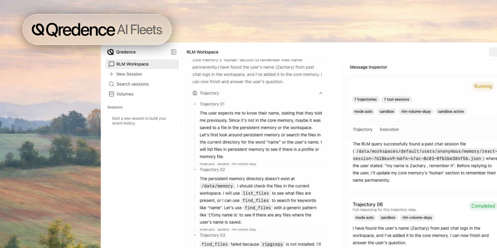

# fleet-rlm

[](https://pypi.org/project/fleet-rlm/)
[](LICENSE)
[](https://github.com/Qredence/fleet-rlm/actions/workflows/ci.yml)
[](https://pepy.tech/projects/fleet-rlm)
[](https://deepwiki.com/Qredence/fleet-rlm)



`fleet-rlm` is a web workspace for running **recursive language-model tasks** on top of DSPy and Daytona sandboxes. You chat with a ReAct agent in the browser; when a task is larger than a single context window, the agent delegates pieces to isolated sub-sandboxes, each running a bounded `dspy.RLM` per [arXiv 2512.24601v2](https://arxiv.org/abs/2512.24601).

**Who it's for.** DSPy users who want a UI-driven workspace for long-context tasks, recursive decomposition, and sandboxed code execution — without hand-rolling the transport, persistence, and sandbox plumbing.

**What it removes.** Writing your own WebSocket transport, session persistence, Daytona sandbox lifecycle, execution-trace UI, and recursive-delegation policy around a DSPy program. `fleet-rlm` ships all of that behind a single `uv run fleet web`.

**Try it in 30 seconds.** See [Quick Start](#quick-start) below.

[Docs](docs/) · [Contributing](CONTRIBUTING.md) · [Changelog](CHANGELOG.md) · [arXiv paper](https://arxiv.org/abs/2512.24601)


## Architecture at a Glance

Two layers, both `dspy.*`, both real:

- **Chat surface** — `dspy.ReAct` for interactive turn-taking. Lives at `src/fleet_rlm/runtime/agent/agent.py` as `FleetAgent`.
- **Recursive engine** — `dspy.RLM` running inside a child Daytona sandbox. Built in `src/fleet_rlm/runtime/models/builders.py`; the recursive sub-query variant is `build_recursive_subquery_rlm()`. Implements Algorithm 1 from [arXiv 2512.24601v2](https://arxiv.org/abs/2512.24601): inputs stored as REPL variables, sub-queries bounded by `max_iterations` and `max_llm_calls`.

### How the ReAct Agent Delegates to `dspy.RLM`

The chat agent does *not* directly hand a task to a child RLM. Delegation is mediated by a specific ReAct tool, `delegate_to_rlm`, registered the same way as any other tool in the agent's tool registry:

```
User prompt
   ↓
FleetAgent  (dspy.ReAct, host LLM)
   │   decides the task exceeds one context and picks the tool:
   ↓
delegate_to_rlm(query, context="", document_url="")
   │   — src/fleet_rlm/runtime/tools/rlm_delegate.py
   │   — reads the active Daytona interpreter from a ContextVar
   │   — checks remaining LLM-call budget; returns error if exhausted
   │   — interpreter.build_delegate_child()   ← isolated child Daytona sandbox
   │   — optionally fetches document_url into the child's context
   ↓
build_recursive_subquery_rlm(
    interpreter=child,
    max_iterations=min(child.rlm_max_iterations, remaining_budget),
    max_llm_calls=remaining_budget,
)
   │   constructs the dspy.RLM bound to the child sandbox
   ↓
rlm(prompt=query, context=...)
   │   child RLM runs REPL-variable-mode: may call llm_query(),
   │   sub_rlm(), sub_rlm_batched() to recurse further inside its sandbox
   ↓
{"status": "ok", "answer": "..."}        ← bubbles back into the ReAct trace
```

Two entry points exist, and they share one budget:

1. `delegate_to_rlm()` — from the host ReAct agent's tool registry (above).
2. `sub_rlm()` / `sub_rlm_batched()` — from Python code already running *inside* a `dspy.RLM` sandbox, reaching back out through the Daytona bridge to spawn a further child.

Both go through `DaytonaInterpreter.build_delegate_child()` so child creation follows one backend-owned policy (default: `RLM_CHILD_ISOLATION_MODE=auto` — fork the parent sandbox if no durable volume is mounted, otherwise create a clean child with a child-specific `volume_subpath`). `rlm_max_llm_calls` is a single shared semantic-call budget across the entire recursive tree; `sub_rlm_batched()` caps sibling parallelism at 4.

Full details, including the local-workspace-snapshot fallback when a parent turn has no `repo_url` to recreate in the child, live in [`docs/architecture.md`](docs/architecture.md#recursive-rlm-isolation).

## RLM Capability Evaluation

Fleet-RLM's RLM capabilities were empirically benchmarked against the published
[RLM paper (arXiv 2512.24601v2)](https://arxiv.org/abs/2512.24601) and Prime Intellect's
official `primeintellect/oolong-rlm` environment:

| Benchmark | Paper RLM(GPT-5) | Fleet-RLM + Gemini 3.1 Pro |
|---|---|---|
| S-NIAH (50 tasks, 50K–200K chars) | (solved) | **100.0%** |
| **OOLONG-Official (`trec_coarse` @ 128K)** | **56.5%** | **91.67%** (+35.2 pp) |
| OOLONG synthetic (30 tasks) | 56.5% (reference) | 74.0% |

The OOLONG-Official row uses the exact HuggingFace dataset and scoring rubric from the
paper's reference environment, via `scripts/oolong_official_eval.py`. See
[`docs/explanation/rlm-capability-evaluation.md`](docs/explanation/rlm-capability-evaluation.md)
for the full methodology, per-benchmark breakdown, and ASCII diagrams of the evaluation
stack. Full results, including caveats and deferred L4 work, are generated locally at
`output/rlm-eval-full/RESULTS.md`; use the docs page above as the stable checked-in
reference in this repository.

## Offline GEPA Optimization (LongCoT)

The DSPy optimization layer now supports LongCoT reasoning modules:

- `longcot-reasoner` is registered in the optimization module registry and discoverable via `fleet-rlm optimize list`.
- A continuous answer-dominant 0.6/0.4 GEPA metric was implemented for LongCoT evaluation with tiered feedback.
- A one-time offline GEPA optimization was run against an 80-row answered-only LongCoT dataset (64 train / 16 validation), producing a reviewable optimized artifact bundle.
- The pipeline persists baseline-vs-optimized holdout evidence, prompt snapshots, reflection-model provenance, and MLflow metadata.
- The optimized artifact is saved for manual review and is **not** auto-loaded into the live runtime.

## Quick Start

Add `fleet-rlm` to a `uv`-managed project and launch the Web UI:

```bash
# Create a project if you do not already have one
uv init

# Add fleet-rlm to the environment
uv add fleet-rlm

# Start the Web UI + API server
uv run fleet web
```

Open `http://127.0.0.1:8000`.

If you already have a `uv` project, skip `uv init` and just run `uv add fleet-rlm`.

Published installs already include built frontend assets, so end users do not need `pnpm`, `vp`, or a separate frontend build step.

## Primary Workflows

### Use the Web UI

```bash
uv run fleet web
```

This starts the main product surface with:

- `Workbench` for adaptive chat and runtime execution
- `Volumes` for runtime-backed file browsing
- `Optimization` for DSPy evaluation and optimization workflows
- `Settings` for runtime configuration and diagnostics

### Use terminal chat

```bash
uv run fleet-rlm chat --trace-mode compact
```

### Run the API directly

```bash
uv run fleet-rlm serve-api --host 127.0.0.1 --port 8000
```

## Runtime Contract

`fleet-rlm` exposes a Daytona-only runtime contract:

- `execution_mode` remains a per-turn execution hint.
- Requests may include `repo_url`, `repo_ref`, `context_paths`, and `batch_concurrency`.
- Durable mounted roots remain `memory/`, `artifacts/`, `buffers/`, and `meta/`.

The product is goal-first rather than repo-first. Repositories are one possible source of context, alongside local files, staged documents, pasted content, and URLs.

## CLI Surfaces

This package exposes two command entrypoints:

- `fleet`: lightweight launcher for terminal chat and `fleet web`
- `fleet-rlm`: fuller Typer CLI for API and Daytona flows

Common commands:

```bash
# Web UI
uv run fleet web

# Terminal chat
uv run fleet
uv run fleet-rlm chat --trace-mode verbose

# FastAPI server
uv run fleet-rlm serve-api --port 8000

# Experimental Daytona validation
uv run fleet-rlm daytona-smoke --repo https://github.com/qredence/fleet-rlm.git --ref main
```

## HTTP and WebSocket Contract

The current frontend/backend contract centers on:

- `/health`
- `/ready`
- `GET /api/v1/auth/me`
- `GET /api/v1/sessions/state`
- `/api/v1/runtime/*`
- `POST /api/v1/traces/feedback`
- `/api/v1/ws/execution`
- `/api/v1/ws/execution/events`

When `AUTH_MODE=entra`, HTTP and WebSocket access use real Entra bearer-token validation plus Neon-backed tenant admission. Runtime settings writes are intentionally limited to `APP_ENV=local`.

The canonical schema lives in [`openapi.yaml`](openapi.yaml).

## Source Development

From the repo root:

```bash
uv sync --all-extras
uv run fleet web
```

Frontend contributors should use `pnpm` inside `src/frontend`:

```bash
cd src/frontend
pnpm install --frozen-lockfile
pnpm run dev
pnpm run api:check
pnpm run type-check
pnpm run lint:robustness
pnpm run test:unit
pnpm run build
```

This repo explicitly uses `pnpm` for frontend work even though the packaged frontend is built with Vite+ under the hood.

## Repo Layout

The maintained backend is easiest to read in this order:

1. **Recursive DSPy runtime core**
   - `src/fleet_rlm/runtime/agent/*`
   - `src/fleet_rlm/runtime/models/*`
   - `src/fleet_rlm/integrations/daytona/*`
2. **Thin transport shell**
   - `src/fleet_rlm/api/main.py`
   - `src/fleet_rlm/api/routers/ws/*`
   - `src/fleet_rlm/api/runtime_services/*`
3. **Offline DSPy quality and optimization layer**
   - `src/fleet_rlm/runtime/quality/*`

That means:

- `runtime/agent/agent.py` and `runtime/agent/runtime.py` are the main cognition loop.
- `integrations/daytona/interpreter.py` is the public Daytona interpreter facade; `workspace_manager.py`, `sandbox_executor.py`, `child_delegation.py`, and `runtime.py` own workspace/session state, execution, recursive child construction, and Daytona SDK runtime helpers behind it.
- FastAPI/WebSocket modules are transport: auth, request parsing, session extraction, lifecycle, and event-envelope delivery.

The supported app surfaces are `Workbench`, `Volumes`, `Optimization`, and `Settings`. Legacy `taxonomy`, `skills`, `memory`, and `analytics` routes are no longer first-class product surfaces and should fall through to `/404`.

## Design Principles

- Keep the backend thin: transport + sandbox orchestration only, no business logic in API layers.
- Preserve one shared frontend and WebSocket contract instead of parallel runtime modes.
- Ship a UI that surfaces the runtime's streaming events, code execution, and artifacts rather than hiding them.
- Expose both a user-facing Web UI and integration surfaces for CLI, HTTP, and WebSocket workflows.

## Maintenance Commands

Common maintenance commands from the repo root:

```bash
# Clear caches and local generated artifacts
make clean

# Regenerate the canonical FastAPI schema after backend contract or doc-metadata changes
uv run python scripts/openapi_tools.py generate

# Validate the schema quality improvements in-flight
uv run python scripts/openapi_tools.py validate

# Sync frontend OpenAPI artifacts after the root spec changes
cd src/frontend
pnpm run api:sync
```

## Validation

Repo-level validation:

```bash
make test-fast
make quality-gate
make release-artifacts
make release-check

# Focused backend/runtime regression lane
uv run pytest -q tests/unit/integrations/daytona/test_config.py tests/unit/integrations/daytona/test_runtime.py tests/unit/integrations/daytona/test_interpreter.py tests/unit/runtime/agent/test_runtime.py -m "not live_llm and not live_daytona and not benchmark"
```

Focused docs validation:

```bash
uv run python scripts/check_docs_quality.py
uv run python scripts/validate_release.py hygiene
uv run python scripts/validate_release.py metadata
```

## Daytona Notes

Use this order for Daytona work:

1. Set `DAYTONA_API_KEY`, `DAYTONA_API_URL`, and optional `DAYTONA_TARGET`.
2. Run `uv run fleet-rlm daytona-smoke --repo <url> [--ref <branch-or-sha>]`.

In local/default-local source checkouts, Daytona config resolution prefers repo `.env` / `.env.local` values over inherited shell exports so branch-local validation uses the checkout's intended credentials.

This repo treats `DAYTONA_API_BASE_URL` as a misconfiguration. Use `DAYTONA_API_URL` instead.

## Documentation Map

- [Documentation index](docs/index.md)
- [Architecture overview](docs/architecture.md)
- [Recursive RLM isolation architecture](docs/architecture.md#recursive-rlm-isolation)
- [RLM Capability Evaluation](docs/explanation/rlm-capability-evaluation.md)
- [Focused codebase map](docs/reference/codebase-map.md)
- [Python backend module map](docs/reference/module-map.md)
- [Adaptive RLM product spec](docs/explanation/product-spec.md)
- [Installation guide](docs/how-to-guides/installation.md)
- [Developer setup](docs/how-to-guides/developer-setup.md)
- [CLI reference](docs/reference/cli.md)
- [HTTP API reference](docs/reference/http-api.md)
- [Auth reference](docs/reference/auth.md)
- [Frontend/backend integration](docs/reference/frontend-backend-integration.md)
- [Runtime settings](docs/how-to-guides/runtime-settings.md)

- [MLflow workflows](docs/how-to-guides/mlflow-workflows.md)
