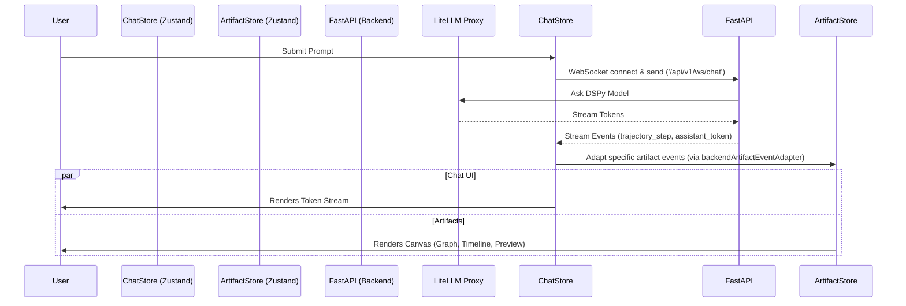

# Phase 6: E2E Browser Testing & Validation

## Overview

This phase focused on ensuring the end-to-end Chat interface works flawlessly inside a live browser session when connected to the Fleet FastAPI backend. We resolved authentication proxy issues and validated the streaming behavior of the chat and the rendering of various execution trajectories in the Artifact Canvas.

## Objectives Met

1. **Identified & Fixed API Auth Issue:** Discovered a `litellm.AuthenticationError` due to missing environment proxy variables (`DSPY_LM_API_BASE` and `DSPY_LLM_API_KEY`). Fixed these inside `.env`.
2. **Started the Stack:** Ran `uv run fleet web` to start both frontend and backend concurrently.
3. **Browser Automation Testing (E2E):** Deployed an autonomous browser subagent to execute user flows:
   - Typed into the chat input.
   - Submitted a basic coding request (`Write a Python script to calculate the first 10 Fibonacci numbers`).
   - Monitored real-time WebSockets streaming response.
4. **Canvas Validation:** Verified the complete streaming sequence within the Artifact Canvas panels:
   - **Graph:** Successfully plotted the logical trajectory sequence of the chat agent execution (user request -> LLM reasoning -> Final Output).
   - **REPL:** Handled the output step logs.
   - **Timeline:** Displayed sequential trace of operations correctly formatted.
   - **Preview:** Beautifully rendered the markdown result containing code execution.

This successfully proves the integration of the React interface with the newly streamlined FastAPI backend, fulfilling the main E2E objective.

## Diagrams

### Component Collaboration

