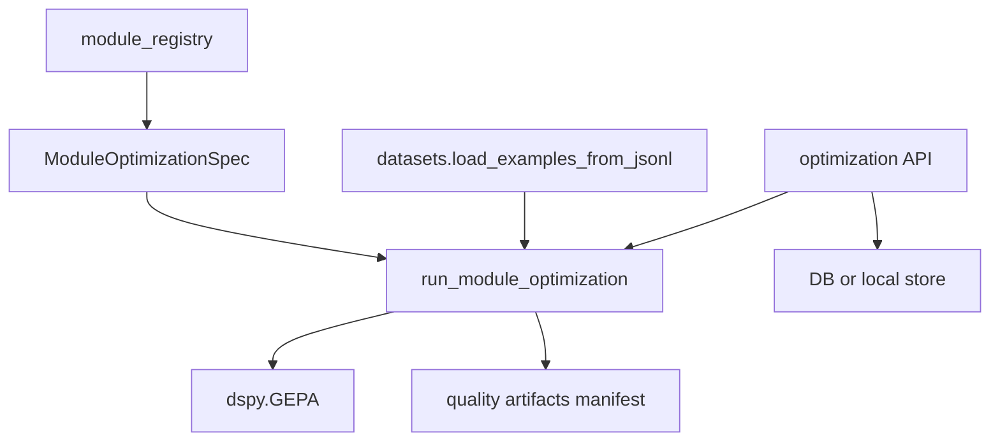

# Codebase Map

## Repository Shape

`fleet-rlm` is a Python package with a bundled React frontend. The backend exposes FastAPI HTTP routes and WebSockets, builds a DSPy/ReAct runtime, and executes work through Daytona sandboxes. The frontend is a Vite+/React application shipped into the Python package for distribution.

Top-level ownership:

- `src/fleet_rlm/` - backend package, runtime, integrations, CLI, and bundled UI assets.
- `src/frontend/` - React 19 + TypeScript frontend.
- `tests/` - unit, UI/server, integration, and e2e tests.
- `scripts/` - maintenance, OpenAPI, evaluation, benchmark, and release scripts.
- `docs/` - architecture, how-to, reference, and explanation docs.
- `migrations/` - Alembic migrations for the Postgres path.
- `openapi.yaml` - generated canonical HTTP contract.
- `Makefile`, `pyproject.toml`, `src/frontend/package.json` - workflow source-of-truth files.
- `output/`, `research/`, `mlartifacts/`, `logs/`, `dogfood-output/` - local/generated artifacts, not core product code.

Approximate code distribution observed during analysis:

- `src/` has the dominant implementation surface.
- `tests/unit/` is the largest test suite.
- `src/fleet_rlm/api/` is the largest backend subpackage.
- `src/fleet_rlm/runtime/` and `src/fleet_rlm/integrations/` are similarly important runtime layers.
- `src/frontend/src/features/`, `src/frontend/src/components/`, and `src/frontend/src/lib/` form the main frontend structure.

## Source-Of-Truth Workflow Files

The repository is intentionally opinionated about workflow commands:

- `pyproject.toml` defines the Python package, dependencies, pytest markers, linting, typing, and console entry points `fleet` and `fleet-rlm`.
- `Makefile` defines repo-level validation commands such as `make lint`, `make typecheck`, `make test`, `make check`, `make quality-gate`, `make api-check`, and `make api-sync`.
- `src/frontend/package.json` defines frontend validation through `pnpm`, Vite+, TypeScript, Vitest, Playwright, and OpenAPI sync scripts.
- `openapi.yaml` is generated and should not be hand-edited.

Important drift: `pyproject.toml` declares `requires-python = ">=3.11,<3.14"`, while the root `AGENTS.md` still describes Python 3.10 as supported. This should be reconciled before release-facing documentation is updated again.

## Backend Architecture

The backend is organized around three layers.

### 1. Transport Shell

Primary files:

- `src/fleet_rlm/api/main.py`
- `src/fleet_rlm/api/bootstrap.py`
- `src/fleet_rlm/api/routers/`
- `src/fleet_rlm/api/runtime_services/`
- `src/fleet_rlm/api/auth/`
- `src/fleet_rlm/api/schemas/`

Responsibilities:

- Create the FastAPI application.
- Mount canonical HTTP routers.
- Mount canonical WebSocket endpoints.
- Serve the bundled SPA.
- Initialize runtime state, persistence, observability, and LM configuration.
- Translate HTTP/WebSocket payloads into runtime calls.

Key entry points:

- `create_app()` in `src/fleet_rlm/api/main.py`
- `startup_server_state()` in `src/fleet_rlm/api/bootstrap.py`
- `websocket_endpoint()` in `src/fleet_rlm/api/routers/ws/endpoint.py`
- `chat_message_loop()` in `src/fleet_rlm/api/routers/ws/stream.py`

The app factory is appropriately thin. `src/fleet_rlm/api/main.py` registers routers, defines the lifespan, and mounts the SPA. The bootstrap path in `src/fleet_rlm/api/bootstrap.py` performs lazy initialization for persistence, LM warmup, MLflow, and PostHog. This fits the repository rule that config and package-root modules should avoid import-time side effects.

### 2. Runtime Core

Primary files:

- `src/fleet_rlm/runtime/factory.py`
- `src/fleet_rlm/runtime/agent/agent.py`
- `src/fleet_rlm/runtime/agent/runtime.py`
- `src/fleet_rlm/runtime/agent/chat.py`
- `src/fleet_rlm/runtime/agent/chat_session_state.py`
- `src/fleet_rlm/runtime/agent/signatures.py`
- `src/fleet_rlm/runtime/models/builders.py`
- `src/fleet_rlm/runtime/tools/`
- `src/fleet_rlm/runtime/quality/`

Responsibilities:

- Build the chat agent and recursive RLM runtime.
- Define DSPy signatures and modules.
- Bind Daytona-backed tools into the agent.
- Manage conversation state, runtime events, and recursive delegation.
- Run offline quality evaluation and GEPA optimization.

Key abstractions:

- `FleetAgent` in `src/fleet_rlm/runtime/agent/agent.py`
- `AgentRuntime` in `src/fleet_rlm/runtime/agent/runtime.py`
- `RuntimeConfig` in `src/fleet_rlm/runtime/config.py`
- `RecursiveWorkspaceModule` in `src/fleet_rlm/runtime/models/builders.py`
- `EvidenceSink` in `src/fleet_rlm/runtime/models/evidence.py`
- `ModuleOptimizationSpec` in `src/fleet_rlm/runtime/quality/module_registry.py`

The runtime layer is powerful but unevenly decomposed. `AgentRuntime` is the right central abstraction for turns and tool binding, but `src/fleet_rlm/runtime/models/builders.py` has grown into a mixed module containing RLM factory functions, memory helpers, answer synthesis, variable execution modules, recursive workspace planning, verification, repair, and evidence persistence wiring.

### 3. Integrations

Primary files:

- `src/fleet_rlm/integrations/daytona/`
- `src/fleet_rlm/integrations/database/`
- `src/fleet_rlm/integrations/local_store.py`
- `src/fleet_rlm/integrations/observability/`

Responsibilities:

- Manage Daytona sandboxes, interpreters, bridge callbacks, and child isolation.
- Persist sessions, turns, datasets, optimization runs, evaluation results, prompt snapshots, and traces.
- Provide local SQLite fallback storage.
- Configure MLflow and PostHog observability.

Key abstractions:

- `DaytonaInterpreter` in `src/fleet_rlm/integrations/daytona/interpreter.py`
- Child sandbox policy functions in `src/fleet_rlm/integrations/daytona/child_isolation.py`
- `FleetRepository` in `src/fleet_rlm/integrations/database/repository.py`
- Optimization repository mixins in `src/fleet_rlm/integrations/database/repository_optimization.py`
- `LocalSessionStore` in `src/fleet_rlm/integrations/local_store.py`
- MLflow helpers in `src/fleet_rlm/integrations/observability/mlflow_runtime.py`

The integration layer is generally where provider-specific code belongs. Daytona-specific child isolation and evidence bridging are placed under `src/fleet_rlm/integrations/daytona/`, which is appropriate. One layering leak remains: `AgentRuntime._bound_runtime_tool_factories()` imports `DaytonaEvidenceSink` inside `src/fleet_rlm/runtime/agent/runtime.py` instead of receiving a concrete `EvidenceSink` through construction.

## Backend Control Flow

The normal workbench turn follows this path:

```mermaid
flowchart TD
  Browser[React Workbench UI]
  WS[/api/v1/ws/execution]
  Auth[WebSocket auth]
  Prep[prepare_chat_runtime]
  Factory[build_chat_agent]
  Runtime[AgentRuntime]
  Agent[FleetAgent / DSPy ReAct]
  Tools[Runtime tools]
  Daytona[DaytonaInterpreter]
  Sandbox[Daytona sandbox]
  Persist[Repository or LocalSessionStore]
  Events[Execution frames]

  Browser --> WS
  WS --> Auth
  Auth --> Prep
  Prep --> Factory
  Factory --> Runtime
  Runtime --> Agent
  Agent --> Tools
  Tools --> Daytona
  Daytona --> Sandbox
  Runtime --> Events
  Events --> Browser
  Runtime --> Persist
```

Evidence paths:

- `src/fleet_rlm/api/routers/ws/endpoint.py` accepts the canonical execution WebSocket and rejects query `session_id` on that endpoint.
- `src/fleet_rlm/api/routers/ws/stream.py` handles the message loop, request context, lifecycle events, persistence, and streaming frames.
- `src/fleet_rlm/api/runtime_services/chat_runtime.py` prepares runtime configuration, identity, LM selection, and Daytona interpreter construction.
- `src/fleet_rlm/runtime/factory.py` constructs `AgentRuntime` and wires interpreter policy.
- `src/fleet_rlm/runtime/agent/runtime.py` streams agent turns, discovers tools, binds runtime tools, and updates history.

## Recursive Runtime Flow

Recursive delegation is split between runtime modules and Daytona bridge callbacks.

Important files:

- `src/fleet_rlm/runtime/models/builders.py`
- `src/fleet_rlm/runtime/tools/rlm_delegate.py`
- `src/fleet_rlm/integrations/daytona/bridge_callbacks.py`
- `src/fleet_rlm/integrations/daytona/child_isolation.py`
- `src/fleet_rlm/integrations/daytona/evidence_bridge.py`

The flow is:

1. Parent runtime exposes delegation tools to the sandbox.
2. Sandbox code calls `sub_rlm()` or `sub_rlm_batched()` through the Daytona bridge.
3. `runtime/tools/rlm_delegate.py` leases recursive budget, builds child runtime context, snapshots local workspace evidence when needed, and executes child tasks.
4. Child isolation policy chooses clean child sandbox, forked child sandbox, or debug context behavior.
5. Child traces and evidence are optionally persisted.
6. Parent aggregation and verification happen in `RecursiveWorkspaceModule`.

This is the repository's most complex control flow. It is also central to the product, so it deserves clearer internal boundaries before more benchmark or GEPA behavior is layered on top.

## Optimization And GEPA Flow

There are two optimization paths today.

### Registry-Based Module Optimization

Important files:

- `src/fleet_rlm/runtime/quality/module_registry.py`
- `src/fleet_rlm/runtime/quality/optimization_runner.py`
- `src/fleet_rlm/runtime/quality/optimize_longcot.py`
- `src/fleet_rlm/runtime/quality/artifacts.py`

Flow:



This path is the best long-term shape because it separates module metadata, dataset loading, GEPA execution, prompt snapshots, evaluation summaries, and artifact writing.

### Generic MLflow-Coupled Optimization

Important files:

- `src/fleet_rlm/runtime/quality/gepa_optimization.py`
- `src/fleet_rlm/api/routers/optimization/runs.py`
- `src/fleet_rlm/api/routers/optimization/background.py`

This path optimizes a program against MLflow datasets and logs results. It is useful, but it overlaps conceptually with the registry runner. The two paths currently create an unclear product contract: the module runner can work offline, but the API status and run endpoints hard-require MLflow availability.

## Frontend Architecture

Primary files and folders:

- `src/frontend/src/routes/` - TanStack Router file routes.
- `src/frontend/src/features/layout/` - app shell and navigation.
- `src/frontend/src/features/workspace/` - workbench/chat surface.
- `src/frontend/src/features/volumes/` - volume browsing surface.
- `src/frontend/src/features/settings/` - settings and diagnostics.
- `src/frontend/src/features/optimization/` - GEPA and optimization workflows.
- `src/frontend/src/features/history/` - history surface.
- `src/frontend/src/lib/rlm-api/` - REST/WebSocket clients and generated API types.
- `src/frontend/src/lib/workspace/` - event adapters and workbench state.
- `src/frontend/src/components/ui/` - shadcn/Base UI primitives.
- `src/frontend/src/components/ai-elements/` - AI/chat primitives.

The frontend follows a reasonable feature-surface organization. The strongest boundary is that layout imports surfaces through feature-level contracts rather than reaching into low-level UI internals.

Optimization frontend files:

- `src/frontend/src/features/optimization/optimization-screen.tsx`
- `src/frontend/src/features/optimization/components/optimization-form.tsx`
- `src/frontend/src/features/optimization/components/runs-tab.tsx`
- `src/frontend/src/features/optimization/components/datasets-tab.tsx`
- `src/frontend/src/lib/rlm-api/optimization.ts`

Important issue: `datasets-tab.tsx` still uses a static list of older module slugs and does not include the current `longcot-reasoner` registry module. The optimization form correctly queries `/api/v1/optimization/modules`, so the dataset export path and module picker can disagree.

## Persistence Map

`fleet-rlm` supports Postgres-backed persistence and local SQLite fallback.

Postgres path:

- `src/fleet_rlm/integrations/database/models.py`
- `src/fleet_rlm/integrations/database/models_optimization.py`
- `src/fleet_rlm/integrations/database/repository.py`
- `src/fleet_rlm/integrations/database/repository_sessions.py`
- `src/fleet_rlm/integrations/database/repository_optimization.py`
- `migrations/versions/0010_target_postgres_schema.py`
- `migrations/versions/0011_rlm_external_traces.py`
- `migrations/versions/0012_trace_payload_columns.py`

Local fallback path:

- `src/fleet_rlm/integrations/local_store.py`

Persisted concepts include:

- Sessions and turns.
- Runtime state and manifests.
- Datasets and dataset examples.
- Optimization runs.
- Evaluation results.
- Prompt snapshots.
- External RLM traces.

The Postgres model path is appropriate for production. The SQLite fallback is practical for local use, but it has accumulated many responsibilities and migrations in one file. That file should not become the canonical domain model for optimization behavior.

## CLI And Script Entry Points

CLI entry points are declared in `pyproject.toml`:

- `fleet = fleet_rlm.cli.main:main`
- `fleet-rlm = fleet_rlm.cli.app:app`

Important CLI/runtime files:

- `src/fleet_rlm/cli/main.py`
- `src/fleet_rlm/cli/app.py`
- `src/fleet_rlm/cli/commands/`
- `src/fleet_rlm/cli/runners.py`

Important benchmark and evaluation scripts:

- `scripts/evaluate_rlm_capabilities.py`
- `scripts/oolong_official_eval.py`
- `scripts/consolidate_rlm_results.py`
- `scripts/generate_longcot_gepa_dataset.py`
- `scripts/generate_longcot_comparison_report.py`
- `scripts/run_longcot_eval.py`
- `scripts/log_benchmark_to_mlflow.py`
- `scripts/setup_longcot_mlflow.py`

The first three scripts are part of the established benchmark story. The LongCoT scripts are the current branch's new or local benchmark work and need cleanup before they become reproducible project workflows.

## Test Map

Test organization:

- `tests/unit/` - unit tests for runtime, integrations, CLI, and quality modules.
- `tests/ui/` - API/server tests.
- `tests/integration/` - integration tests, including database and MLflow-related paths.
- `tests/e2e/` - backend e2e tests.
- `src/frontend/src/**/__tests__/` - frontend Vitest tests.
- `src/frontend/tests/e2e/` - Playwright tests.

Branch-relevant tests include:

- `tests/unit/runtime/quality/test_optimize_longcot.py`
- `tests/unit/runtime/quality/test_longcot_dataset.py`
- `tests/unit/runtime/quality/test_optimization_runner.py`
- `tests/unit/runtime/quality/test_module_registry.py`
- `tests/unit/runtime/quality/test_gepa_e2e.py`
- `tests/ui/server/test_gepa_e2e_api.py`
- `tests/ui/server/test_optimization_mlflow.py`
- `tests/unit/test_run_longcot_eval.py`

The quality and GEPA test coverage is meaningful. The main caution is that the untracked `tests/unit/test_run_longcot_eval.py` depends on vendored LongCoT config paths, which may not be reliable in fresh checkouts or CI unless the vendor directory becomes an explicit dependency.
