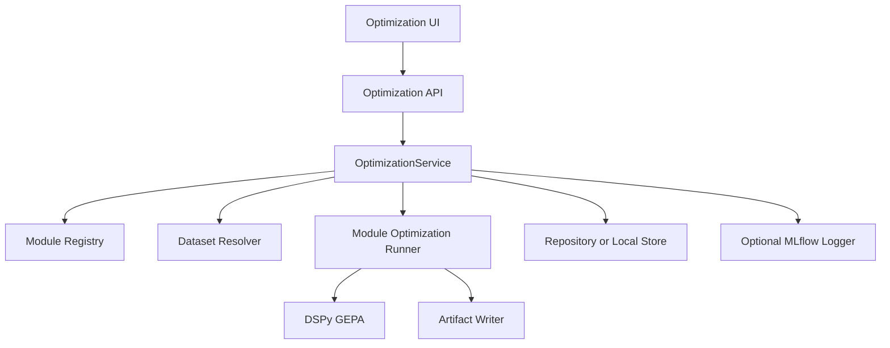

# GEPA Integration Review

## Executive Assessment

GEPA is being integrated in two overlapping ways:

1. A generic MLflow-coupled optimization path in `src/fleet_rlm/runtime/quality/gepa_optimization.py`.
2. A registry-based module optimization path in `src/fleet_rlm/runtime/quality/module_registry.py` and `src/fleet_rlm/runtime/quality/optimization_runner.py`.

The registry-based path is the better long-term architecture for `fleet-rlm`. It fits the product's need to optimize specific runtime modules, expose them through the UI, persist run artifacts, and compare baseline versus optimized behavior.

The biggest current design issue is product-contract ambiguity. The registry runner is written as an offline-capable GEPA path, but the API and UI still treat MLflow as a hard requirement for optimization availability.

## Relevant Files

Core GEPA and quality files:

- `src/fleet_rlm/runtime/quality/__init__.py`
- `src/fleet_rlm/runtime/quality/module_registry.py`
- `src/fleet_rlm/runtime/quality/optimization_runner.py`
- `src/fleet_rlm/runtime/quality/gepa_optimization.py`
- `src/fleet_rlm/runtime/quality/optimize_longcot.py`
- `src/fleet_rlm/runtime/quality/datasets.py`
- `src/fleet_rlm/runtime/quality/artifacts.py`
- `src/fleet_rlm/runtime/quality/scoring.py`

API files:

- `src/fleet_rlm/api/routers/optimization/status.py`
- `src/fleet_rlm/api/routers/optimization/runs.py`
- `src/fleet_rlm/api/routers/optimization/background.py`
- `src/fleet_rlm/api/routers/optimization/datasets.py`
- `src/fleet_rlm/api/routers/optimization/results.py`
- `src/fleet_rlm/api/routers/optimization/compare.py`
- `src/fleet_rlm/api/routers/optimization/_deps.py`
- `src/fleet_rlm/api/schemas/optimization.py`

Persistence files:

- `src/fleet_rlm/integrations/database/models_optimization.py`
- `src/fleet_rlm/integrations/database/repository_optimization.py`
- `src/fleet_rlm/integrations/local_store.py`
- `migrations/versions/0010_target_postgres_schema.py`
- `migrations/versions/0011_rlm_external_traces.py`
- `migrations/versions/0012_trace_payload_columns.py`

Frontend files:

- `src/frontend/src/features/optimization/optimization-screen.tsx`
- `src/frontend/src/features/optimization/components/optimization-form.tsx`
- `src/frontend/src/features/optimization/components/runs-tab.tsx`
- `src/frontend/src/features/optimization/components/datasets-tab.tsx`
- `src/frontend/src/lib/rlm-api/optimization.ts`

Tests:

- `tests/unit/runtime/quality/test_optimize_longcot.py`
- `tests/unit/runtime/quality/test_optimization_runner.py`
- `tests/unit/runtime/quality/test_module_registry.py`
- `tests/unit/runtime/quality/test_gepa_e2e.py`
- `tests/ui/server/test_gepa_e2e_api.py`
- `tests/ui/server/test_optimization_mlflow.py`
- `tests/unit/integrations/test_local_store_evaluation.py`
- `tests/unit/integrations/test_local_store_runs.py`
- `tests/integration/test_db_repository.py`

## Where GEPA Fits Today

GEPA is positioned as part of `runtime/quality`, not core request handling. That is appropriate.

The expected flow is:

1. A user selects a module and dataset in the Optimization UI.
2. The frontend calls optimization API routes.
3. The backend resolves a registered module spec and dataset path or dataset ID.
4. The optimization runner loads examples and constructs the DSPy program.
5. GEPA optimizes prompts against a metric.
6. The runner evaluates baseline and optimized programs.
7. Artifacts, prompt snapshots, evaluation results, and run metadata are persisted.
8. The UI displays progress, status, results, and comparisons.

This flow is the right product shape.

## Module Registry

Evidence:

- `ModuleOptimizationSpec` in `src/fleet_rlm/runtime/quality/module_registry.py`
- `_MODULE_ENTRYPOINTS = ("fleet_rlm.runtime.quality.optimize_longcot",)`
- `get_module_spec()` and `list_module_specs()`

The module registry is a good abstraction. It prevents API routes from needing to know how to construct every optimizable module.

Current strengths:

- Lazy module loading.
- Slug-based lookup.
- Explicit metadata for display name, description, dataset keys, output field, train split, and default GEPA settings.
- Clean extension point for future modules.

Current risks:

- Only `longcot-reasoner` appears registered in the current code.
- Docs and frontend still reference older module slugs.
- Repository persistence infers output key from the last required key, which works for `question`/`answer` but is fragile for future module specs.

Recommendation:

- Make `output_key` an explicit first-class persisted field in module metadata instead of deriving it from `required_keys[-1]`.
- Add a registry integrity test that ensures docs/frontend static references do not drift from backend module slugs, or remove static frontend references entirely.

## Optimization Runner

Evidence:

- `run_module_optimization()` in `src/fleet_rlm/runtime/quality/optimization_runner.py`
- `OptimizationResult`
- `_evaluate_per_example()`
- `_build_holdout_comparisons()`
- `_capture_prompt_snapshots()`
- `_persist_run_artifacts()`

The runner is mostly well-shaped. It owns module-level optimization and returns a structured result rather than writing directly into API response objects.

Positive design choices:

- GEPA import is inside runtime execution, not package import.
- Artifacts are written through `runtime/quality/artifacts.py`.
- Baseline and optimized evaluations are both captured.
- Prompt snapshots are returned.
- Reflection LM provenance is captured.
- Review bundles and manifest paths are returned.

Important concerns:

- Train/validation split is prefix-based and can be biased by ordered datasets.
- `_MIN_VAL_EXAMPLES = 1` allows very small validation sets.
- The runner's local metric can differ from external benchmark evaluators.
- The runner and `gepa_optimization.py` overlap conceptually.

Recommendation:

- Add a split strategy parameter to `ModuleOptimizationSpec`, defaulting to deterministic stratified split when metadata keys such as `domain` or `difficulty` exist.
- Include split summaries in `OptimizationResult` and artifact manifests.
- Raise or warn when validation examples are below a meaningful threshold for the selected module.

## Generic GEPA Optimization Path

Evidence:

- `src/fleet_rlm/runtime/quality/gepa_optimization.py`

This file contains a generic MLflow-oriented optimization workflow: dataset loading from MLflow, feedback metric construction, GEPA execution, and MLflow logging.

It is useful as a lower-level or legacy path, but it overlaps with the registry runner in ways that can confuse future development.

Concerns:

- API routes can call generic optimization for blocking runs while background runs call module optimization.
- MLflow is treated as both telemetry and required execution substrate.
- Dataset identity, artifact output, and run lifecycle are split across generic and module paths.

Recommendation:

- Treat `gepa_optimization.py` as an adapter for MLflow datasets and MLflow logging, not as the primary product runner.
- Make `optimization_runner.py` the canonical runner for module optimization.
- Have generic MLflow paths convert inputs into the same internal `OptimizationJob` or `OptimizationRunRequest` model used by module runs.

## LongCoT GEPA Module

Evidence:

- `src/fleet_rlm/runtime/quality/optimize_longcot.py`
- `src/fleet_rlm/runtime/agent/signatures.py`
- `scripts/generate_longcot_gepa_dataset.py`
- `tests/unit/runtime/quality/test_optimize_longcot.py`

The LongCoT module registers a DSPy program using `LongCoTQASignature`. It expects dataset fields:

- `question`
- `answer`
- optional metadata such as `domain`, `difficulty`, and `question_id`

The metric combines answer score and reasoning score:

- Answer weight: 0.6
- Reasoning weight: 0.4

The answer score uses exact match, normalized match, token overlap, and sequence similarity. The reasoning score rewards sufficient length, step markers, causal connectors, verification language, and non-filler content.

This is a reasonable prompt-optimization metric for early experimentation, but it is not equivalent to the official LongCoT evaluator.

Critical implication:

- GEPA improvements on this metric should not be presented as LongCoT benchmark improvements unless optimized outputs are evaluated with the same vendored LongCoT evaluator used for direct/RLM benchmark comparison.

Metric risk:

- A response can receive reasoning credit even when the final answer is wrong.
- The metric can reward plausible-looking reasoning rather than task correctness.
- Similarity scoring may over-credit partial answers in domains that require exact structured output.

Recommendation:

- Keep this metric for GEPA prompt search, but label it as a surrogate training metric.
- Add a separate post-GEPA benchmark evaluation step using the official LongCoT evaluator.
- Track metric correlation between surrogate score and evaluator correctness by domain.

## API Integration

Evidence:

- `src/fleet_rlm/api/routers/optimization/status.py`
- `src/fleet_rlm/api/routers/optimization/runs.py`
- `src/fleet_rlm/api/routers/optimization/background.py`
- `src/fleet_rlm/api/routers/optimization/_deps.py`

The API supports:

- Status checks.
- Module listing.
- Dataset resolution.
- Blocking run execution.
- Async background run execution.
- Run listing, detail, cancellation, and recovery.
- Results and prompt snapshots.

This is a strong feature surface, but there is too much route-level orchestration.

Key design gap:

- `_ensure_gepa_runtime_available()` requires MLflow for all optimization execution, while `run_module_optimization()` can run without MLflow.

Recommendation:

- Split availability into two flags: `gepa_available` and `mlflow_logging_available`.
- Let module runs proceed when GEPA and dataset access are available.
- Surface MLflow as optional telemetry status in the UI.
- Keep generic MLflow dataset optimization gated on MLflow.

## Persistence Integration

Evidence:

- `src/fleet_rlm/integrations/database/models_optimization.py`
- `src/fleet_rlm/integrations/database/repository_optimization.py`
- `src/fleet_rlm/integrations/local_store.py`

The persistence model covers the right entities:

- Optimization modules.
- Datasets and examples.
- Optimization runs.
- Evaluation results.
- Prompt snapshots.

The Postgres path is appropriate for production. The local SQLite store is useful for development but has accumulated large manual migration logic.

Concerns:

- Local store schema evolution is embedded in one large file.
- Module output key persistence is inferred rather than explicit.
- Some run lifecycle behavior is duplicated between repository and local store paths.

Recommendation:

- Define a small persistence protocol for optimization runs and implement it in both Postgres and local store adapters.
- Keep lifecycle semantics in one service layer so repository and local store implementations only perform storage operations.

## Frontend Integration

Evidence:

- `src/frontend/src/features/optimization/optimization-screen.tsx`
- `src/frontend/src/features/optimization/components/optimization-form.tsx`
- `src/frontend/src/features/optimization/components/datasets-tab.tsx`
- `src/frontend/src/features/optimization/components/runs-tab.tsx`
- `src/frontend/src/lib/rlm-api/optimization.ts`

The frontend has the right workflow shape:

- Overview/status.
- Module selection.
- Dataset selection and upload.
- Run creation.
- Run progress.
- Run details and comparison.

Main issue:

- The UI's optimization availability depends on backend status, which currently hard-requires MLflow.
- Dataset export uses static stale module slugs.

Recommendation:

- Query backend module registry for all module-specific selectors.
- Display separate status states for GEPA runtime and MLflow logging.
- Avoid making MLflow copy the primary explanation if offline optimization remains supported.

## Architectural Soundness

The GEPA integration is architecturally sound in its direction but not fully settled in its boundaries.

Sound choices:

- GEPA lives under `runtime/quality` rather than core request routing.
- Modules are registered by spec rather than route conditionals.
- Artifacts and prompt snapshots are explicit.
- API and frontend expose optimization as a first-class surface.
- Tests cover core runner behavior, registry behavior, API behavior, and persistence.

Unsound or unsettled choices:

- MLflow requirement conflicts with offline runner behavior.
- Generic and registry optimization paths overlap.
- Dataset split strategy is too weak for benchmark claims.
- LongCoT surrogate metric is treated too close to benchmark evaluation.
- Static frontend module slugs can drift from backend registry.

## Recommended GEPA Architecture

Target structure:

Key principles:

- One service owns optimization lifecycle.
- One runner owns module optimization execution.
- MLflow is an optional observer unless the selected dataset source is MLflow.
- API routes are thin and mostly validate/serialize.
- Frontend module selectors come from the backend registry.
- Benchmark evaluation remains separate from GEPA surrogate metrics.

## Concrete Design Changes

### 1. Introduce `OptimizationService`

Priority: high.

Affected files:

- `src/fleet_rlm/api/routers/optimization/runs.py`
- `src/fleet_rlm/api/routers/optimization/background.py`
- `src/fleet_rlm/api/routers/optimization/_deps.py`
- new service under `src/fleet_rlm/api/runtime_services/optimization.py` or `src/fleet_rlm/runtime/quality/service.py`

Benefit:

- Consolidates blocking and async run behavior.
- Reduces duplicated path validation and run persistence logic.
- Makes MLflow optionality explicit.

Tradeoff:

- Requires careful tests around existing API behavior.

### 2. Add Dataset Split Metadata

Priority: high.

Affected files:

- `src/fleet_rlm/runtime/quality/datasets.py`
- `src/fleet_rlm/runtime/quality/optimization_runner.py`
- `scripts/generate_longcot_gepa_dataset.py`
- `tests/unit/runtime/quality/test_optimization_runner.py`
- `tests/unit/runtime/quality/test_longcot_dataset.py`

Benefit:

- Prevents domain-biased validation.
- Makes benchmark and optimization comparisons more meaningful.

Tradeoff:

- Existing datasets without split metadata need a fallback strategy.

### 3. Separate Surrogate GEPA Metrics From Benchmark Metrics

Priority: high.

Affected files:

- `src/fleet_rlm/runtime/quality/optimize_longcot.py`
- `scripts/run_longcot_eval.py`
- `scripts/generate_longcot_comparison_report.py`
- docs under `docs/how-to-guides/` and `docs/explanation/`

Benefit:

- Prevents overstated optimization claims.
- Makes it clear what GEPA is optimizing versus what benchmark evaluator measures.

Tradeoff:

- Requires an extra evaluation step after GEPA.

### 4. Remove Static Frontend Module Slugs

Priority: medium.

Affected files:

- `src/frontend/src/features/optimization/components/datasets-tab.tsx`
- `src/frontend/src/lib/rlm-api/optimization.ts`
- frontend tests under `src/frontend/src/features/optimization/__tests__/`

Benefit:

- Prevents UI/backend drift.
- Makes new GEPA modules visible automatically.

Tradeoff:

- Dataset export flow must handle module loading state.

### 5. Make MLflow Status Granular

Priority: medium.

Affected files:

- `src/fleet_rlm/api/routers/optimization/status.py`
- `src/fleet_rlm/api/schemas/optimization.py`
- `src/frontend/src/features/optimization/components/optimization-form.tsx`
- `src/frontend/src/features/optimization/optimization-screen.tsx`

Benefit:

- Clarifies whether GEPA is unavailable or only MLflow logging is unavailable.
- Supports offline optimization cleanly.

Tradeoff:

- OpenAPI and frontend generated artifacts need sync if schemas change.
