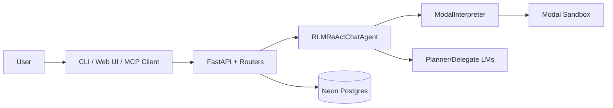

# Architecture Overview

This document describes the maintained architecture for `fleet-rlm`.

## Entry Points

- `fleet` launcher (`src/fleet_rlm/fleet_cli.py`)
- `fleet-rlm` CLI (`src/fleet_rlm/cli.py`)
- FastAPI server (`src/fleet_rlm/server/main.py`)
- MCP server (`src/fleet_rlm/mcp/`)

## High-Level Component Flow

The same agent/runtime stack powers terminal chat and WebSocket chat, with
HTTP chat retained only as compatibility (`POST /api/v1/chat`, deprecated;
removal target `v0.4.93`).

## Core Layers

### 1. Orchestration Layer

- `src/fleet_rlm/react/agent.py`
- `src/fleet_rlm/react/streaming.py`
- `src/fleet_rlm/react/tools*.py`

Responsibilities:
- ReAct loop orchestration
- tool dispatch and command handling
- trajectory and streaming event generation

### 2. Execution Layer

- `src/fleet_rlm/core/interpreter.py`
- `src/fleet_rlm/core/driver.py`
- `src/fleet_rlm/core/driver_factories.py`

Responsibilities:
- remote code execution in Modal
- execution profile control
- sandbox helper injection and protocol handling

### 3. Service Layer

- `src/fleet_rlm/server/routers/*`
- `src/fleet_rlm/server/deps.py`
- `src/fleet_rlm/server/config.py`

Responsibilities:
- HTTP and WS transport
- auth and identity normalization
- runtime settings and diagnostics
- session/execution streaming lifecycle

### 4. Persistence Layer

- `src/fleet_rlm/db/*`
- `migrations/*`

Responsibilities:
- tenant-aware run/step/artifact/memory persistence
- RLS-enforced isolation

## API and Streaming Surfaces

- REST contract source: `openapi.yaml`
- WS chat stream (canonical): `/api/v1/ws/chat`
- WS execution stream: `/api/v1/ws/execution`
- HTTP chat (compatibility-only, deprecated): `/api/v1/chat`

Execution stream events are additive observability and do not replace chat envelopes.
