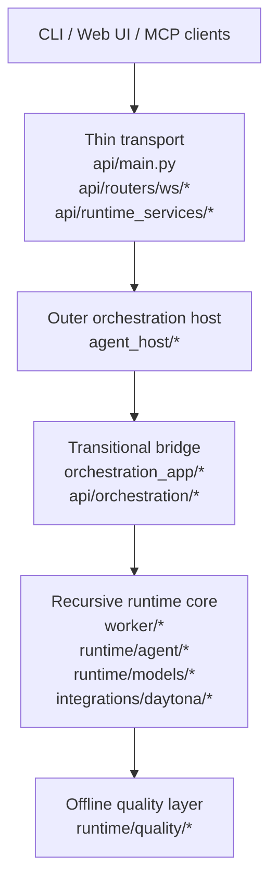

# Architecture Overview

`fleet-rlm` is best understood as a recursive DSPy + Daytona runtime core wrapped by two thinner outer layers:

1. **Thin FastAPI/WebSocket transport** in `src/fleet_rlm/api/`
2. **Narrow but real Agent Framework outer orchestration host** in `src/fleet_rlm/agent_host/`
3. **Daytona-backed recursive DSPy worker/runtime core** in `src/fleet_rlm/worker/`, `src/fleet_rlm/runtime/`, and `src/fleet_rlm/integrations/daytona/`

Two additional layers matter when reading the current tree:

- **Transitional bridge**: `src/fleet_rlm/orchestration_app/` and `src/fleet_rlm/api/orchestration/`
- **Offline quality layer**: `src/fleet_rlm/runtime/quality/`

## Current Runtime Status

- The main cognition loop lives in `src/fleet_rlm/runtime/agent/chat_agent.py` and `src/fleet_rlm/runtime/agent/recursive_runtime.py`.
- The execution and durable-workspace substrate lives in `src/fleet_rlm/integrations/daytona/interpreter.py` and `src/fleet_rlm/integrations/daytona/runtime.py`.
- `src/fleet_rlm/agent_host/workflow.py` is the hosted policy seam around the worker boundary, not the core engine.
- `src/fleet_rlm/api/main.py`, `src/fleet_rlm/api/routers/ws/*`, and `src/fleet_rlm/api/runtime_services/*` should stay transport-thin: auth, request parsing, session extraction, lifecycle, and event-envelope delivery.
- `src/fleet_rlm/orchestration_app/*` and `src/fleet_rlm/api/orchestration/*` remain compatibility layers during the transition; they should shrink rather than gain new product logic.
- `src/fleet_rlm/runtime/quality/*` is the offline DSPy evaluation and optimization surface, not the online request path.

## Layered View

## What Each Layer Owns

### 1. Thin FastAPI/WebSocket transport

Primary files:

- `src/fleet_rlm/api/main.py`
- `src/fleet_rlm/api/routers/ws/*`
- `src/fleet_rlm/api/runtime_services/*`

Responsibilities:

- App factory and lifespan wiring
- HTTP and websocket route registration
- Auth and session/user extraction
- Request normalization and websocket lifecycle
- Event shaping and envelope delivery
- Runtime settings, diagnostics, and volume browsing service orchestration

Non-goals:

- Owning the recursive cognition loop
- Becoming the primary orchestration layer
- Holding Daytona execution semantics that belong in runtime/provider code

### 2. Narrow but real Agent Framework outer orchestration host

Primary files:

- `src/fleet_rlm/agent_host/app.py`
- `src/fleet_rlm/agent_host/workflow.py`
- `src/fleet_rlm/agent_host/hitl_flow.py`
- `src/fleet_rlm/agent_host/checkpoints.py`
- `src/fleet_rlm/agent_host/repl_bridge.py`
- `src/fleet_rlm/agent_host/startup_status.py`

Responsibilities:

- Host workflow construction and hosted execution policy
- Session/HITL/checkpoint coordination around the worker seam
- Agent Framework integration for websocket execution turns
- Outer policy around streamed worker execution

Non-goals:

- Replacing the runtime core
- Owning Daytona interpreter behavior
- Reimplementing transport responsibilities that belong in `api/`

### 3. Daytona-backed recursive DSPy worker/runtime core

Primary files:

- `src/fleet_rlm/worker/*`
- `src/fleet_rlm/runtime/agent/chat_agent.py`
- `src/fleet_rlm/runtime/agent/recursive_runtime.py`
- `src/fleet_rlm/runtime/models/*`
- `src/fleet_rlm/integrations/daytona/interpreter.py`
- `src/fleet_rlm/integrations/daytona/runtime.py`

Responsibilities:

- The shared ReAct + recursive `dspy.RLM` cognition loop
- Tool selection, recursive delegation, and streaming turn execution
- Daytona sandbox/session lifecycle and durable workspace semantics
- Provider-native memory, repo/context staging, and runtime metadata

This is the system's center of gravity. When the architecture description and the file layout disagree, start here and work outward.

### 4. Transitional bridge layers

Primary files:

- `src/fleet_rlm/orchestration_app/*`
- `src/fleet_rlm/api/orchestration/*`

Responsibilities:

- Compatibility shims and migration seams retained during the Agent Framework transition
- Legacy policy adapters that still bridge transport and host behavior

Direction of travel:

- Keep only still-needed seams
- Reduce wrapper clutter and duplicated ownership signals
- Prefer forwarding to `agent_host/` or the runtime core instead of growing new logic here

### 5. Offline worker quality layer

Primary files:

- `src/fleet_rlm/runtime/quality/*`

Responsibilities:

- DSPy evaluation
- Optimization workflows
- Scoring, metrics, and offline quality runs

This layer supports the runtime core but is not the online websocket execution path.

## Current-State Module Map

| Area | Role now | Read first |
| --- | --- | --- |
| `api/` | thin transport shell | `api/main.py`, `api/routers/ws/endpoint.py`, `api/routers/ws/stream.py` |
| `agent_host/` | outer orchestration host | `agent_host/workflow.py`, `agent_host/app.py` |
| `orchestration_app/` | transitional bridge | `orchestration_app/coordinator.py`, `orchestration_app/terminal_flow.py` |
| `api/orchestration/` | compatibility shims | `api/orchestration/*.py` |
| `worker/` | worker boundary and task contract | `worker/contracts.py`, `worker/adapters.py` |
| `runtime/agent/` | main cognition loop | `runtime/agent/chat_agent.py`, `runtime/agent/recursive_runtime.py` |
| `runtime/models/` | runtime module/model registry and exports | `runtime/models/builders.py`, `runtime/models/registry.py` |
| `integrations/daytona/` | execution and memory substrate | `integrations/daytona/interpreter.py`, `integrations/daytona/runtime.py` |
| `runtime/quality/` | offline evaluation/optimization | `runtime/quality/*` |

## Cleanup Guidance for the First Pass

The current cleanup pass should stay structural and documentary.

Safe targets:

- Reduce compatibility clutter in `src/fleet_rlm/api/orchestration/*`
- Reduce compatibility clutter in wrapper files under `src/fleet_rlm/api/routers/ws/*`
- Shrink `src/fleet_rlm/orchestration_app/*` toward only the still-needed transition seams
- Remove stale ownership descriptions and deleted-file references from docs

Do not do in this pass:

- Redesign the runtime
- Broadly refactor transport/host/runtime boundaries
- Rewrite recursive worker behavior
- Move cognition into orchestration layers
- Move Daytona execution or memory semantics into transport or host state
- Change websocket/public contract semantics as part of the docs cleanup

## Canonical Shared Endpoints

- `/health`
- `/ready`
- `GET /api/v1/auth/me`
- `GET /api/v1/sessions/state`
- `/api/v1/runtime/*`
- `POST /api/v1/traces/feedback`
- `GET /api/v1/optimization/status`
- `POST /api/v1/optimization/run`
- `/api/v1/ws/execution`
- `/api/v1/ws/execution/events`

## Recommended Companion Docs

- [Current architecture and transition note](notes/current-architecture-transition.md)
- [Focused codebase map](reference/codebase-map.md)
- [Python backend module map](reference/module-map.md)
- [Frontend/backend integration](reference/frontend-backend-integration.md)
