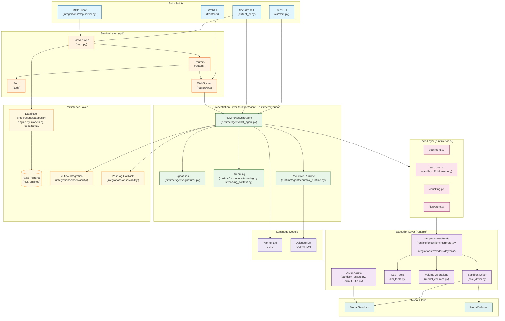
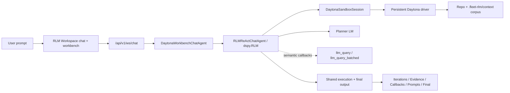
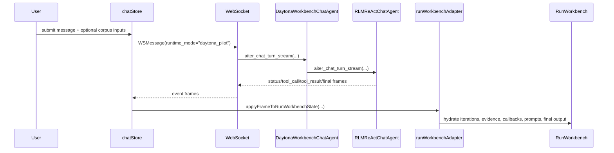
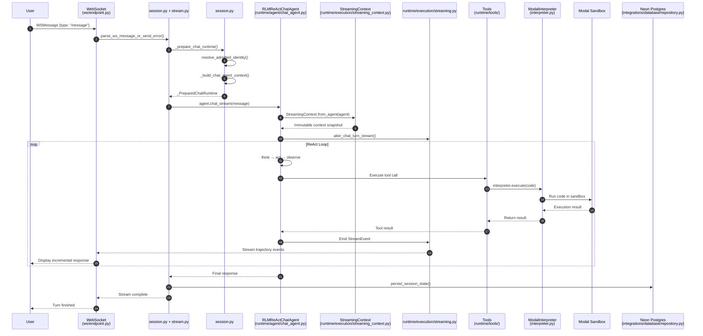
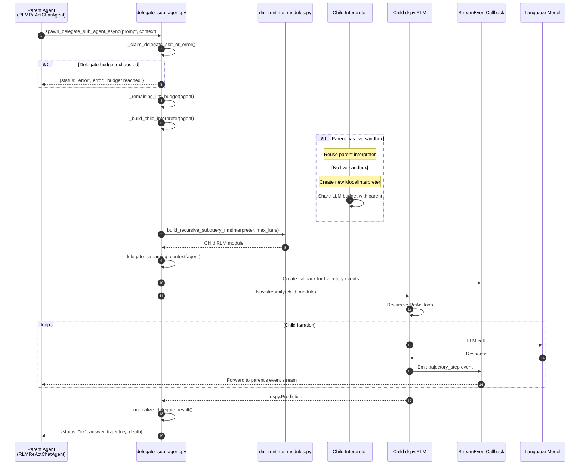

# Architecture Overview

This document describes the maintained architecture for `fleet-rlm`.
The primary product path is now the shared DSPy ReAct + recursive `dspy.RLM`
runtime with Daytona as the default interpreter backend. Modal remains a
supported backend for the same runtime architecture.

## Current Runtime Status

- The primary product runtime is the shared `RLMReActChatAgent` plus recursive
  `dspy.RLM` stack described below.
- Daytona is the default interpreter backend for that shared runtime in the
  workspace product.
- Modal remains supported for compatibility, terminal flows, and backend parity
  where the Modal interpreter is still the selected execution backend.
- The Web UI still uses the same `/api/v1/ws/chat` surface; `runtime_mode`
  selects interpreter/backend details rather than swapping in a separate chat
  orchestrator.
- The only supported Daytona CLI surface is `fleet-rlm daytona-smoke --repo ... [--ref ...]` for native Daytona validation.
- `fleet-rlm daytona-smoke` is the required first-step validation path and now emits phase-aware diagnostics for config, sandbox bootstrap, driver startup, execution, and cleanup.
- The Daytona pilot now splits cleanly into an async Daytona interpreter core and a thin product adapter. The interpreter owns persistent sandbox execution, prompt-object storage, typed `SUBMIT`, and workspace-native helpers while the shared ReAct/RLM runtime owns chat orchestration and recursion.
- The Daytona interpreter helper surface is environment-native: workspace inspection and chunking happen inside the persistent sandbox driver via `read_file_slice`, `grep_repo`, `chunk_text`, and `chunk_file`, long task/observation payloads are externalized there through `store_prompt`, `list_prompts`, and `read_prompt_slice`, and local document ingestion is shared with the rest of the backend through `document_ingestion.py`; host callbacks bridge semantic `llm_query` work back to the planner LM.
- In the Web UI integration, Daytona-backed workspace execution is the primary
  path. Optional `repo_url`, optional `context_paths`, optional `repo_ref` when
  a repo is configured, and optional `batch_concurrency` remain available
  Daytona request controls. Daytona websocket requests reject request-side
  `max_depth`, while streamed runtime metadata still includes
  `runtime.max_depth` as read-only execution state. Image-only or scanned PDFs
  fail with an explicit OCR-required context-stage diagnostic rather than
  silently degrading.

## System Architecture Diagram

The following diagram shows the complete system architecture with all major components and their relationships:



## Entry Points

| Entry Point | Source File                   | Description                                                                                                       |
| ----------- | ----------------------------- | ----------------------------------------------------------------------------------------------------------------- |
| `fleet`     | `src/fleet_rlm/cli/main.py`                    | Primary interactive chat launcher. Supports `fleet web` for the Web UI.                                           |
| `fleet-rlm` | `src/fleet_rlm/cli/fleet_cli.py`               | Full CLI with `chat`, `serve-api`, `serve-mcp`, `init`, and `daytona-smoke`. |
| Web UI      | `src/frontend/`               | React/TypeScript frontend served by FastAPI at `http://0.0.0.0:8000`.                                             |
| MCP Server  | `src/fleet_rlm/integrations/mcp/server.py`   | Model Context Protocol server for Claude Desktop integration.                                                      |

## Core Layers

### 1. Entry Points Layer

Entry points define how users interact with the system:

- **`cli/main.py`**: Lightweight wrapper that provides `fleet` for terminal
  chat and `fleet web` for Web UI launch.
- **`cli/fleet_cli.py`**: Full Typer-based CLI with subcommands:
  - `chat`: Standalone interactive terminal chat
  - `serve-api`: FastAPI server for HTTP/WebSocket API
  - `serve-mcp`: MCP server for Claude Desktop integration
  - `init`: Bootstrap Claude Code scaffold assets
  - `daytona-smoke`: native Daytona smoke validation for repo clone + driver persistence

### 2. Orchestration Layer (`runtime/agent/` + `runtime/execution/`)

The orchestration layer manages the ReAct agent loop and streaming:

| Module                  | Purpose                                                           |
| ----------------------- | ----------------------------------------------------------------- |
| `chat_agent.py`         | `RLMReActChatAgent` - stateful conversational agent with tool use |
| `chat_turns.py`         | Turn-state accounting, prediction normalization, and turn result shaping |
| `signatures.py`         | DSPy signature definitions for agent inputs/outputs               |
| `streaming.py`          | Real-time streaming of chat turns and trajectory events           |
| `streaming_context.py`  | Context management for streaming sessions                         |
| `recursive_runtime.py`  | Spawns child `dspy.RLM` instances for recursive reasoning         |
| `commands.py`           | Built-in command dispatch (e.g., `/help`, `/reset`)               |

### 3. Tools Layer (`runtime/tools/`)

Tools provide capabilities for the ReAct agent:

| Module                   | Purpose                             |
| ------------------------ | ----------------------------------- |
| `document.py`            | Document loading and processing     |
| `sandbox.py`             | Sandbox execution, cached-runtime delegation tools, memory-intelligence tools, and persistent memory helpers |
| `chunking.py`            | Text chunking for long documents    |
| `filesystem.py`          | File system operations in sandbox   |

### 4. Execution Layer (`runtime/`)

The execution layer owns the shared interpreter/runtime infrastructure used by both Modal and Daytona:

| Module                | Purpose                                              |
| --------------------- | ---------------------------------------------------- |
| `interpreter.py`      | `ModalInterpreter` - manages Modal sandbox lifecycle |
| `core_driver.py`     | `sandbox_driver` - executes Python code in sandbox   |
| `driver_factories.py` | Factory functions for driver configuration           |
| `llm_tools.py`        | LLM-backed tools for the sandbox                     |
| `modal_volumes.py`    | Canonical Modal volume persistence and browsing helpers |
| `sandbox_assets.py`   | Bundled helper assets injected into the sandbox driver |
| `output_utils.py`     | Output redaction and stdout summarization helpers    |

### 4a. Experimental Daytona Pilot (`integrations/providers/daytona/`)

The Daytona pilot is an experimental interpreter backend for the shared runtime and is not a separate orchestration stack.

| Module                | Purpose                                                                                                             |
| --------------------- | ------------------------------------------------------------------------------------------------------------------- |
| `types_budget.py`, `types_context.py`, `types_recursive.py`, `types_result.py`, `types_serialization.py` | Focused Daytona rollout, context, recursion, result, and serialization contracts |
| `config.py`           | Explicit native Daytona env resolution and preflight validation                                                     |
| `runtime.py`          | Direct-SDK sandbox bootstrap, repo clone orchestration, volume attach, and local context staging                    |
| `bridge.py`           | Minimal guide-style broker bridge for `llm_query`, `llm_query_batched`, custom tools, and `SUBMIT(...)`            |
| `smoke.py`            | CLI-first Daytona smoke workflow validating persistent code-interpreter state                                        |
| `interpreter.py`      | Daytona interpreter backend compatible with the shared ReAct + `dspy.RLM` flow                                      |
| `agent.py`            | Thin Daytona compatibility wrapper over the shared ReAct agent                                                      |
| `state.py`            | Daytona chat/session normalization helpers                                                                           |
| `volumes.py`          | Daytona volume browsing helpers                                                                                      |

Important scope notes:

- The pilot is workspace-centric: `--repo` is optional, `--context-path` is repeatable, and `--ref` is only valid when a repo is configured.
- Each root Daytona session uses one sandbox workspace plus one persistent Daytona code-interpreter context.
- Repo and workspace-analysis helpers are sandbox-native helper functions injected into that persistent context and survive across iterations.
- `llm_query` / `llm_query_batched` are host-side LM callbacks bridged into the sandbox through the minimal Daytona broker process. `rlm_query` / `rlm_query_batched` remain the true recursive child-RLM helpers through the shared runtime.
- The pilot still does not replace `ModalInterpreter` or the default `modal_chat` product path, but it now has its own first-class websocket runtime mode while sharing the same ReAct + `dspy.RLM` orchestration core.
- Contributors should run Daytona in this order: set `DAYTONA_API_KEY` + `DAYTONA_API_URL`, then run `fleet-rlm daytona-smoke --repo <url>` before using `daytona_pilot` in the web workspace.

### 4b. Experimental Daytona Workbench

The Daytona pilot now has a dedicated DSPy-native websocket chat agent plus a workbench inspector in `RLM Workspace`.

| Module                                                              | Purpose                                                                                                                                                                                                                         |
| ------------------------------------------------------------------- | ------------------------------------------------------------------------------------------------------------------------------------------------------------------------------------------------------------------------------- |
| `integrations/providers/daytona/agent.py`                          | `DaytonaWorkbenchChatAgent` - focused Daytona-specific agent layer over the shared ReAct runtime                                                                                                                                |
| `api/schemas/core.py`                                               | Adds Daytona websocket source controls (`runtime_mode`, `repo_url`, `repo_ref`, `context_paths`, `batch_concurrency`) plus Daytona runtime readiness metadata; request-side `max_depth` is explicitly rejected for Daytona chat |
| `api/routers/ws/endpoint.py` / `api/routers/ws/session.py`          | Select the top-level websocket chat agent from the first message and bootstrap runtime/session state                                                                                                                             |
| `api/routers/ws/stream.py` / `api/routers/ws/commands.py`           | Route Daytona turns through the shared websocket session/streaming lifecycle instead of a one-shot Daytona-only branch                                                                                                          |
| `frontend/src/screens/workspace/model/chat-store.ts`                | Persists runtime selection, session identity, and runtime-specific request options in UI state                                                                                                                                 |
| `frontend/src/screens/workspace/components/workspace-composer.tsx`  | Renders runtime selection and keeps execution-mode controls Modal-only                                                                                                                                                           |
| `frontend/src/screens/workspace/workspace-screen.tsx`               | Keeps the shared chat surface visible, switches warnings by runtime, and relies on the workbench instead of a mandatory Daytona setup card                                                                                     |
| `frontend/src/screens/workspace/model/run-workbench-*`              | Dedicated analyst workbench state/UI for iterations, evidence, callbacks, prompt objects, and final output                                                                                                                      |

Important scope notes:

- The UI toggle is explicit: `Modal chat` vs `Daytona pilot`.
- `execution_mode` still applies only to the default Modal chat path.
- Daytona UI requests are Daytona-interpreter-oriented: the backend runs the shared ReAct + `dspy.RLM` flow against a Daytona-backed persistent REPL/runtime and renders workbench state from structured run events plus interpreter output.
- Daytona websocket chat now shares the same session/export/import lifecycle as Modal chat, so Daytona history persists by `session_id` and restores through the existing websocket session store.
- The workbench is now general-purpose Daytona-backed recursive reasoning rather than repo-analysis-only and currently shows:
  - task-aware runtime/task controls and status,
  - optional repo plus staged local document/directory sources or `No external sources`,
  - ordered iteration summaries instead of a recursive run tree,
  - an evidence tab for staged corpus items, cited file slices, and attachments,
  - callback, prompt-object, and final-output tabs for analyst-style drill-in.

#### Daytona Analyst Runtime Flow



#### Daytona Frontend Data Flow



### 5. Service Layer (`api/`)

The service layer provides HTTP and WebSocket APIs:

| Module                       | Purpose                                      |
| ---------------------------- | -------------------------------------------- |
| `main.py`                    | FastAPI application factory                  |
| `routers/runtime.py`         | Runtime settings and status endpoints        |
| `routers/sessions.py`        | Session state management                     |
| `routers/traces.py`          | MLflow trace endpoints                       |
| `routers/health.py`          | Health check endpoints (`/health`, `/ready`) |
| `routers/auth.py`            | Authentication endpoints                     |
| `routers/ws/session.py`      | WebSocket runtime/session bootstrap          |
| `routers/ws/endpoint.py`     | WebSocket API surface                        |
| `auth/`                      | Authentication middleware (dev/Entra modes)  |

### 6. Persistence Layer

| Component                                  | Purpose                                                 |
| ------------------------------------------ | ------------------------------------------------------- |
| `integrations/database/engine.py`          | Async database engine with connection pooling           |
| `integrations/database/models.py`          | SQLModel definitions for runs, steps, artifacts, memory |
| `integrations/database/repository.py`      | Repository pattern for database operations              |
| `integrations/observability/mlflow_runtime.py` | MLflow lifecycle, callbacks, and request-context wiring |
| `integrations/observability/mlflow_traces.py`  | MLflow trace lookup, feedback logging, and dataset export |
| `integrations/observability/posthog_callback.py` | PostHog telemetry callback                           |

## Data Flow Diagrams

### Chat Turn Flow

This diagram shows the complete flow of a chat turn from user message to response streaming, based on the WebSocket runtime in `src/fleet_rlm/api/routers/ws/`.



**Key Components:**

| Component                        | Source File                           | Role                                                      |
| -------------------------------- | ------------------------------------- | --------------------------------------------------------- |
| `parse_ws_message_or_send_error` | `ws/session.py`                       | Parse incoming WebSocket JSON into `WSMessage`            |
| `_prepare_chat_runtime`          | `ws/session.py`                       | Initialize agent with planner LM, delegate LM, repository |
| `StreamingContext`               | `runtime/execution/streaming_context.py` | Immutable snapshot of agent state for event enrichment |
| `aiter_chat_turn_stream`         | `runtime/execution/streaming.py`      | Async iterator yielding `StreamEvent` objects             |

### RLM Delegation Flow

This diagram shows how parent agents spawn child RLM instances for recursive reasoning, based on `src/fleet_rlm/runtime/agent/recursive_runtime.py`.



**Key Components:**

| Function                         | Source File                          | Purpose                                           |
| -------------------------------- | ------------------------------------ | ------------------------------------------------- |
| `spawn_delegate_sub_agent_async` | `runtime/agent/recursive_runtime.py` | Main entry point for delegation                   |
| `claim_delegate_slot_or_error`   | `runtime/agent/delegation_policy.py` | Enforce `delegate_max_calls_per_turn` limit       |
| `build_child_interpreter`        | `runtime/agent/delegation_policy.py` | Create or reuse ModalInterpreter for child        |
| `build_recursive_subquery_rlm`   | `runtime/models/rlm_runtime_modules.py` | Construct `dspy.RLM` module with sandbox tools |
| `_delegate_streaming_context`    | `runtime/agent/recursive_runtime.py` | Build `StreamingContext` for child depth tracking |

**Depth and Budget Controls:**

- `max_depth`: Maximum recursion depth (default: 2)
- `delegate_max_calls_per_turn`: Maximum delegate calls per parent turn (default: 8)
- `max_llm_calls`: LLM call budget shared between parent and children

### Sandbox Execution Flow

This diagram shows how code execution flows from tool calls through the ModalInterpreter to the sandbox driver, based on `src/fleet_rlm/runtime/execution/interpreter.py` and `core_driver.py`.


**JSON Protocol:**

The driver communicates via JSON over stdin/stdout:

**Input command:**

```json
{
  "code": "result = analyze_data(df)\nFinal = result",
  "variables": { "df": {} },
  "tool_names": ["llm_query"],
  "output_names": ["result"],
  "execution_profile": "ROOT_INTERLOCUTOR"
}
```

**Output:**

```json
{
  "stdout": "...",
  "stderr": "",
  "final": { "result": {} }
}
```

**Execution Profiles:**

| Profile             | When Used            | Tool Exposure                       |
| ------------------- | -------------------- | ----------------------------------- |
| `ROOT_INTERLOCUTOR` | Primary user chat    | Full tools + sandbox helpers        |
| `RLM_ROOT`          | RLM query mode       | Full tools + sandbox helpers        |
| `RLM_DELEGATE`      | Child RLM delegation | Restricted tools, bounded execution |
| `MAINTENANCE`       | Administrative tasks | Minimal tools                       |

**Key Components:**

| Component                | Source File                     | Role                                                             |
| ------------------------ | ------------------------------- | ---------------------------------------------------------------- |
| `ModalInterpreter`       | `runtime/execution/interpreter.py` | Main interpreter class, manages sandbox lifecycle             |
| `sandbox_driver`         | `runtime/execution/core_driver.py` | Long-lived JSON protocol driver inside sandbox                |
| `VolumeOpsMixin`         | `runtime/tools/modal_volumes.py`   | Volume persistence operations (upload, commit, reload)        |
| `ExecutionProfile`       | `runtime/execution/profiles.py`    | Enum controlling sandbox helper/tool exposure                 |
| `inject_sandbox_helpers` | `runtime/execution/driver_factories.py` | Inject `SUBMIT`, `Final`, `llm_query`, etc. into sandbox globals |

## API and Streaming Surfaces

- **REST contract source**: `openapi.yaml`
- **WebSocket chat stream**: `/api/v1/ws/chat`
- **WebSocket execution stream**: `/api/v1/ws/execution`

Execution stream events are additive observability and do not replace chat envelopes.

## Configuration

Configuration is managed via Hydra with YAML files in `src/fleet_rlm/integrations/config/`:

- `config.yaml`: Base configuration
- Environment overrides via `key=value` CLI arguments

Key configuration areas:

- `interpreter`: Modal interpreter settings (volume, secrets, timeout)
- `agent`: ReAct agent settings (max iterations, delegate LM)
- `server`: FastAPI server settings (host, port, auth mode)
