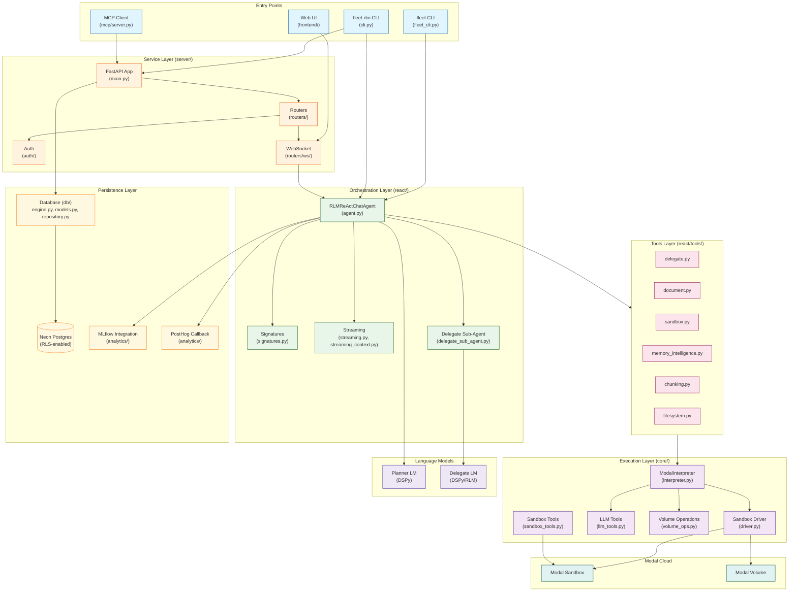
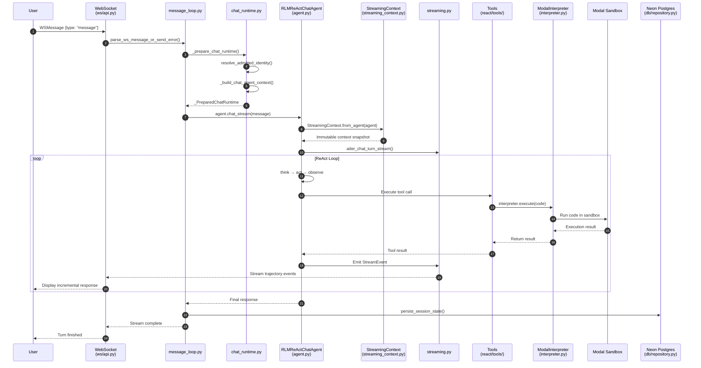
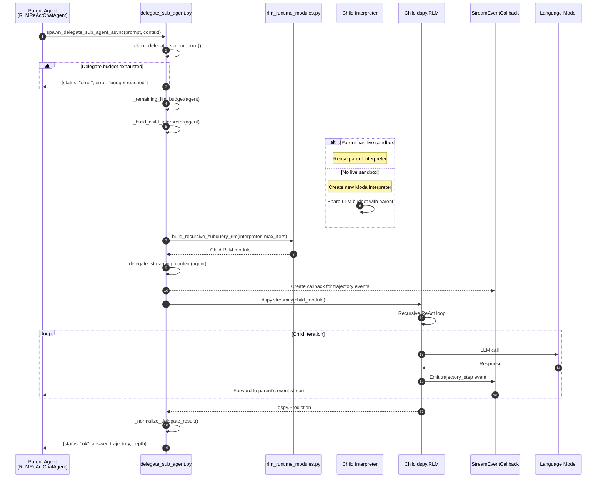
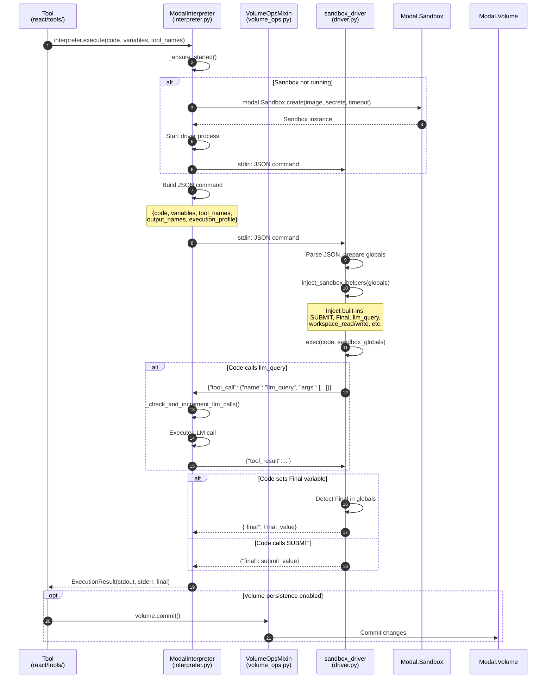

# Architecture Overview

This document describes the maintained architecture for `fleet-rlm`.
The production chat product remains DSPy + Modal + `RLMReActChatAgent`.
The repository now also includes an experimental Daytona-backed strict-RLM pilot under `src/fleet_rlm/daytona_rlm/`.

## Current Runtime Status

- The primary product runtime is still the Modal-backed chat and WebSocket stack described below.
- The Daytona pilot is intentionally isolated from the production Modal stack and does not replace the default Web UI runtime, MCP server, or terminal chat.
- The Web UI now exposes the Daytona pilot through an explicit experimental runtime toggle in `RLM Workspace`; the backend still uses the same `/api/v1/ws/chat` surface and branches by `runtime_mode`, but Daytona mode now renders a dedicated workbench instead of the generic chat transcript.
- The CLI surfaces are now `fleet-rlm daytona-smoke --repo ... [--ref ...]` for native Daytona validation and `fleet-rlm daytona-rlm --repo ... --task ...` for the experimental rollout path.
- The Daytona pilot supports repository clone inputs only, uses a persistent sandbox-side Python driver per sandbox, persists rollout traces to `results/daytona-rlm/`, and resolves credentials explicitly from `DAYTONA_API_KEY`, `DAYTONA_API_URL`, and optional `DAYTONA_TARGET`.
- `fleet-rlm daytona-smoke` is the required first-step validation path and now emits phase-aware diagnostics for config, sandbox bootstrap, driver startup, execution, and cleanup.
- The Daytona pilot now splits cleanly into a guide-native interpreter core and a thin product adapter. The core owns persistent sandbox execution, sandbox-local LM boot, canonical `llm_query` / `llm_query_batched`, typed `SUBMIT`, prompt-object storage, and recursive child sandbox spawning. The adapter owns typed provenance, `child_links`, result persistence, root-only synthesis safety validation, cancellation wiring, and UI event shaping.
- The Daytona pilot helper surface is environment-native: repo inspection and chunking happen inside the persistent sandbox driver via `read_file_slice`, `grep_repo`, `chunk_text`, and `chunk_file`, and long task/observation payloads are externalized there through `store_prompt`, `list_prompts`, and `read_prompt_slice`; the host no longer brokers normal recursive LM delegation.
- The Daytona runtime now performs tree-wide cancellation inside the sandbox path: cancelling the root run stops new recursive work, best-effort terminates reachable descendant sandboxes, and persists warning summaries when some descendants do not shut down cleanly.
- In the Web UI integration, `Modal chat` remains the default runtime. `Daytona pilot` is opt-in, repo-clone-only, and requires `repo_url` plus optional `repo_ref`, `max_depth`, and `batch_concurrency`.

## System Architecture Diagram

The following diagram shows the complete system architecture with all major components and their relationships:



## Entry Points

| Entry Point | Source File | Description |
|-------------|-------------|-------------|
| `fleet` | `src/fleet_rlm/fleet_cli.py` | Primary interactive chat launcher. Supports `fleet web` subcommand for Web UI. |
| `fleet-rlm` | `src/fleet_rlm/cli.py` | Full CLI with `chat`, `serve-api`, `serve-mcp`, `init`, `daytona-smoke`, and experimental `daytona-rlm` commands. |
| Web UI | `src/frontend/` | React/TypeScript frontend served by FastAPI at `http://0.0.0.0:8000`. |
| MCP Server | `src/fleet_rlm/mcp/server.py` | Model Context Protocol server for Claude Desktop integration. |

## Core Layers

### 1. Entry Points Layer

Entry points define how users interact with the system:

- **`fleet_cli.py`**: Lightweight wrapper that provides `fleet` command for terminal chat and `fleet web` for Web UI launch.
- **`cli.py`**: Full Typer-based CLI with subcommands:
  - `chat`: Standalone interactive terminal chat
  - `serve-api`: FastAPI server for HTTP/WebSocket API
  - `serve-mcp`: MCP server for Claude Desktop integration
  - `init`: Bootstrap Claude Code scaffold assets
  - `daytona-smoke`: native Daytona smoke validation for repo clone + driver persistence
  - `daytona-rlm`: Experimental Daytona-backed strict-RLM pilot for repo-scoped tasks

### 2. Orchestration Layer (`react/`)

The orchestration layer manages the ReAct agent loop and streaming:

| Module | Purpose |
|--------|---------|
| `agent.py` | `RLMReActChatAgent` - stateful conversational agent with tool use |
| `signatures.py` | DSPy signature definitions for agent inputs/outputs |
| `streaming.py` | Real-time streaming of chat turns and trajectory events |
| `streaming_context.py` | Context management for streaming sessions |
| `delegate_sub_agent.py` | Spawns child `dspy.RLM` instances for recursive reasoning |
| `commands.py` | Built-in command dispatch (e.g., `/help`, `/reset`) |

### 3. Tools Layer (`react/tools/`)

Tools provide capabilities for the ReAct agent:

| Module | Purpose |
|--------|---------|
| `delegate.py` | Delegates tasks to child RLM agents |
| `document.py` | Document loading and processing |
| `sandbox.py` | Code execution in Modal sandbox |
| `memory_intelligence.py` | Intelligent memory management |
| `chunking.py` | Text chunking for long documents |
| `filesystem.py` | File system operations in sandbox |

### 4. Execution Layer (`core/`)

The execution layer handles remote code execution in Modal:

| Module | Purpose |
|--------|---------|
| `interpreter.py` | `ModalInterpreter` - manages Modal sandbox lifecycle |
| `driver.py` | `sandbox_driver` - executes Python code in sandbox |
| `driver_factories.py` | Factory functions for driver configuration |
| `llm_tools.py` | LLM-backed tools for the sandbox |
| `sandbox_tools.py` | Helper tools for sandbox operations |
| `volume_ops.py` | Modal volume operations for persistence |
| `volume_tools.py` | Tools for volume management |

### 4a. Experimental Daytona Pilot (`daytona_rlm/`)

The Daytona pilot is a separate experimental runtime and is not part of the production chat architecture shown in the diagrams above.

| Module | Purpose |
|--------|---------|
| `types.py` | Rollout budget, execution observations, agent tree nodes, final artifact types |
| `config.py` | Explicit native Daytona env resolution and preflight validation |
| `sandbox.py` | Daytona sandbox lifecycle, repo clone bootstrap, persistent driver execution, and run-controller transport |
| `sandbox_controller.py` | Sandbox-self-orchestrated Daytona node runtime, recursive child spawning, prompt-object handling, and final artifact production |
| `smoke.py` | CLI-first Daytona smoke workflow with phase-aware live diagnostics for sandbox clone + persistent driver validation |
| `runner.py` | Thin host adapter for bootstrap, cancellation, persistence, root synthesis safety checks, and UI event shaping |
| `spawn.py` | Canonical `llm_query` / `llm_query_batched` helpers with bounded fan-out plus compatibility aliases |
| `system_prompt.py` | Guide-first Daytona system prompt construction with compatibility alias notes |
| `results.py` | Persisted JSON rollout traces under `results/daytona-rlm/` |

Important scope notes:

- The pilot is repo-centric for now: `--repo` is required and `--ref` is optional.
- Each root or child node gets a fresh Daytona sandbox session with a persistent Python runtime inside it.
- Repo-analysis helpers are sandbox-native: `read_file_slice`, `grep_repo`, `chunk_text`, and `chunk_file` execute inside that persistent driver and survive across iterations.
- Prompt objects are sandbox-native too: large task and observation payloads are persisted under the Daytona runtime directory, exposed through prompt-handle metadata, and re-read via `read_prompt_slice` instead of being dragged through every LM turn inline.
- Within the pilot, `find_files` remains glob/path discovery and `grep_repo` is the structured content-search helper.
- Recursive `llm_query` / `llm_query_batched` calls are self-orchestrated inside the sandbox runtime and spawn fresh child sandboxes that run the same node controller. `rlm_query` / `rlm_query_batched` remain compatibility aliases only.
- Child execution now uses live session-based bubbling instead of final-result-only hydration: descendant `status`, `tool_call`, `tool_result`, `warning`, and `cancelled` frames are re-emitted upward while the child is still running, and the final result envelope is used for aggregation plus final hydration.
- The public pilot CLI additionally exposes `--max-depth` and `--batch-concurrency` as rollout controls.
- Contributors should run Daytona in this order: set `DAYTONA_API_KEY` + `DAYTONA_API_URL`, run `fleet-rlm daytona-smoke --repo <url>`, inspect any phase-aware diagnostics, then run `fleet-rlm daytona-rlm` only after the smoke path is clean.
- The pilot does not yet replace `ModalInterpreter`, `RLMReActChatAgent`, or the default WebSocket runtime path.
- The pilot remains analysis-first; repo-editing workflows are still out of scope.
- The pilot is much closer to the Daytona DSPy guide now and externalizes large Daytona prompt payloads into sandbox-resident prompt objects, but it still does not fully implement Algorithm 1 because product-wide session/history assembly remains host-managed and prompt externalization is still Daytona-specific.
- The pilot is the repository's narrow reference path for future Daytona-first strict-RLM work.

### 4b. Experimental Daytona Workbench

The Daytona pilot now has a thin WebSocket adapter plus a dedicated analysis-first workbench in `RLM Workspace`.

| Module | Purpose |
|--------|---------|
| `server/schemas/core.py` | Adds `runtime_mode`, `repo_url`, `repo_ref`, `max_depth`, and `batch_concurrency` to websocket message payloads |
| `server/routers/ws/chat_connection.py` | Branches `/api/v1/ws/chat` between default Modal chat and the explicit Daytona pilot path |
| `server/routers/ws/daytona_streaming.py` | Adapts Daytona rollout events into the existing websocket chat event contract |
| `frontend/src/stores/chatStore.ts` | Persists runtime selection and Daytona repo/runtime options in UI state |
| `frontend/src/components/chat/ChatInput.tsx` | Renders the runtime selector and Daytona-only repo/runtime controls |
| `frontend/src/features/rlm-workspace/RlmWorkspace.tsx` | Switches Daytona mode from chat-first rendering to the dedicated workbench body |
| `frontend/src/features/rlm-workspace/daytona-workbench/*` | Dedicated run tree, timeline, node detail, and final artifact workbench state/UI |

Important scope notes:

- The UI toggle is explicit: `Modal chat` vs `Daytona pilot`.
- `execution_mode` still applies only to the default Modal chat path.
- Daytona UI requests are strict-RLM-oriented: the backend calls the real Daytona runner directly, preserves the self-orchestrated sandbox runtime, and renders workbench state from structured run events plus the pilot's `FinalArtifact`.
- The workbench is analysis-first and currently shows:
  - top runtime/task controls and status,
  - a tree-first recursive run tree with live descendant status and warnings,
  - a live selected-node timeline of phases, tool events, and cancellation progress,
  - detail tabs for prompt objects, the selected node, and the final report.

### 5. Service Layer (`server/`)

The service layer provides HTTP and WebSocket APIs:

| Module | Purpose |
|--------|---------|
| `main.py` | FastAPI application factory |
| `routers/runtime.py` | Runtime settings and status endpoints |
| `routers/sessions.py` | Session state management |
| `routers/traces.py` | MLflow trace endpoints |
| `routers/health.py` | Health check endpoints (`/health`, `/ready`) |
| `routers/auth.py` | Authentication endpoints |
| `routers/ws/chat_runtime.py` | WebSocket chat runtime |
| `routers/ws/api.py` | WebSocket API surface |
| `auth/` | Authentication middleware (dev/Entra modes) |

### 6. Persistence Layer

| Component | Purpose |
|-----------|---------|
| `db/engine.py` | Async database engine with connection pooling |
| `db/models.py` | SQLModel definitions for runs, steps, artifacts, memory |
| `db/repository.py` | Repository pattern for database operations |
| `analytics/mlflow_integration.py` | MLflow tracing for DSPy optimization |
| `analytics/posthog_callback.py` | PostHog telemetry callback |

## Data Flow Diagrams

### Chat Turn Flow

This diagram shows the complete flow of a chat turn from user message to response streaming, based on the WebSocket runtime in `src/fleet_rlm/server/routers/ws/`.



**Key Components:**

| Component | Source File | Role |
|-----------|-------------|------|
| `parse_ws_message_or_send_error` | `ws/message_loop.py` | Parse incoming WebSocket JSON into `WSMessage` |
| `_prepare_chat_runtime` | `ws/chat_runtime.py` | Initialize agent with planner LM, delegate LM, repository |
| `StreamingContext` | `react/streaming_context.py` | Immutable snapshot of agent state for event enrichment |
| `aiter_chat_turn_stream` | `react/streaming.py` | Async iterator yielding `StreamEvent` objects |

### RLM Delegation Flow

This diagram shows how parent agents spawn child RLM instances for recursive reasoning, based on `src/fleet_rlm/react/delegate_sub_agent.py`.



**Key Components:**

| Function | Source File | Purpose |
|----------|-------------|---------|
| `spawn_delegate_sub_agent_async` | `react/delegate_sub_agent.py` | Main entry point for delegation |
| `_claim_delegate_slot_or_error` | `react/delegate_sub_agent.py` | Enforce `delegate_max_calls_per_turn` limit |
| `_build_child_interpreter` | `react/delegate_sub_agent.py` | Create or reuse ModalInterpreter for child |
| `build_recursive_subquery_rlm` | `react/rlm_runtime_modules.py` | Construct `dspy.RLM` module with sandbox tools |
| `_delegate_streaming_context` | `react/delegate_sub_agent.py` | Build `StreamingContext` for child depth tracking |

**Depth and Budget Controls:**
- `max_depth`: Maximum recursion depth (default: 2)
- `delegate_max_calls_per_turn`: Maximum delegate calls per parent turn (default: 8)
- `max_llm_calls`: LLM call budget shared between parent and children

### Sandbox Execution Flow

This diagram shows how code execution flows from tool calls through the ModalInterpreter to the sandbox driver, based on `src/fleet_rlm/core/interpreter.py` and `driver.py`.



**JSON Protocol:**

The driver communicates via JSON over stdin/stdout:

**Input command:**

```json
{
  "code": "result = analyze_data(df)\nFinal = result",
  "variables": {"df": {}},
  "tool_names": ["llm_query"],
  "output_names": ["result"],
  "execution_profile": "ROOT_INTERLOCUTOR"
}
```

**Output:**

```json
{
  "stdout": "...",
  "stderr": "",
  "final": {"result": {}}
}
```

**Execution Profiles:**

| Profile | When Used | Tool Exposure |
|---------|-----------|---------------|
| `ROOT_INTERLOCUTOR` | Primary user chat | Full tools + sandbox helpers |
| `RLM_ROOT` | RLM query mode | Full tools + sandbox helpers |
| `RLM_DELEGATE` | Child RLM delegation | Restricted tools, bounded execution |
| `MAINTENANCE` | Administrative tasks | Minimal tools |

**Key Components:**

| Component | Source File | Role |
|-----------|-------------|------|
| `ModalInterpreter` | `core/interpreter.py` | Main interpreter class, manages sandbox lifecycle |
| `sandbox_driver` | `core/driver.py` | Long-lived JSON protocol driver inside sandbox |
| `VolumeOpsMixin` | `core/volume_ops.py` | Volume persistence operations (upload, commit, reload) |
| `ExecutionProfile` | `core/interpreter.py` | Enum controlling sandbox helper/tool exposure |
| `inject_sandbox_helpers` | `core/driver_factories.py` | Inject `SUBMIT`, `Final`, `llm_query`, etc. into sandbox globals |

## API and Streaming Surfaces

- **REST contract source**: `openapi.yaml`
- **WebSocket chat stream**: `/api/v1/ws/chat`
- **WebSocket execution stream**: `/api/v1/ws/execution`

Execution stream events are additive observability and do not replace chat envelopes.

## Configuration

Configuration is managed via Hydra with YAML files in `src/fleet_rlm/conf/`:

- `config.yaml`: Base configuration
- Environment overrides via `key=value` CLI arguments

Key configuration areas:
- `interpreter`: Modal interpreter settings (volume, secrets, timeout)
- `agent`: ReAct agent settings (max iterations, delegate LM)
- `server`: FastAPI server settings (host, port, auth mode)
