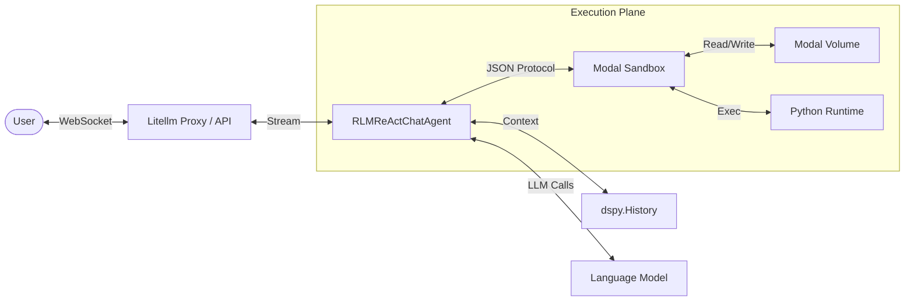
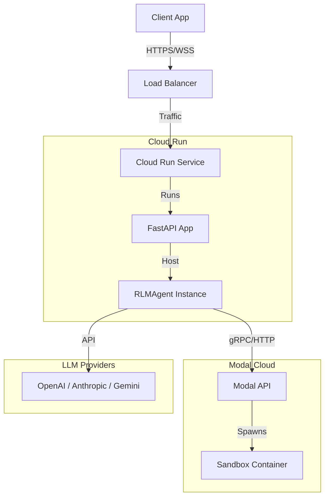
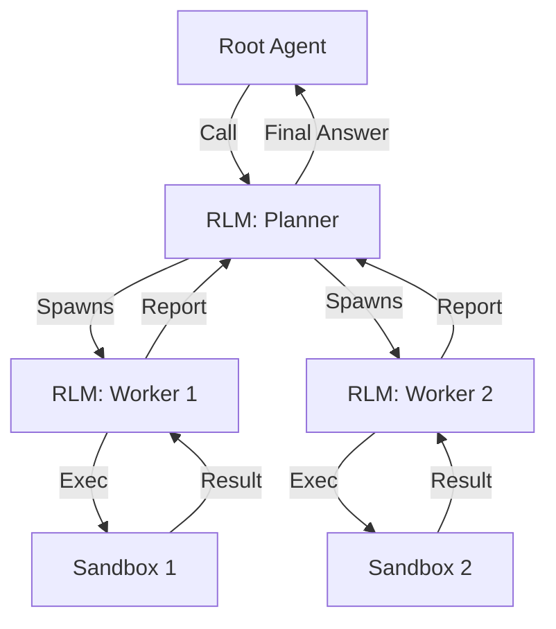

# System Architecture

Visualizing the structural components and relationships within `fleet-rlm`.

## Overview

```
                        ┌─────────────────────────────────────────┐
                        │           Entry Points                  │
                        │                                         │
                        │  CLI   FastAPI  Ink TUI  MCP   Web UI  │
                        │ (Typer)(WS/REST)(bridge)(stdio)(React)  │
                        └────────────┬────────────────────────────┘
                                     │
                        ┌────────────▼────────────────────────────┐
                        │     RLMReActChatAgent (dspy.Module)     │
                        │                                         │
                        │  ReAct Loop ◄── Chat History            │
                        │      │      ◄── Core Memory             │
                        │      │      ◄── Document Cache          │
                        │      │          (Guardrails)            │
                        │      ▼                                  │
                        │  ┌──────────┬──────────┬────────────┐   │
                        │  │ load_doc │ rlm_query│execute_code│   │
                        │  │ read_file│ llm_query│ edit_file  │   │
                        │  │ chunk_*  │(recursive)│ search    │   │
                        │  └────┬─────┴─────┬────┴─────┬──────┘   │
                        └───────┼───────────┼──────────┼──────────┘
                                │           │          │
                        ┌───────▼───────────▼──────────▼──────────┐
                        │         ModalInterpreter                │
                        │    (JSON protocol · exec profiles)      │
                        │   ROOT │ DELEGATE │ MAINTENANCE         │
                        └────────────────┬────────────────────────┘
                                         │ stdin/stdout
                    ─ ─ ─ ─ ─ ─ ─ ─ ─ ─ ┼ ─ ─ ─ ─ ─ ─ ─ ─ ─ ─ ─
                      Modal Cloud        │
                        ┌────────────────▼────────────────────────┐
                        │          Sandbox Driver                 │
                        │   exec() · helpers · tool_call bridge   │
                        │                                         │
                        │   ┌──────────────────────────────────┐  │
                        │   │    Persistent Volume (/data/)    │  │
                        │   │  workspaces/  artifacts/  memory/│  │
                        │   └──────────────────────────────────┘  │
                        └─────────────────────────────────────────┘
```

**Layers at a glance:**

| Layer         | Components                          | Responsibility                                        |
| ------------- | ----------------------------------- | ----------------------------------------------------- |
| Entry Points  | CLI, FastAPI, Ink TUI (bridge), MCP, Web UI (React) | User-facing surfaces — all converge on the same agent |
| Orchestration | `RLMReActChatAgent` + ReAct tools   | DSPy reasoning loop, tool dispatch, history & memory  |
| Execution     | `ModalInterpreter`                  | JSON protocol to sandbox, execution profile gating    |
| Sandbox       | Driver + Volume                     | Isolated Python exec, persistent `/data/` storage     |

## 1. Module Hierarchy

The DSPy module structure of the interactive agent.

```mermaid
graph TD
    Agent[RLMReActChatAgent] -->|wraps| ReAct[dspy.ReAct]
    ReAct -->|uses| Signature[RLMReActChatSignature]
    ReAct -->|calls| Tools[Tool List]

    subgraph "Tools"
        Tools -->|Standard| FS[File System Tools]
        Tools -->|Delegate| RLM[dspy.RLM Wrappers]
        Tools -->|Sandbox| Edit[Edit File / Chunking]
    end

    RLM -->|"uses"| Interpreter[ModalInterpreter]
    Edit -->|uses| Interpreter
```

## 2. Component Architecture

Top-level system components and data flow relative to the user and cloud infrastructure.



## 3. Network Topology

Physical/Network view of the deployment.



## 4. RLM Recursive Structure

How `dspy.RLM` handles complex tasks through recursion.


