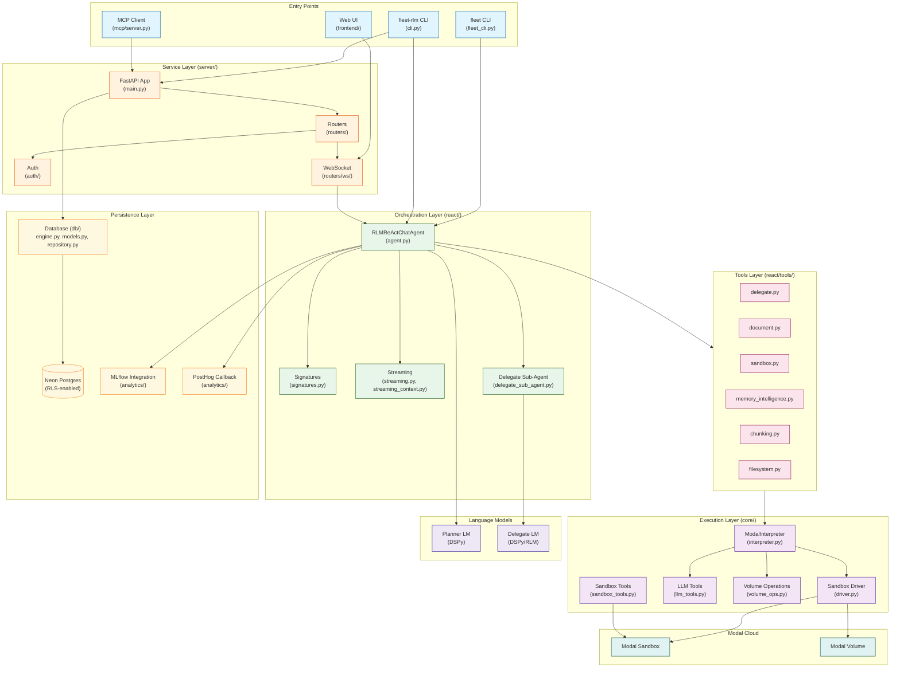
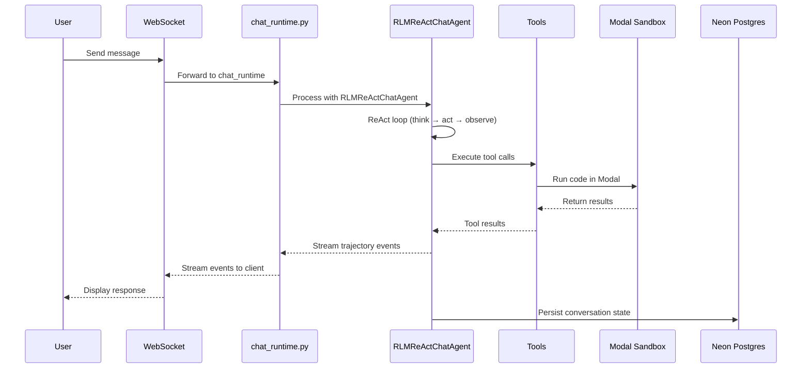
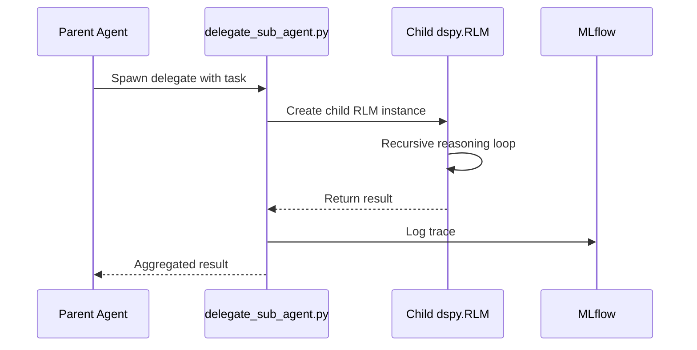
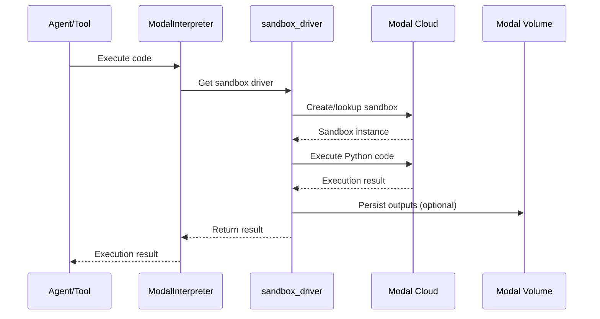

# Architecture Overview

This document describes the maintained architecture for `fleet-rlm`, a Recursive Language Model system built on DSPy and Modal.

## System Architecture Diagram

The following diagram shows the complete system architecture with all major components and their relationships:

## Entry Points

| Entry Point | Source File | Description |
|-------------|-------------|-------------|
| `fleet` | `src/fleet_rlm/fleet_cli.py` | Primary interactive chat launcher. Supports `fleet web` subcommand for Web UI. |
| `fleet-rlm` | `src/fleet_rlm/cli.py` | Full CLI with `chat`, `serve-api`, `serve-mcp`, `init` commands. |
| Web UI | `src/frontend/` | React/TypeScript frontend served by FastAPI at `http://0.0.0.0:8000`. |
| MCP Server | `src/fleet_rlm/mcp/server.py` | Model Context Protocol server for Claude Desktop integration. |

## Core Layers

### 1. Entry Points Layer

Entry points define how users interact with the system:

- **`fleet_cli.py`**: Lightweight wrapper that provides `fleet` command for terminal chat and `fleet web` for Web UI launch.
- **`cli.py`**: Full Typer-based CLI with subcommands:
  - `chat`: Standalone interactive terminal chat
  - `serve-api`: FastAPI server for HTTP/WebSocket API
  - `serve-mcp`: MCP server for Claude Desktop integration
  - `init`: Bootstrap Claude Code scaffold assets

### 2. Orchestration Layer (`react/`)

The orchestration layer manages the ReAct agent loop and streaming:

| Module | Purpose |
|--------|---------|
| `agent.py` | `RLMReActChatAgent` - stateful conversational agent with tool use |
| `signatures.py` | DSPy signature definitions for agent inputs/outputs |
| `streaming.py` | Real-time streaming of chat turns and trajectory events |
| `streaming_context.py` | Context management for streaming sessions |
| `delegate_sub_agent.py` | Spawns child `dspy.RLM` instances for recursive reasoning |
| `commands.py` | Built-in command dispatch (e.g., `/help`, `/reset`) |

### 3. Tools Layer (`react/tools/`)

Tools provide capabilities for the ReAct agent:

| Module | Purpose |
|--------|---------|
| `delegate.py` | Delegates tasks to child RLM agents |
| `document.py` | Document loading and processing |
| `sandbox.py` | Code execution in Modal sandbox |
| `memory_intelligence.py` | Intelligent memory management |
| `chunking.py` | Text chunking for long documents |
| `filesystem.py` | File system operations in sandbox |

### 4. Execution Layer (`core/`)

The execution layer handles remote code execution in Modal:

| Module | Purpose |
|--------|---------|
| `interpreter.py` | `ModalInterpreter` - manages Modal sandbox lifecycle |
| `driver.py` | `sandbox_driver` - executes Python code in sandbox |
| `driver_factories.py` | Factory functions for driver configuration |
| `llm_tools.py` | LLM-backed tools for the sandbox |
| `sandbox_tools.py` | Helper tools for sandbox operations |
| `volume_ops.py` | Modal volume operations for persistence |
| `volume_tools.py` | Tools for volume management |

### 5. Service Layer (`server/`)

The service layer provides HTTP and WebSocket APIs:

| Module | Purpose |
|--------|---------|
| `main.py` | FastAPI application factory |
| `routers/runtime.py` | Runtime settings and status endpoints |
| `routers/sessions.py` | Session state management |
| `routers/traces.py` | MLflow trace endpoints |
| `routers/health.py` | Health check endpoints (`/health`, `/ready`) |
| `routers/auth.py` | Authentication endpoints |
| `routers/ws/chat_runtime.py` | WebSocket chat runtime |
| `routers/ws/api.py` | WebSocket API surface |
| `auth/` | Authentication middleware (dev/Entra modes) |

### 6. Persistence Layer

| Component | Purpose |
|-----------|---------|
| `db/engine.py` | Async database engine with connection pooling |
| `db/models.py` | SQLModel definitions for runs, steps, artifacts, memory |
| `db/repository.py` | Repository pattern for database operations |
| `analytics/mlflow_integration.py` | MLflow tracing for DSPy optimization |
| `analytics/posthog_callback.py` | PostHog telemetry callback |

## Data Flow

### Chat Turn Flow

### RLM Delegation Flow

### Sandbox Execution Flow

## API and Streaming Surfaces

- **REST contract source**: `openapi.yaml`
- **WebSocket chat stream**: `/api/v1/ws/chat`
- **WebSocket execution stream**: `/api/v1/ws/execution`

Execution stream events are additive observability and do not replace chat envelopes.

## Configuration

Configuration is managed via Hydra with YAML files in `src/fleet_rlm/conf/`:

- `config.yaml`: Base configuration
- Environment overrides via `key=value` CLI arguments

Key configuration areas:
- `interpreter`: Modal interpreter settings (volume, secrets, timeout)
- `agent`: ReAct agent settings (max iterations, delegate LM)
- `server`: FastAPI server settings (host, port, auth mode)
