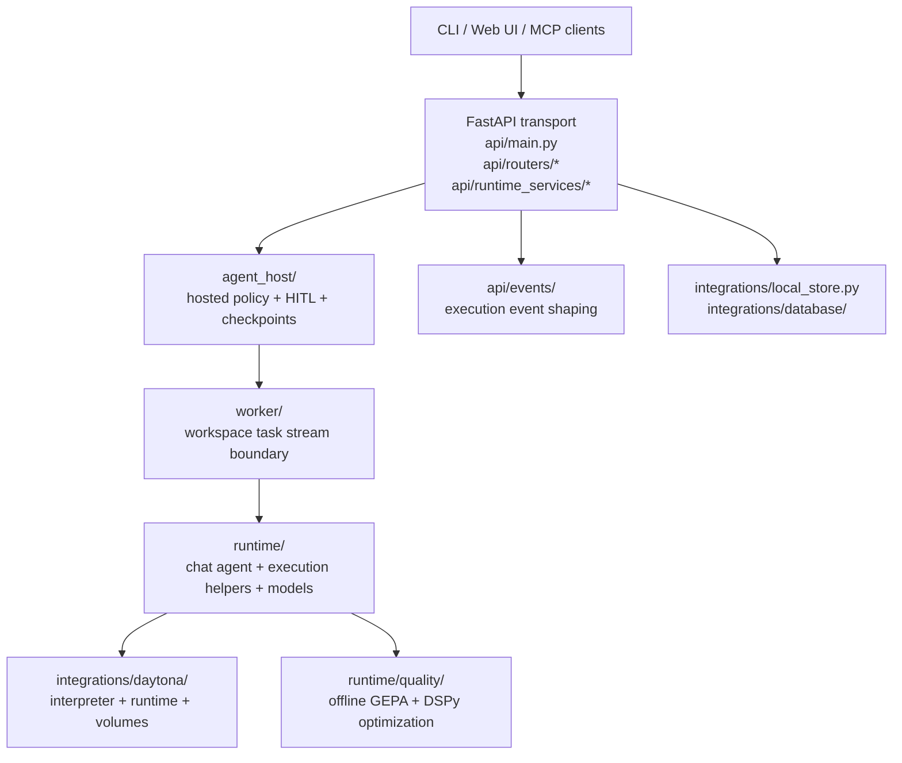

# Architecture Overview

`fleet-rlm` is a Daytona-backed recursive runtime wrapped by a thin transport shell and a narrow hosted-policy layer.

## Current Layering

1. **Thin FastAPI/WebSocket transport** in `src/fleet_rlm/api/`
2. **Narrow but real Agent Framework outer host** in `src/fleet_rlm/agent_host/`
3. **Worker/runtime core** in `src/fleet_rlm/worker/`, `src/fleet_rlm/runtime/`, and `src/fleet_rlm/integrations/daytona/`
4. **Offline evaluation and optimization** in `src/fleet_rlm/runtime/quality/`

## What Each Layer Owns

### 1. Transport

Primary files:

- `src/fleet_rlm/api/main.py`
- `src/fleet_rlm/api/routers/ws/endpoint.py`
- `src/fleet_rlm/api/runtime_services/chat_runtime.py`
- `src/fleet_rlm/api/runtime_services/chat_persistence.py`
- `src/fleet_rlm/api/runtime_services/diagnostics.py`
- `src/fleet_rlm/api/runtime_services/settings.py`
- `src/fleet_rlm/api/runtime_services/volumes.py`

Responsibilities:

- App factory, lifespan, route mounting, and SPA asset serving
- Auth-derived HTTP and websocket identity
- Session lookup, runtime preparation, and service orchestration
- Websocket lifecycle and execution-event envelope delivery
- Runtime settings, diagnostics, and Daytona volume browsing

### 2. Hosted policy

Primary files:

- `src/fleet_rlm/agent_host/workflow.py`
- `src/fleet_rlm/agent_host/hitl_flow.py`
- `src/fleet_rlm/agent_host/terminal_flow.py`
- `src/fleet_rlm/agent_host/checkpoints.py`
- `src/fleet_rlm/agent_host/sessions.py`
- `src/fleet_rlm/agent_host/execution_events.py`
- `src/fleet_rlm/agent_host/repl_bridge.py`
- `src/fleet_rlm/agent_host/startup_status.py`

Responsibilities:

- Hosted Agent Framework workflow around the worker seam
- HITL checkpointing, terminal ordering, and session continuation policy
- Startup-status gating for slow initial turns
- REPL bridge and execution-event coordination around the runtime stream

### 3. Worker/runtime core

Primary files:

- `src/fleet_rlm/worker/streaming.py`
- `src/fleet_rlm/worker/contracts.py`
- `src/fleet_rlm/runtime/factory.py`
- `src/fleet_rlm/runtime/agent/chat_agent.py`
- `src/fleet_rlm/runtime/agent/recursive_runtime.py`
- `src/fleet_rlm/runtime/execution/*`
- `src/fleet_rlm/runtime/models/*`

Responsibilities:

- Shared chat/runtime execution
- Recursive delegation and tool execution
- Execution-event assembly and workbench hydration inputs
- Runtime model assembly and registry management

### 4. Daytona substrate

Primary files:

- `src/fleet_rlm/integrations/daytona/interpreter.py`
- `src/fleet_rlm/integrations/daytona/runtime.py`
- `src/fleet_rlm/integrations/daytona/runtime_helpers.py`
- `src/fleet_rlm/integrations/daytona/volumes.py`
- `src/fleet_rlm/integrations/daytona/diagnostics.py`

Responsibilities:

- Sandbox and interpreter lifecycle
- Repo checkout, workspace path staging, and durable mounted volumes
- Provider-specific diagnostics and volume normalization

### 5. Offline quality

Primary files:

- `src/fleet_rlm/runtime/quality/*`

Responsibilities:

- DSPy evaluation
- GEPA optimization
- Offline scoring, datasets, and module registry management

## Canonical Runtime Surfaces

- `/health`
- `/ready`
- `GET /api/v1/auth/me`
- `GET /api/v1/sessions/state`
- `GET /api/v1/sessions`
- `GET /api/v1/sessions/{id}`
- `GET /api/v1/sessions/{id}/turns`
- `DELETE /api/v1/sessions/{id}`
- `POST /api/v1/sessions/{id}/export`
- `GET /api/v1/runtime/settings`
- `PATCH /api/v1/runtime/settings`
- `POST /api/v1/runtime/tests/daytona`
- `POST /api/v1/runtime/tests/lm`
- `GET /api/v1/runtime/status`
- `GET /api/v1/runtime/volume/tree`
- `GET /api/v1/runtime/volume/file`
- `GET /api/v1/optimization/status`
- `POST /api/v1/optimization/run`
- `GET /api/v1/optimization/modules`
- `POST /api/v1/optimization/runs`
- `GET /api/v1/optimization/runs`
- `GET /api/v1/optimization/runs/{run_id}`
- `GET /api/v1/optimization/runs/{run_id}/results`
- `GET /api/v1/optimization/runs/compare`
- `POST /api/v1/optimization/datasets`
- `GET /api/v1/optimization/datasets`
- `GET /api/v1/optimization/datasets/{dataset_id}`
- `/api/v1/ws/execution`
- `/api/v1/ws/execution/events`

## Reading Order

When you need the current backend story, start here:

1. `src/fleet_rlm/api/main.py`
2. `src/fleet_rlm/api/routers/ws/endpoint.py`
3. `src/fleet_rlm/agent_host/workflow.py`
4. `src/fleet_rlm/worker/streaming.py`
5. `src/fleet_rlm/runtime/factory.py`
6. `src/fleet_rlm/runtime/agent/chat_agent.py`
7. `src/fleet_rlm/integrations/daytona/interpreter.py`
8. `src/fleet_rlm/integrations/daytona/runtime.py`

## Historical Note

Older transition notes may still mention `orchestration_app/` and `api/orchestration/`. Those labels are historical only and are intentionally absent from the current tree.
