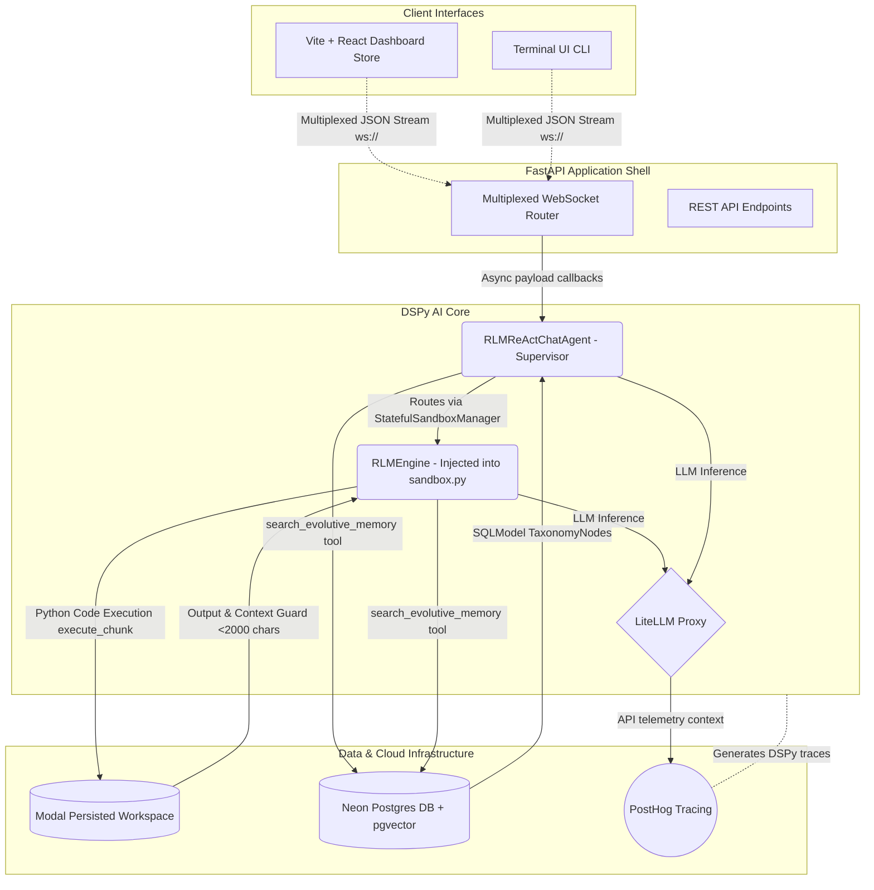

# System Component Diagram (Surgical Integration)

This artifact maps the master architecture of the `fleet-rlm` project, visualizing how the separate client, backend, and infrastructure layers communicate through the DSPy components using the new Surgical integration method.

## Macro Architecture

