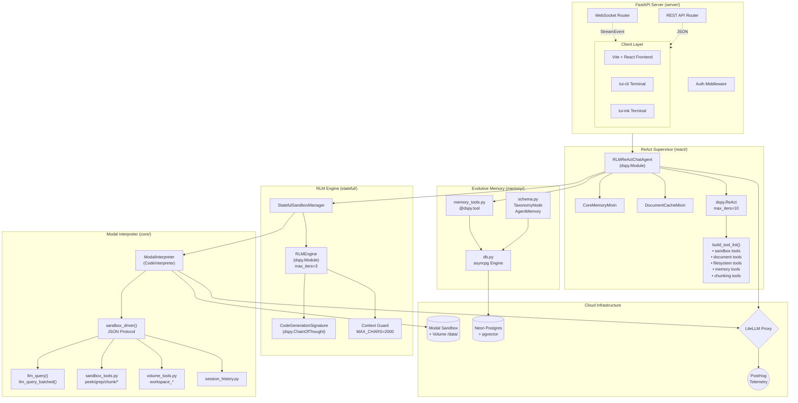
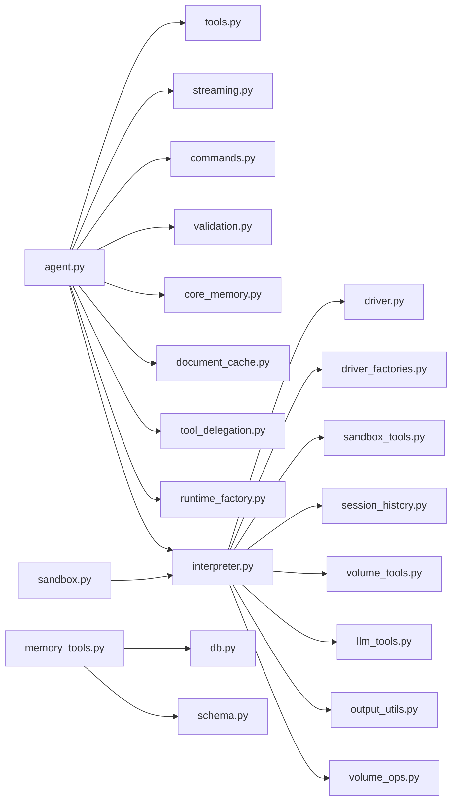

# Architecture Diagram: fleet-rlm v0.5 (Hyper-Advanced)

## Full System Topology

## Module Dependency Graph

## Data Flow Layers

| Layer                | Component                   | Protocol               | Data                            |
| :------------------- | :-------------------------- | :--------------------- | :------------------------------ |
| **L1 - Client**      | React / TUI                 | WebSocket JSON         | `StreamEvent` typed payloads    |
| **L2 - API**         | FastAPI                     | HTTP / WS              | REST endpoints + WS stream      |
| **L3 - Supervisor**  | `RLMReActChatAgent`         | DSPy Module call       | `dspy.Prediction`               |
| **L4 - RLM**         | `RLMEngine` in `sandbox.py` | Internal Python        | `SandboxResult`                 |
| **L5 - Interpreter** | `ModalInterpreter`          | JSON over stdin/stdout | Code + tool_call payloads       |
| **L6 - Sandbox**     | Modal Container             | Python `exec()`        | Globals dict + `SUBMIT`/`Final` |
| **L7 - Storage**     | Neon + Modal Volume         | SQL / Filesystem       | Embeddings + workspace files    |
