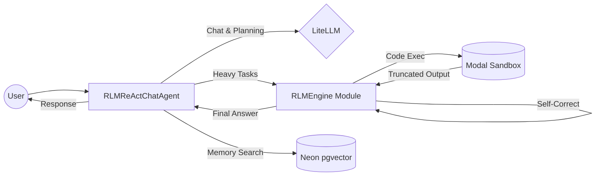

# fleet-rlm: Concept Document

## Vision

**fleet-rlm** is a production-grade Recursive Language Model (RLM) system that fuses the conversational intelligence of a ReAct Supervisor with the deep execution power of a self-correcting code generation engine, backed by persistent cloud infrastructure and long-term semantic memory.

## Core Principles

### 1. Separation of Concerns (Dual-Loop Architecture)

The system separates **conversational reasoning** from **deep code execution**. A `dspy.ReAct` Supervisor handles user interaction, planning, and tool selection. When engineering work is needed, it delegates to an `RLMEngine` that recursively writes, executes, and self-corrects Python code inside an isolated Modal sandbox.

### 2. Context Window Sovereignty

Context rot is the #1 failure mode of long-running LLM agents. fleet-rlm enforces strict truncation guards (`MAX_CHARS=2000`) at the execution layer, combined with metadata-only stdout history compression. The RLM is forced to write efficient, filtering code rather than dumping raw data.

### 3. Stateful Persistence

Unlike ephemeral sandbox environments (Deno/WASM, Docker), fleet-rlm uses **Modal Volumes** that persist across sessions. Files written in iteration N=1 survive to iteration N=100 and beyond server restarts. Combined with **Neon pgvector** for semantic memory, the system accumulates knowledge over time.

### 4. DSPy-Native Composability

Every component is a `dspy.Module` subclass, making the entire system optimizable by `BootstrapFewShot`, `MIPROv2`, and `GEPA` (Genetic Evolutionary Prompt Assembly), and serializable via `save()`/`load()`. Tools are registered via `@dspy.tool` decorators, ensuring clean integration with the DSPy ecosystem.

## Architecture Summary

## Target Users

- **AI Engineers** building production agent systems that need reliable code execution
- **Research Teams** evaluating RLM architectures against benchmarks
- **Product Teams** needing a visible, debuggable AI backend with real-time UI telemetry
- **Non-Technical Users** who benefit from fleet-rlm's native web UI — no terminal or CLI knowledge required to interact with the full power of the RLM agent through a polished, accessible browser dashboard
