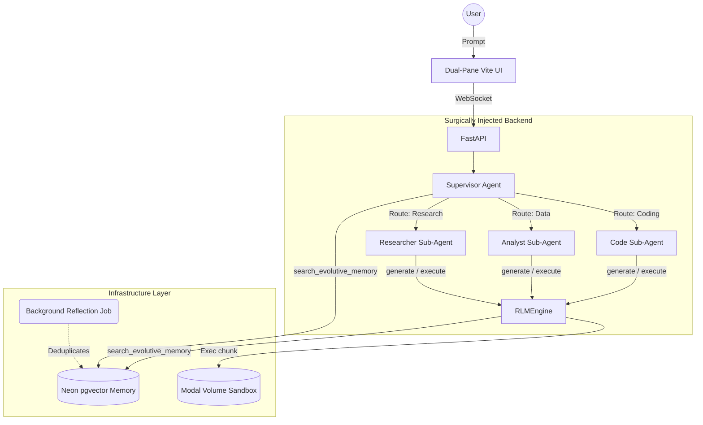

# Fleet-RLM Phase 6-8: Evolution Design

This document covers the architectural design, feature matrix, user flows, and industry comparison for the advanced orchestration and memory hardening phases of the project.

---

## 🚀 Features (Phases 6-8)

1. **Multi-Agent Orchestration (Supervisor & Sub-Agents)**
   - Recursive delegation of complex intents to hyper-specialized sub-agents.
   - Reduced token cost and decreased hallucination (smaller prompts, narrow scope).
2. **Evolutive Memory Hardening & Hybrid Search**
   - Combining Neon `pgvector` with Postgres boolean full-text search for exact-match accuracy plus semantic recall.
   - Background "Reflection Worker" periodically deduplicates raw observations into consolidated "rules" (Taxonomy Nodes).
3. **Advanced Frontend Workspace & Visualizations**
   - Interactive Mermaid diagrams mapping live agent actions and generated memory.
   - Rich block execution view in the workspace rendering interactive Python results straight from the backend Modal environment.
4. **Tool Expansion**
   - Scalable web-scraping tool and local deep-dataset chunked analysis tools, heavily guarded by input/output size constraints.

---

## 📊 RLM Framework Comparison Matrix

How does the evolved **Fleet-RLM** stack up against other modern Recursive Language Model architectures for handling ultra-long contexts and code execution?

| Feature / Framework         | Fleet-RLM (DSPy + Modal + Neon)      | DSPy RLM (Standalone)       | PrimeIntellect (Verifiers)    | Daytona RLM Architecture       |
| :-------------------------- | :----------------------------------- | :-------------------------- | :---------------------------- | :----------------------------- |
| **Execution Environment**   | ✨ Native Cloud Sandboxing (Modal)   | Local WASM (Deno/Pyodide)   | Cloud Sandboxes               | Daytona Workspaces             |
| **Core Architecture**       | DSPy ReAct Supervisor + RLM Engine   | Iterative REPL Loop         | Context Folding via variables | Deep Recursive Agents          |
| **Context Management**      | ✨ Evolutive Vector DB (pgvector)    | REPL Variable Space         | Diffusion & Sub-LLM offload   | Sub-Agent Result Aggregation   |
| **Code Execution Strategy** | Direct `exec()` with Context Guards  | `SUBMIT()` via exploration  | Output via `answer` dict      | Parallel REPLs in fresh clones |
| **Tool Usage Scope**        | Guarded execution + Evolutive Memory | Basic Sub-LLM (`llm_query`) | Sub-LLMs exclusively          | Full system commands           |
| **Frontend Integration**    | ✨ Multiplexed SSE React Dashboard   | None (Code-level execution) | None (Research focused)       | None (CLI focused)             |

---

## 🏗 Diagram Architecture (Multi-Agent RLM)

---

## 🌊 User Flow

1. **User Request**: The user submits a highly complex, multi-step prompt, e.g., _"Analyze my CRM database schema, write an external API wrapper, and test it."_
2. **Supervisor Delegation**: The `Supervisor Agent` realizes this is too big for one pass. It spins up an `Analyst Sub-Agent` to query `search_evolutive_memory` to learn what the schema is.
3. **Task Handoff**: The Analyst writes a summary. The Supervisor kills the Analyst and hands the summary to the `Code Sub-Agent`.
4. **Execution Loop**: The Code Sub-Agent enters the `RLMEngine` loop, executing Python in the Modal Sandbox, iteratively fixing errors with its 2000-character stdout context limit.
5. **Memory Deposition**: Upon success, a rule is crystallized and sent to the Neon DB.
6. **Frontend Synchronization**: Throughout this, the frontend UI is instantly updating its Dual-Pane view via TanStack queries, showing bouncing sub-agent avatars and real-time execution blocks.

---

## 📖 User Stories

### User Story 1: The Context Deduplication

> **As an** Orchestrator Agent dealing with an aging project,  
> **I want** a background worker to consolidate redundant memory entries,  
> **So that** when I search my memory index to find the user's coding style guidelines, I don't retrieve five identical fragments and waste tokens.

### User Story 2: The Multi-Agent Specialization

> **As a** Developer using the TUI/Frontend,  
> **I want** to see my complex task automatically broken into a Research pass and an Execution pass,  
> **So that** I know the system isn't trying to blindly write code without first fully understanding the constraints.

### User Story 3: The Hybrid Search Necessity

> **As a** specialized Sub-Agent,  
> **I want** to query my memory for an exact string match on a library function `init_database_pool_v3` rather than just semantic closeness,  
> **So that** I don't accidentally hallucinate an old `v2` implementation.
