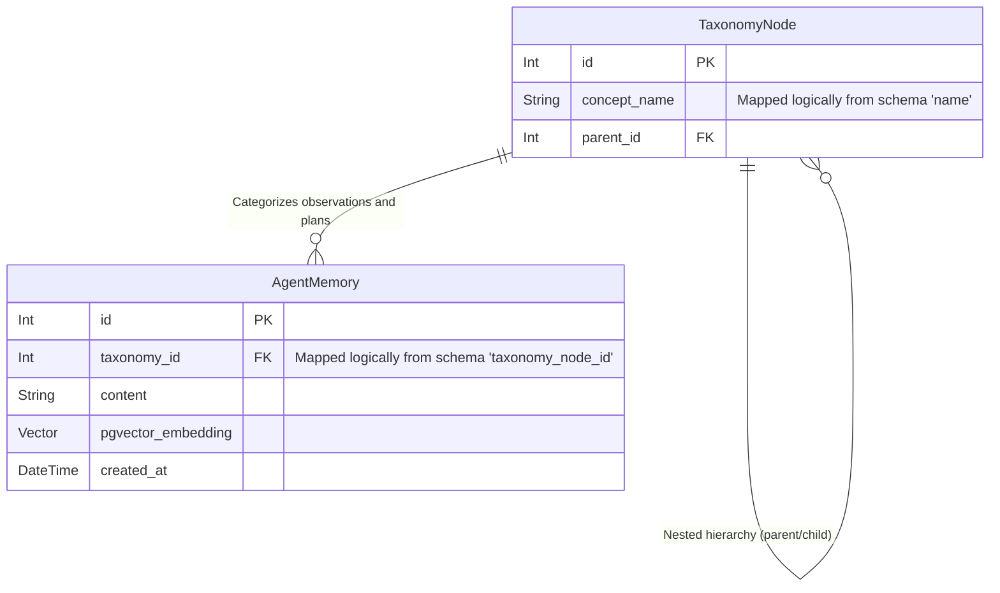

# Evolutive Memory Schema

This artifact models the stateful storage of the Neon PostgreSQL database utilizing `pgvector` and `SQLModel`. This constitutes the agent's long-term evolutive memory, allowing the RLM Worker to retain and retrieve complex context over time.

## Entity-Relationship Diagram (ERD)

## Memory Write Flow

**How the RLMEngine records evolutive memory:**

1. **Evaluation of Success:** After the RLM successfully completes a task or discovers a novel programming solution (a "coding trick") within the Modal Workspace, the `Context_Evaluation` state identifies this execution block as highly valuable.
2. **Context Summarization:** The ReAct Supervisor instructs the RLM to compress its successful source code and textual reasoning into a concise Markdown summary.
3. **Vector Generation:** The RLM calls the internal `LiteLLM Proxy` (acting as the unified gateway). LiteLLM passes the summary string to the underlying embedding model (e.g., `text-embedding-3-small`), which returns a 1536-dimensional float array.
4. **Taxonomy Linking:** The Supervisor queries the `TaxonomyNode` tree. If the coding trick belongs to an existing concept (e.g., "Pandas Dataframe Optimizations"), it retrieves that node's `id`. If the concept is entirely original, the agent executes an `INSERT` to create a brand new `TaxonomyNode`.
5. **Database Persistence:** Using `asyncpg`, the Supervisor instantiates an `AgentMemory` record containing the summary `content`, the `pgvector_embedding`, and the corresponding `taxonomy_id`, writing it durably to the Neon DB. This permanently expands the architecture's intelligent repertoire for future queries.
