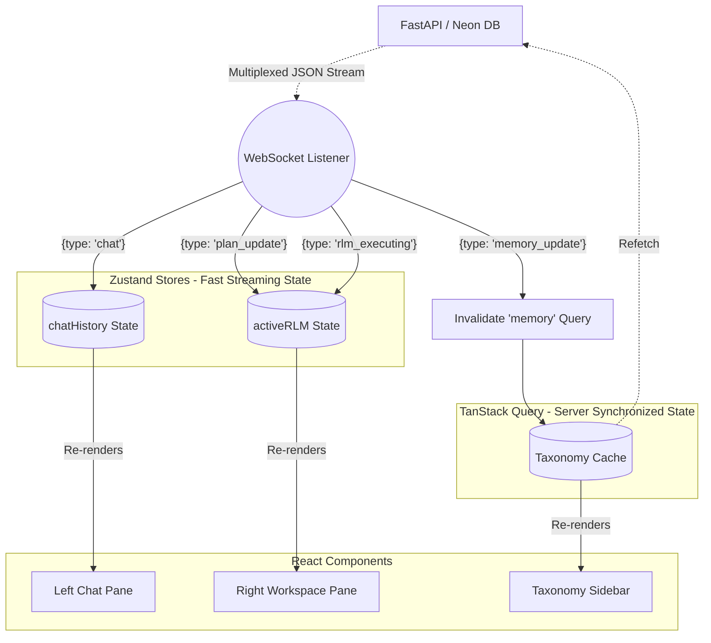

# Frontend State Flow Diagram (Surgical Integration)

This artifact maps the frontend reactivity paradigm. It illustrates how the React dashboard handles rapid AI execution data (using Zustand for fast, transient state) while retaining persistent structural data (using TanStack Query for robust Neon DB synchronization).

## React UI Data & Event Flow

