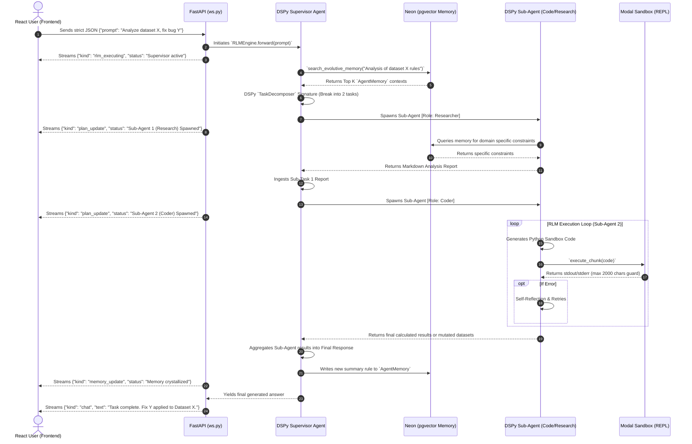

# Phase 6: Multi-Agent Sequence Diagram

This artifact provides a deep-dive sequence diagram for the **Multi-Agent Orchestration** flow introduced in Phase 6. It illustrates how the DSPy Supervisor routes intents, manages the lifecycle of Sub-Agents, interacts with the Neon Evolutive Memory, and streams updates back to the original React WebSocket client.

## 🌊 Execution Sequence



## Protocol Specifications

### Multiplexed WebSocket Payloads

As seen in the sequence above, the backend utilizes multiplexed JSON via SSE/WebSockets to communicate state transitions to the Zustand stores.

**1. `rlm_executing`**
Fired when a major agentic loop begins or shifts focus.

```json
{
  "kind": "rlm_executing",
  "text": "Supervisor actively delegating to Analyst Sub-Agent...",
  "depth": 0
}
```

**2. `plan_update`**
Fired specifically when the DSPy `TaskDecomposer` mutates its internal state list of pending/completed tasks.

```json
{
  "kind": "plan_update",
  "tasks": [
    "Research schema (Done)",
    "Write API wrapper (In Progress)",
    "Run tests (Pending)"
  ]
}
```

**3. `memory_update`**
Fired right before closing the loop, triggering TanStack `invalidateQueries` on the frontend.

```json
{
  "kind": "memory_update",
  "memory_id": "uuid-1234",
  "action": "crystallized"
}
```
