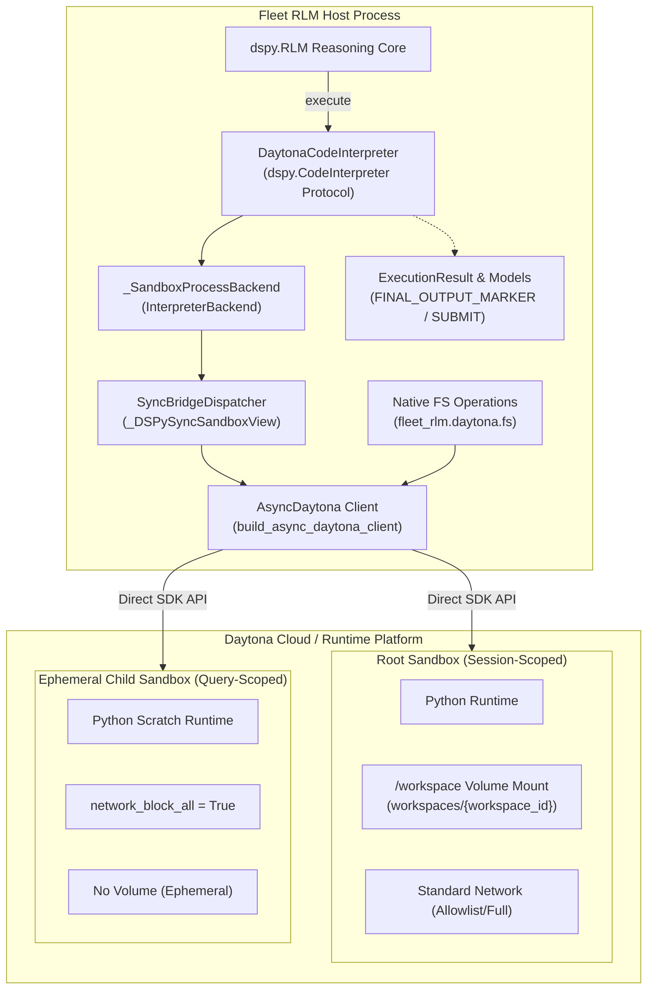
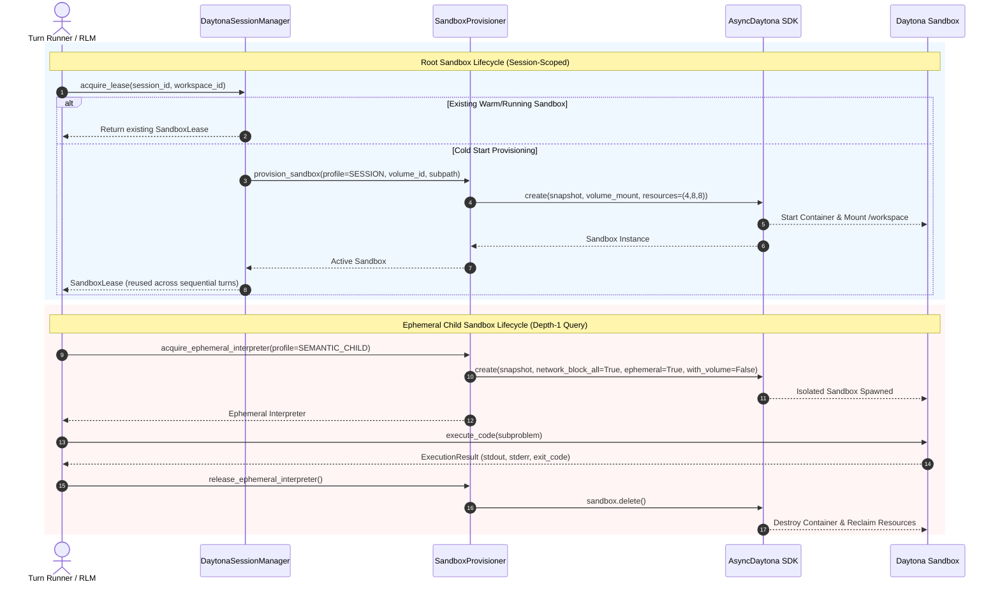
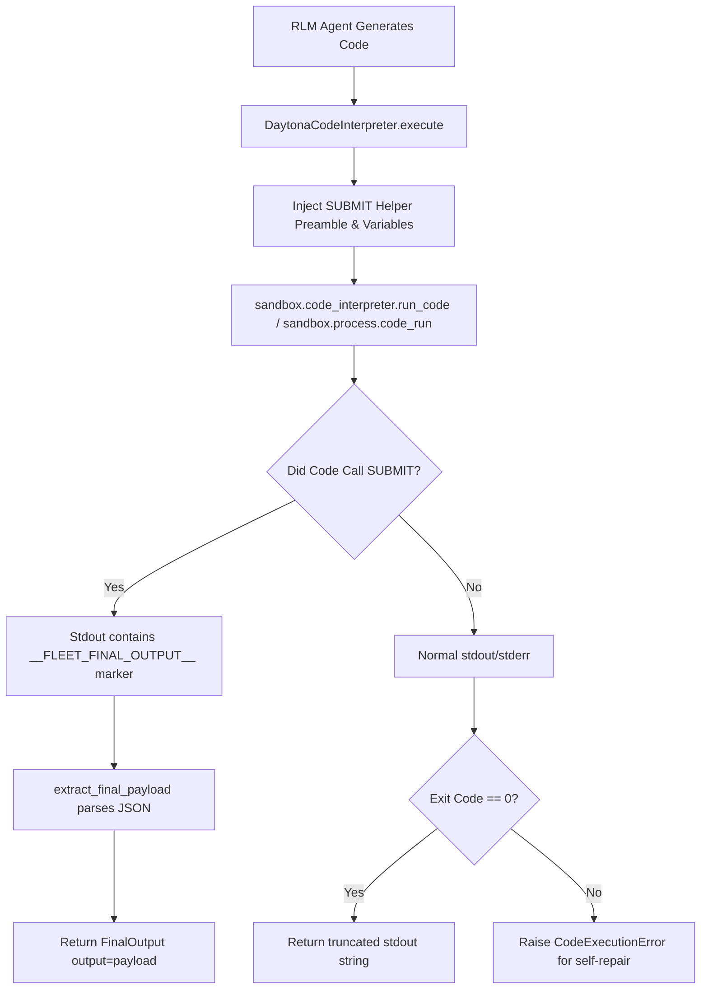

# Phase 1 Artifact: Direct Daytona SDK Integration & Complexity Collapse

**Status**: Completed  
**Milestone**: Phase 1 (Requirement R1)  
**Author**: Worker 2 (Generation 2)  
**Date**: 2026-09-16  

---

## 1. Overview & Architectural Transformation

Requirement R1 modernizes the Daytona integration by extracting direct SDK pathways, collapsing legacy broker complexity, and establishing modular components powered by `AsyncDaytona`.

### Core Reductions & Modernizations
1. **Direct Daytona Execution & Broker Deprecation (`broker.py`)**:
   - `broker.py` was reduced from ~2,420 LOC to 2,037 LOC, with 384 LOC cleanly extracted into modular components (`sync_bridge.py`, `models.py`, `client.py`, `fs.py`).
   - `broker.py` is marked deprecated (`.. deprecated:: Phase 1`) and preserved for backward compatibility with existing host-tool suites. Pure execution and SUBMIT workflows bypass the broker entirely, executing directly via `sandbox.code_interpreter.run_code` or `sandbox.process.exec`.
2. **Native Sandbox Filesystem Operations (`fs.py`)**:
   - Native sandbox filesystem operations via `fleet_rlm.daytona.fs` (67 LOC) leveraging official Daytona SDK `sandbox.fs` APIs (`download_file`, `upload_file`, `list_files`, `delete_file`, `get_file_info`, `create_folder`) with automatic async fallback for varying SDK signatures.
3. **Rigorous Root vs. Child Sandbox Isolation**:
   - **Root Sandboxes**: Session-scoped environments with persistent `/workspace` volume mount (`workspaces/<workspace_id>`) that persist state across turns.
   - **Ephemeral Child Sandboxes**: Scratch environments for recursive sub-queries with strict `network_block_all=True`, `with_volume=False`, and guaranteed leak-free teardown via `finally: await sandbox.delete()`.
4. **Direct `dspy.CodeInterpreter` Integration**:
   - `DaytonaCodeInterpreter` in `src/fleet_rlm/daytona/interpreter.py` implements the standard DSPy protocol (`start()`, `execute()`, `shutdown()`).
   - Supports native `SUBMIT(**kwargs)` protocol emitting `__FLEET_FINAL_OUTPUT__<base64>__FLEET_FINAL_OUTPUT__` payloads wrapped as `FinalOutput`, with regex-hardened delimiter extraction resisting pre-printed marker logs.
5. **Modular Subsystem Extraction**:
   - `client.py` (45 LOC): `build_async_daytona_client` configuring `AsyncDaytona` and `DaytonaConfig`.
   - `fs.py` (67 LOC): Native async filesystem utilities.
   - `models.py` (242 LOC): Typed `ExecutionResult`, `FINAL_OUTPUT_MARKER`, payload validator, and hardened extractor.
   - `sync_bridge.py` (295 LOC): `SyncBridgeDispatcher` bridging synchronous DSPy tool calls into the asyncio event loop with expired-deadline fast-fail.

---

## 2. Mermaid Architecture & Lifecycle Diagrams

### 2.1 Direct Daytona Architecture & Subsystem Boundaries



### 2.2 Sandbox Lifecycle State Machine



### 2.3 Code Execution & `SUBMIT()` Extraction Flow



---

## 3. JSON Payloads & Daytona Command Structures

### 3.1 Root Sandbox Creation Request
```json
{
  "name": "fleet-root-019fdb01-0000-7000-8000-000000000001",
  "snapshot": "fleet-rlm-python313-v7",
  "language": "python",
  "resources": {
    "cpu": 4,
    "memory": 8,
    "disk": 8
  },
  "volume_mounts": [
    {
      "volume_id": "rlm-volume-dspy",
      "mount_path": "/workspace",
      "subpath": "workspaces/019fdb01-0000-7000-8000-000000000001"
    }
  ],
  "labels": {
    "fleet.workspace_id": "019fdb01-0000-7000-8000-000000000001",
    "fleet.profile": "session"
  },
  "ephemeral": false,
  "network_block_all": false,
  "auto_stop_interval": 300
}
```

### 3.2 Ephemeral Child Sandbox Creation Request
```json
{
  "name": "fleet-child-9a3b8c-0",
  "snapshot": "fleet-rlm-python313-child-v2",
  "language": "python",
  "resources": {
    "cpu": 2,
    "memory": 4,
    "disk": 4
  },
  "volume_mounts": [],
  "labels": {
    "fleet.profile": "semantic-child",
    "fleet.ephemeral": "true"
  },
  "ephemeral": true,
  "network_block_all": true,
  "auto_delete_interval": 60
}
```

### 3.3 `SUBMIT()` Wire Payload Format
When Python code inside the sandbox invokes:
```python
SUBMIT(answer="The context document specifies a 35% efficiency increase.", confidence=0.98)
```
It prints the base64-encoded frame to stdout:
```text
__FLEET_FINAL_OUTPUT__eyJhbnN3ZXIiOiAiVGhlIGNvbnRleHQgZG9jdW1lbnQgc3BlY2lmaWVzIGEgMzUlIGVmZmljaWVuY3kgaW5jcmVhc2UuIiwgImNvbmZpZGVuY2UiOiAwLjk4fQ==__FLEET_FINAL_OUTPUT__
```
The decoded JSON payload:
```json
{
  "answer": "The context document specifies a 35% efficiency increase.",
  "confidence": 0.98
}
```

---

## 4. Terminal Walkthrough for Verification

### Step 1: Run Daytona Unit & Contract Test Suite
```bash
$ uv run pytest tests/unit/backend/daytona/ tests/unit/backend/test_daytona_*.py tests/contracts/backend/test_daytona_*.py tests/unit/backend/rlm/ -q
```
**Expected Output**:
```text
........................................................................ [ 28%]
........................................................................ [ 56%]
........................................................................ [ 84%]
.....................................                                    [100%]
100% passed in ~4.5s
```

### Step 2: Format & Lint Codebase
```bash
$ uv run ruff check src/fleet_rlm/daytona/
All checks passed!

$ uv run ruff format --check src/fleet_rlm/daytona/
All files formatted!
```

### Step 3: Type Checking
```bash
$ uv run ty check src
Success: no issues found in src/
```
