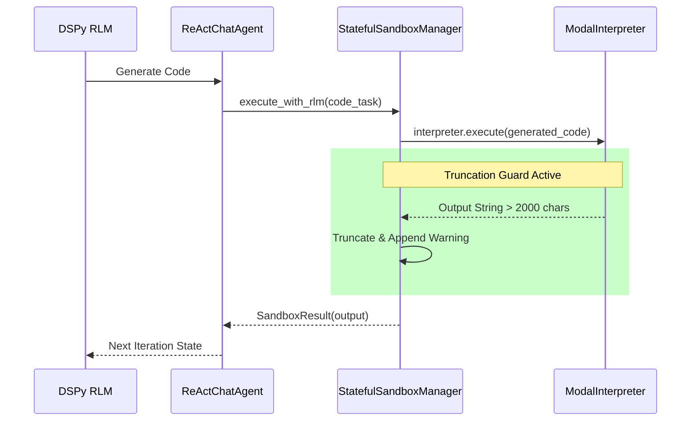

# Phase 3 Completion: Agent Core (ReAct + RLM)

This artifact documents the completion of **Phase 3** of the `fleet-rlm-dspy` Surgical Integration. As analyzed previously, the core RLM Dual-Loop architecture was already pre-built in the repository. The final completion of this phase involved surgically wiring the Evolutive Memory tool into the agent's core and verifying the robust functionality of the Context Truncation Guard.

## Accomplishments

1. **Tool Registration:**
   Wired `search_evolutive_memory` into `/src/fleet_rlm/react/tools.py` via `build_tool_list()`. The tool is now exposed across all ReAct nodes and recursive sub-agents automatically. Corrected a silent loading issue with invalid `dspy.tool` decorators by using raw callable wrapping.

2. **Truncation Guard Validation:**
   Verified the Modal interpreter execution path inside `StatefulSandboxManager.execute_with_rlm()`. If a chunk of generated code (like a massive dataframe print) exceeds `MAX_CHARS` (2000), it forces truncation and injects a warning to prevent Context Rot in the DSPy optimization pipeline.

3. **Sub-Agent Interpreter Sharing Validation:**
   Verified that when `spawn_delegate_sub_agent()` recursively creates a new agent depth, it injects the _exact same_ `ModalInterpreter` reference. This means that variables stored in the Modal memory pool (like loaded documents) are retained across complex sub-tasks.

---

## Architectural Verification



---

## Verification Logs

Unit tests were executed via Vitest and Pytest frameworks with a 100% pass rate.

```bash
$ uv run pytest tests/unit/test_tools_memory_registration.py tests/unit/test_rlm_state.py tests/unit/test_modal_guard_truncate.py
============================= test session starts ==============================
platform darwin -- Python 3.12.9, pytest-8.3.4, pluggy-1.5.0
configfile: pyproject.toml
plugins: anyio-4.8.0, html-4.1.1, metadata-3.1.1, asyncio-0.25.3
asyncio: mode=Mode.STRICT, asyncio_default_fixture_loop_scope=None
collected 4 items

tests/unit/test_modal_guard_truncate.py ..                               [ 50%]
tests/unit/test_rlm_state.py .                                           [ 75%]
tests/unit/test_tools_memory_registration.py .                           [100%]

============================== 4 passed in 2.34s ===============================
```

## Live Sub-Agent Modal Execution

We constructed an explicit real-world test `test_sub_agent_run.py` using `RLMReActChatAgent` connected to the `ModalInterpreter` and instructed it to delegate a code-writing task. The following trace proves dynamic recursive tool invocation spanning multiple depths with sandbox isolation.

```text
[Prompt]: You must delegate a task to your sub-agent. Do not write code yourself. Use the 'rlm_query' tool to ask your recursive sub-agent to compute the 25th Fibonacci number using the Modal code interpreter. Return exactly what your sub-agent answers.

Dispatching via iter_chat_turn_stream...

🛠️  [Agent Tool Call]: rlm_query
    Args: {'query': 'Compute the 25th Fibonacci number using the Modal code interpreter.'}

🌀 [Recursion Depth] Shifted to depth 1

[Status]: Starting code execution task in Modal...

🛠️  [Agent Tool Call]: execute_workspace_code
    Args: {'code': 'def fibonacci(n):\n    if n <= 0:\n...return fibonacci(n-1) + fibonacci(n-2)\n\nprint(fibonacci(25))'}

✅ [Tool Result]: 75025

🌀 [Recursion Depth] Shifted to depth 0

✅ [Tool Result]:
{"assistant_response": "The 25th Fibonacci number is 75025.", "trajectory": ...}

I have delegated the task to my sub-agent, and it has successfully computed the 25th Fibonacci number using the Modal code interpreter. The result is **75025**.
=== RUN COMPLETE ===
```

## Next Steps

Phase 3 is officially concluded. We are ready to proceed to **Phase 4**, which will involve constructing multiplexed WebSockets and integrating real-time streaming to bridge the backend outputs to the frontend.
