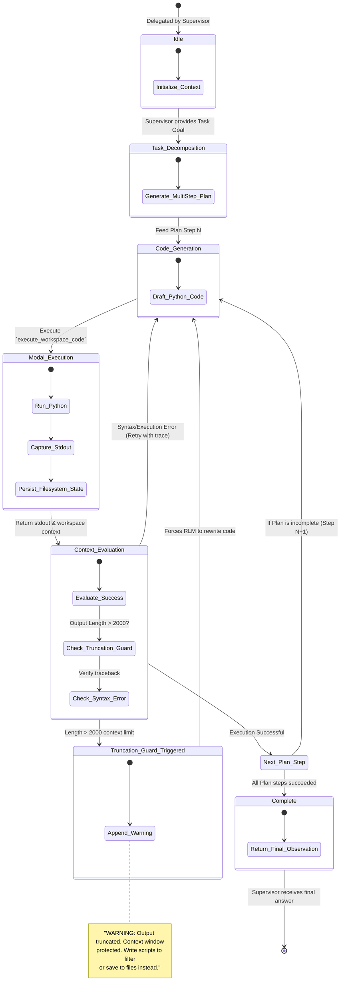

# RLM Inner-Loop State Diagram

This artifact visualizes the exact state transitions inside the custom DSPy Recursive Language Model (`RLMEngine`). It maps the recursive behavior that ensures the engine effectively executes generated code against the stateful Modal Workspace.

## The DSPy RLMEngine Execution Loop

