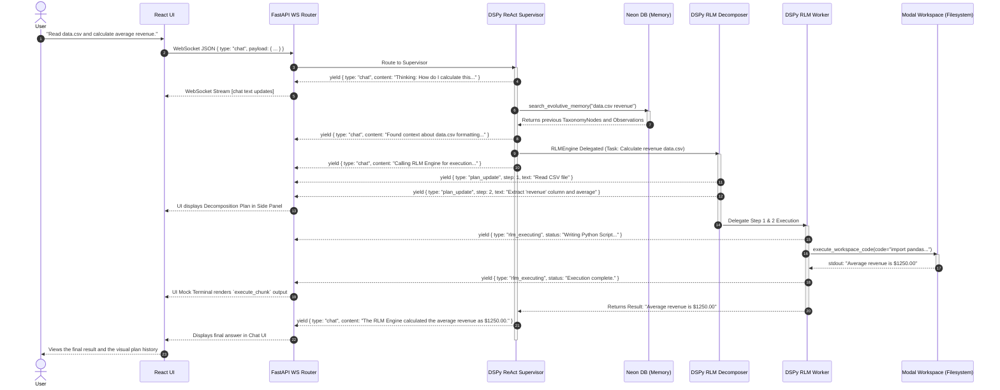

# Chronological AI Sequence Diagram

This artifact models the end-to-end event sequence when a user queries the `fleet-rlm` agentic architecture. This specifically details the interaction between the primary ReAct Supervisor and the subordinate RLM Worker, as they concurrently multiplex feedback to the React UI.

## Execution Flow: "Read my data.csv and calculate the average revenue."

