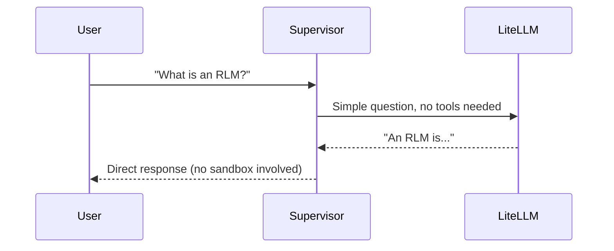
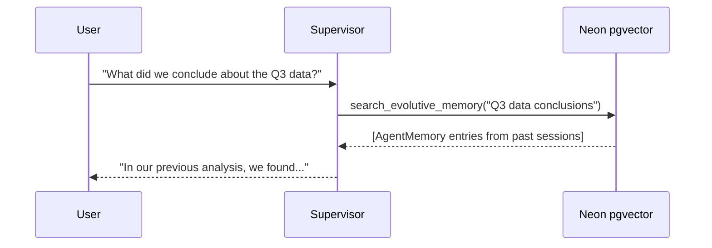

# User Flow: End-to-End Request Journey

This artifact traces a single user request from the frontend through the full dual-loop agent architecture and back.

## Primary Flow (Chat + RLM Delegation)

````mermaid
sequenceDiagram
    participant U as User
    participant FE as Frontend / TUI
    participant WS as WebSocket Router
    participant SUP as RLMReActChatAgent (Supervisor)
    participant RLM as RLMEngine (sandbox.py)
    participant MOD as Modal Sandbox
    participant MEM as Neon pgvector
    participant LLM as LiteLLM Proxy

    U->>FE: "Analyze this 500-page PDF and extract revenue data"
    FE->>WS: ws.send({type: "chat", content: "..."})
    WS->>SUP: forward(user_request=message)

    Note over SUP: ReAct Loop begins (max 10 iters)

    SUP->>MEM: search_evolutive_memory("revenue extraction")
    MEM-->>SUP: [Previous extraction patterns]

    SUP->>LLM: Think: "This requires code execution..."
    LLM-->>SUP: Action: delegate_to_rlm(task)

    SUP->>RLM: execute_with_rlm(code_task)

    Note over RLM: RLM Inner Loop begins (max 3 iters)

    rect rgb(40, 40, 60)
        RLM->>LLM: Generate Python code for task
        LLM-->>RLM: ```python code```
        RLM->>MOD: interpreter.execute(code)
        MOD-->>RLM: stdout (truncated to 2000 chars)

        alt Code had errors
            RLM->>LLM: "Fix this error: ..."
            LLM-->>RLM: ```corrected python code```
            RLM->>MOD: interpreter.execute(corrected_code)
            MOD-->>RLM: stdout (success)
        end
    end

    RLM-->>SUP: SandboxResult(output="Revenue: $20M")

    SUP->>LLM: Formulate final response
    LLM-->>SUP: "Based on my analysis..."

    SUP-->>WS: StreamEvent(kind="final", text="...")
    WS-->>FE: ws.send({type: "chat", content: "..."})
    FE-->>U: Display formatted response

    Note over FE: Right pane showed RLM execution in real-time
````

## Alternative Flows

### Quick Chat (No RLM Delegation)



### Memory-Only Query


