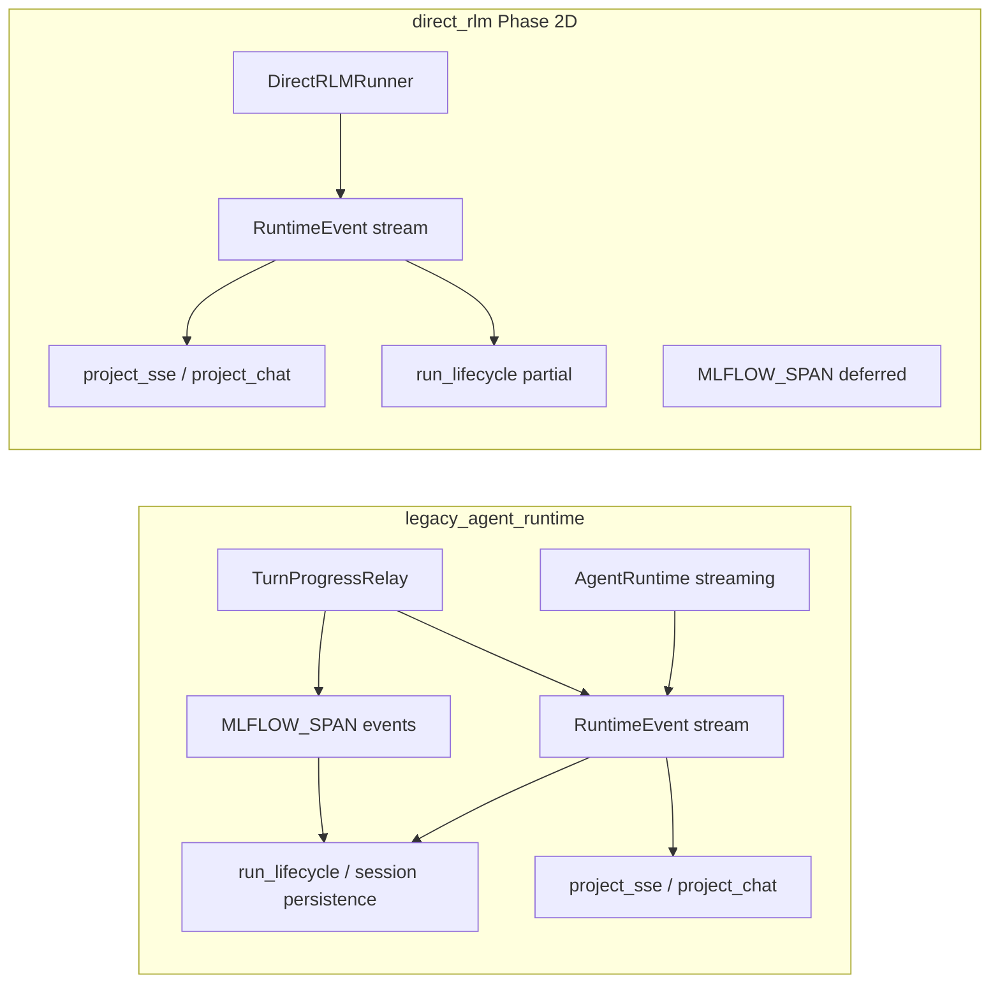

# MLflow / Trace Parity Audit (read-only)

**Date:** 2026-07-08
**Scope:** Compare `legacy_agent_runtime` vs opt-in `direct_rlm` observability paths.
**Status:** Audit only — no code changes in this document.

## Summary

Both backends share the same transport projection (`project_sse` / `project_chat`) and
`RuntimeEvent` vocabulary. Legacy emits live `MLFLOW_SPAN` events via
`TurnProgressRelay` during execution; `direct_rlm` (Phase 2D) does not. Trace
recorder and session persistence consume the shared event stream but inherit the
same gap for direct RLM turns.

## Architecture

## RuntimeEvent kinds (`runtime/events.py`)

| Kind | Legacy | direct_rlm (2D) | SSE projection |
|------|--------|-----------------|----------------|
| `STATUS` | yes (live) | yes | status part |
| `TURN_INPUTS` | yes (relay) | yes (direct) | `data-turn-inputs` |
| `TEXT` | yes (live) | yes (post-turn) | `text-delta` |
| `REASONING` | yes (live) | yes (trajectory replay) | `reasoning` |
| `TOOL_CALL` / `TOOL_RESULT` | yes | yes (trajectory replay) | `tool-*` |
| `SANDBOX_EXEC` | yes (`TOOL_CALL`+`phase=sandbox_exec`) | same | `data-sandbox-exec` |
| `ERROR` | yes | yes (structured) | `error` |
| `DONE` | yes (`schema_version`, `history_turns`, `trajectory`) | yes (+ `execution_backend`) | `finish` |
| `MLFLOW_SPAN` | yes (relay) | **no** | `data-span` |
| `WARNING` / `CLARIFICATION` | yes | **no** | mapped |
| Live token chunks | yes (`TurnProgressRelay`) | **no** (post-hoc only) | `text-delta` |

## Key integration points

| Area | File(s) |
|------|---------|
| MLflow init / tracking URI | `integrations/observability/mlflow_runtime.py`, `mlflow_context.py`, `api/bootstrap_observability.py` |
| Span → RuntimeEvent | `runtime/agent/runtime_helpers.py` (`emit_progress_event`), `runtime/events.py` (`RuntimeEvent.mlflow_span`) |
| Live relay | `runtime/agent/turn_progress_relay.py`; wired in `api/routers/ws/turn_runner.py` |
| Legacy streaming | `runtime/agent/runtime_streaming.py`, `runtime/modules/escalating.py` |
| direct_rlm emitter | `rlm/runner.py`, `rlm/trajectory.py`, `rlm/inputs.py` |
| SSE projection | `api/events/project_sse.py` (MLFLOW_SPAN → `data-span`, line ~295) |
| Trace schemas | `api/schemas/sessions.py` (`SessionTraceDebugSpan`, performance summary) |
| Trace debug API | `api/runtime_services/session_trace_debug.py` |
| Trace service | `api/runtime_services/trace_service.py` |

## Gap table (legacy vs direct_rlm)

| Capability | Legacy | direct_rlm | Recommended phase |
|------------|--------|------------|-------------------|
| Terminal DONE metadata | `schema_version`, `history_turns`, `trajectory` | same + `execution_backend` | done (2D) |
| TURN_INPUTS | relay | direct emit | done (2D) |
| Live MLFLOW_SPAN during turn | yes | no | Phase 6 / 2D.1+ relay |
| TurnProgressRelay (tokens, heartbeats) | yes | no | deferred |
| Post-turn trajectory replay | n/a (live) | yes | done (2C/2D) |
| Session trace debug spans from MLflow | yes | partial (no live spans) | Phase 6 |
| Performance summary ingestion | legacy path | unverified on direct | Phase 6 audit |
| Cancel → DONE+`cancelled` | yes | ERROR+`TURN_CANCELLED` | deferred |

## Phase 6 recommendations (implementation — not this audit)

1. Wire `TurnProgressRelay` (or equivalent) into `DirectRLMRunner` without calling legacy `AgentRuntime` streaming.
2. Emit `MLFLOW_SPAN` RuntimeEvents from `dspy.RLM` / interpreter hooks during direct turns.
3. Verify `run_lifecycle` and `session_trace_debug` ingest direct_rlm DONE trajectories end-to-end.
4. Add parity tests: legacy vs direct_rlm trace span counts for a fixture turn.

## Deferred (accepted)

- TurnProgressRelay live streaming
- Live `MLFLOW_SPAN` relay
- Cancel semantics alignment (`DONE`+`cancelled=True`)
- `WARNING` / `CLARIFICATION` post-turn extras

## No code changes

This audit documents current state only. Observability implementation must not
proceed until Phase 6 planning incorporates these gaps.
