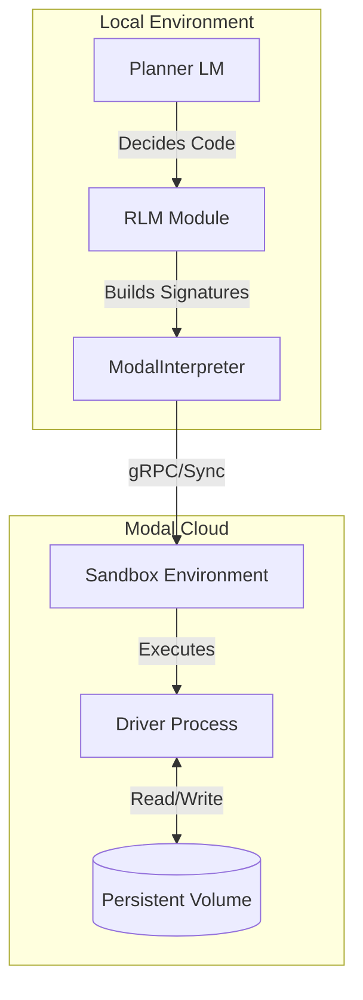

# Concepts

## Recursive Language Models (RLM)

Recursive Language Models represent a paradigm shift in how LLMs interact with large contexts. Instead of stuffing all information into the context window, RLM treats the context (documents, databases, logs) as an **external environment**.

The core loop involves:

1.  **The Planner**: An LLM that decides what information it needs.
2.  **The Code**: The Planner writes Python code to explore, filter, or read the data.
3.  **The Sandbox**: Code executes in a secure environment (Modal) and returns results.
4.  **Recursion/Refinement**: If the result is too large or requires analysis, the process can recurse or call sub-LLMs.

## Architecture

The `fleet-rlm` architecture separates the local orchestration from the remote execution.

### Components

- **Planner LM**: The "brain" that generates Python code to solve the query.
- **ModalInterpreter**: A DSPy-compatible `CodeInterpreter` that manages the lifecycle of the remote Modal sandbox.
- **Driver**: A lightweight process running inside the sandbox that listens for code execution requests and returns results.
- **Sandbox**: An isolated Python environment where untrusted code (generated by the LLM) can safely run.

## RLM Patterns

`fleet-rlm` implements several patterns for efficient long-context processing:

### 1. The "Navigate → Query → Synthesize" Pattern

Useful for finding specific information in structured documents.

1.  **Navigate**: Code searches for structure (e.g., Markdown headers, Table of Contents).
2.  **Query**: The code passes specific sections to an `llm_query()` tool (a sub-LLM call).
3.  **Synthesize**: The results are aggregated and returned via `SUBMIT()`.

### 2. Parallel Chunk Processing

Useful for summarization or extraction across large documents.

1.  **Split**: Divide the document into logical chunks (e.g., by header).
2.  **Parallel Map**: Use `llm_query_batched()` to process chunks simultaneously.
3.  **Reduce**: Aggregate the structured results from all chunks.

### 3. Stateful Analysis

Useful for iterative discovery or finding patterns.

1.  **Search**: Look for keywords or patterns.
2.  **State**: Save intermediate findings to variables (state persists across code execution steps in the same session).
3.  **Refine**: Use previous findings to refine the next query or search.
