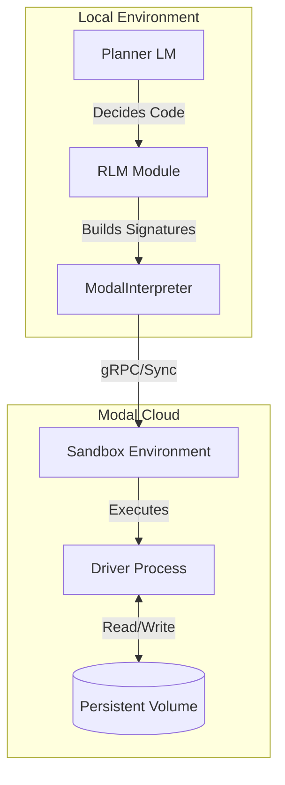

# Concepts

## Recursive Language Models (RLM)

Recursive Language Models represent a paradigm shift in how LLMs interact with large contexts. Instead of stuffing all information into the context window, RLM treats the context (documents, databases, logs) as an **external environment**.

The core loop involves:

1.  **The Planner**: An LLM that decides what information it needs.
2.  **The Code**: The Planner writes Python code to explore, filter, or read the data.
3.  **The Sandbox**: Code executes in a secure environment (Modal) and returns results.
4.  **Recursion/Refinement**: If the result is too large or requires analysis, the process can recurse or call sub-LLMs.

## Architecture

The `fleet-rlm` architecture separates the local orchestration from the remote execution.

### Components

- **Planner LM**: The "brain" that generates Python code to solve the query.
- **ModalInterpreter**: A DSPy-compatible `CodeInterpreter` that manages the lifecycle of the remote Modal sandbox. Supports the `with ModalInterpreter() as interp:` context manager pattern for automatic cleanup.
- **Driver**: A lightweight process running inside the sandbox that listens for code execution requests and returns results. Injects sandbox-side helpers into the execution environment.
- **Sandbox**: An isolated Python environment where untrusted code (generated by the LLM) can safely run.

### Sandbox-Side Helpers

The driver injects the following helper functions into the sandbox `globals` so the Planner's code can call them directly:

| Helper                               | Description                                                          |
| :----------------------------------- | :------------------------------------------------------------------- |
| `peek(text, start, length)`          | Return a slice of a large document without exceeding context limits. |
| `grep(text, pattern, context=0)`     | Case-insensitive line search with optional surrounding context.      |
| `chunk_by_size(text, size, overlap)` | Split text into fixed-size chunks with optional overlap.             |
| `chunk_by_headers(text, pattern)`    | Split document at lines matching a regex header pattern.             |
| `add_buffer(name, value)`            | Append a value to a named buffer (persists across iterations).       |
| `get_buffer(name)`                   | Retrieve the contents of a named buffer.                             |
| `clear_buffer(name)`                 | Clear one (or all) named buffers.                                    |
| `save_to_volume(path, content)`      | Write content to `/data/<path>` if a volume is mounted.              |
| `load_from_volume(path)`             | Read content from `/data/<path>`.                                    |

These helpers use only the Python standard library and require no external packages.

### Host-Side Chunking Module

For host-side use (tests, notebooks, pre-processing), `fleet_rlm.chunking` provides four pure functions:

- `chunk_by_size()` — Fixed-size chunking with optional overlap.
- `chunk_by_headers()` — Split by markdown/structured text headers.
- `chunk_by_timestamps()` — Split log files by timestamp boundaries.
- `chunk_by_json_keys()` — Split a JSON object into per-key chunks.

All functions are stdlib-only and can also be injected into the sandbox.

## RLM Patterns

`fleet-rlm` implements several patterns for efficient long-context processing:

### 1. The "Navigate → Query → Synthesize" Pattern

Useful for finding specific information in structured documents.

1.  **Navigate**: Code uses `chunk_by_headers(document)` to discover sections, `peek(document, start, length)` or `grep(document, pattern)` to find relevant parts.
2.  **Query**: The code passes specific sections to an `llm_query()` tool (a sub-LLM call).
3.  **Synthesize**: The results are aggregated and returned via `SUBMIT()`.

### 2. Parallel Chunk Processing

Useful for summarization or extraction across large documents.

1.  **Split**: `chunk_by_size(document, 4000)` or `chunk_by_headers(document)` to divide the document.
2.  **Parallel Map**: Use `llm_query_batched([chunk1, chunk2, ...])` to process chunks simultaneously.
3.  **Reduce**: Aggregate the structured results from all chunks.

### 3. Stateful Analysis

Useful for iterative discovery or finding patterns.

1.  **Search**: `grep(document, "keyword")` to search for patterns.
2.  **Accumulate**: `add_buffer("findings", match)` to accumulate across iterations.
3.  **Categorize**: `llm_query()` to categorize buffered findings.
4.  **Retrieve**: `get_buffer("findings")` to retrieve and refine.

### 4. Volume-Persisted State

Useful for multi-session workflows where results need to survive across runs.

1.  **Save**: `save_to_volume("cache/results.json", data)` to persist between runs.
2.  **Restore**: `load_from_volume("cache/results.json")` to restore previous state.
3.  **Combine**: Use with buffers for multi-session workflows.
