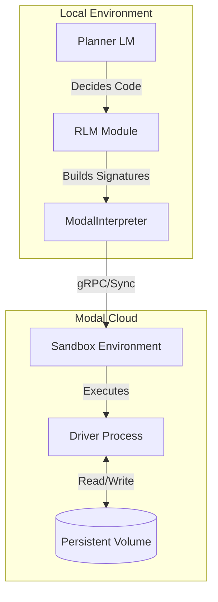

# Concepts

## Recursive Language Models (RLM)

Recursive Language Models represent a paradigm shift in how LLMs interact with large contexts. Instead of stuffing all information into the context window, RLM treats the context (documents, databases, logs) as an **external environment**.

The core loop involves:

1.  **The Planner**: An LLM that decides what information it needs.
2.  **The Code**: The Planner writes Python code to explore, filter, or read the data.
3.  **The Sandbox**: Code executes in a secure environment (Modal) and returns results.
4.  **Recursion/Refinement**: If the result is too large or requires analysis, the process can recurse or call sub-LLMs.

## Architecture

The `fleet-rlm` architecture separates the local orchestration from the remote execution.

### Component Diagram

```
┌─────────────────┐     ┌──────────────────┐     ┌─────────────────┐
│   CLI (Typer)   │────▶│  Modal Sandbox   │────▶│  DSPy Planner   │
│   cli.py        │     │  interpreter.py  │     │  config.py      │
└─────────────────┘     └──────────────────┘     └─────────────────┘
                             │
                             ▼
                      ┌──────────────────┐
                      │  Sandbox Driver  │
                      │  driver.py       │
                      │  (runs in Modal) │
                      └──────────────────┘
```

### Detailed Architecture



### Long-Context RLM Workflow

The `.claude/skills/rlm-long-context/` scripts handle large contexts:

1. **Chunking**: Content split using semantic boundaries (headers, timestamps, JSON keys)
2. **Ranking**: Chunks ranked by query relevance using keyword matching
3. **Caching**: Results cached per chunk+query to avoid re-analysis
4. **Processing**: Subagents process chunks in relevance order
5. **Early Exit**: Stops when confidence threshold reached

### Components

- **Planner LM**: The "brain" that generates Python code to solve the query.
- **ModalInterpreter**: A DSPy-compatible `CodeInterpreter` that manages the lifecycle of the remote Modal sandbox. Supports the `with ModalInterpreter() as interp:` context manager pattern for automatic cleanup.
- **Driver**: A lightweight process running inside the sandbox that listens for code execution requests and returns results. Injects sandbox-side helpers into the execution environment.
- **Sandbox**: An isolated Python environment where untrusted code (generated by the LLM) can safely run.
- **Agents**: Specialized subagents (`rlm-orchestrator`, `rlm-specialist`, `rlm-subcall`) for coordinated long-context processing.

### Sandbox-Side Helpers

The driver injects the following helper functions into the sandbox `globals` so the Planner's code can call them directly:

| Helper                               | Description                                                          |
| :----------------------------------- | :------------------------------------------------------------------- |
| `peek(text, start=0, length=2000)`   | Return a slice of a large document without exceeding context limits. |
| `grep(text, pattern, context=0)`     | Case-insensitive line search with optional surrounding context.      |
| `chunk_by_size(text, size=200_000, overlap=0)` | Split text into fixed-size chunks with optional overlap.   |
| `chunk_by_headers(text, pattern=r"^#{1,3} ", flags=re.MULTILINE)` | Split document at regex header boundaries. |
| `add_buffer(name, value)`            | Append a value to a named buffer (persists across iterations).       |
| `get_buffer(name)`                   | Retrieve the contents of a named buffer.                             |
| `clear_buffer(name)`                 | Clear one (or all) named buffers.                                    |
| `save_to_volume(path, content)`      | Write content to `/data/<path>` if a volume is mounted.              |
| `load_from_volume(path)`             | Read content from `/data/<path>`.                                    |

These helpers use only the Python standard library and require no external packages.

### Key Design Patterns

**Sandbox-Injectable Functions**: Functions in `chunking.py` are pure (stdlib-only) so they can be injected into the sandbox for the LLM to use directly.

**JSON Protocol**: Sandbox communicates via JSON lines on stdin/stdout, enabling bidirectional communication for tool calls and structured output.

**Stateful Execution**: Globals persist across `execute()` calls for incremental workflows. Use buffers or volume storage for multi-step pipelines.

**Sub-LLM Calls**: `llm_query()` and `llm_query_batched()` are built-in tools exposed in the sandbox runtime by `driver.py` and brokered by `ModalInterpreter`. In Claude workflows, the packaged `rlm-subcall` agent can be used as an orchestration pattern around these calls.

### Host-Side Chunking Module

For host-side use (tests, notebooks, pre-processing), `fleet_rlm.chunking` provides four pure functions:

- `chunk_by_size()` — Fixed-size chunking with optional overlap.
- `chunk_by_headers()` — Split by markdown/structured text headers.
- `chunk_by_timestamps()` — Split log files by timestamp boundaries.
- `chunk_by_json_keys()` — Split a JSON object into per-key chunks.

All functions are stdlib-only and can also be injected into the sandbox. Note: `chunk_by_headers` defaults use `re.MULTILINE` flags to match the sandbox implementation.

## Architecture Comparison

### RLM Paper (Conceptual)

```
┌─────────────────────────────────────────────────────────────┐
│ RLM Paper (Conceptual)                                      │
│  ┌─────────────┐    ┌──────────┐    ┌─────────────┐        │
│  │   LLM       │───▶│  REPL    │───▶│ Sub-LLM     │        │
│  │  (policy)   │◀───│  (state) │◀───│ (analysis)  │        │
│  └─────────────┘    └──────────┘    └─────────────┘        │
└─────────────────────────────────────────────────────────────┘
```

The research paper introduces the core RLM paradigm: an LLM treats long contexts as an external environment, writes code to explore it, and delegates semantic analysis to sub-LLMs.

### DSPy RLM (Local WASM)

```
┌─────────────────────────────────────────────────────────────┐
│ DSPy RLM (Local WASM)                                       │
│  ┌─────────────┐    ┌──────────────┐   ┌─────────────┐     │
│  │   LLM       │───▶│ Deno/Pyodide │──▶│  Sub-LLM    │     │
│  │             │◀───│   (WASM)     │◀──│  (llm_query)│     │
│  └─────────────┘    └──────────────┘   └─────────────┘     │
└─────────────────────────────────────────────────────────────┘
```

DSPy's default RLM implementation uses a Deno/Pyodide WASM sandbox running locally. It provides `llm_query()` and `llm_query_batched()` as built-in functions for sub-LLM calls.

### fleet-rlm (Modal Cloud)

```
┌─────────────────────────────────────────────────────────────┐
│ fleet-rlm (Modal Cloud)                                     │
│  ┌─────────────┐    ┌──────────────┐   ┌─────────────┐     │
│  │   LLM       │───▶│Modal Sandbox │───▶│ Sub-LLM via │     │
│  │             │◀───│  (driver.py) │◀──│ llm_query()  │     │
│  └─────────────┘    └──────────────┘   └─────────────┘     │
│         │                  │                                  │
│         └──────────────────┘ (JSON over stdin/stdout)        │
│  ┌──────────────┐                                           │
│  │Modal Volume  │◀── Persistent storage (/data)             │
│  │(rlm-volume*) │                                           │
│  └──────────────┘                                           │
└─────────────────────────────────────────────────────────────┘
```

fleet-rlm extends the RLM concept with Modal cloud infrastructure:

| Feature | DSPy Default | fleet-rlm |
|---------|--------------|-----------|
| **Interpreter** | Deno/Pyodide WASM | Modal cloud sandbox |
| **Signature Usage** | `dspy.RLM(signature, ...)` | Same ✅ |
| **LM Configuration** | `dspy.configure(lm=dspy.LM(...))` | Same ✅ |
| **Output Access** | `result.field` | Same ✅ |
| **Sub-LLM Calls** | `llm_query()` built-in | `llm_query()` / `llm_query_batched()` built-ins (optionally orchestrated via `rlm-subcall`) |
| **Persistence** | None (ephemeral) | Modal volumes (`/data`) |
| **Execution Context** | Local browser/WASM | Cloud sandbox (gRPC) |
| **Max Context Size** | ~10MB (browser limits) | 100MB+ (cloud storage) |

### Unique fleet-rlm Features

| Feature | Description |
|---------|-------------|
| **Volume Persistence** | Data survives sandbox restarts across sessions |
| **Stateful Execution** | Globals persist across `execute()` calls |
| **JSON Protocol** | Structured communication via `sandbox_driver()` |
| **Chunking Scripts** | Standalone `.claude/skills/rlm-long-context/` scripts |
| **Agent Integration** | `rlm-orchestrator`, `rlm-specialist`, `rlm-subcall` agents |
| **Custom Tools** | `regex_extract`, `chunk_by_headers`, `chunk_by_size` helpers |

## RLM Patterns

`fleet-rlm` implements several patterns for efficient long-context processing:

### 1. The "Navigate → Query → Synthesize" Pattern

Useful for finding specific information in structured documents.

1.  **Navigate**: Code uses `chunk_by_headers(document)` to discover sections, `peek(document, start, length)` or `grep(document, pattern)` to find relevant parts.
2.  **Query**: The code passes specific sections to an `llm_query()` tool (a sub-LLM call).
3.  **Synthesize**: The results are aggregated and returned via `SUBMIT()`.

### 2. Parallel Chunk Processing

Useful for summarization or extraction across large documents.

1.  **Split**: `chunk_by_size(document, 4000)` or `chunk_by_headers(document)` to divide the document.
2.  **Parallel Map**: Use `llm_query_batched([chunk1, chunk2, ...])` to process chunks simultaneously.
3.  **Reduce**: Aggregate the structured results from all chunks.

### 3. Stateful Analysis

Useful for iterative discovery or finding patterns.

1.  **Search**: `grep(document, "keyword")` to search for patterns.
2.  **Accumulate**: `add_buffer("findings", match)` to accumulate across iterations.
3.  **Categorize**: `llm_query()` to categorize buffered findings.
4.  **Retrieve**: `get_buffer("findings")` to retrieve and refine.

### 4. Volume-Persisted State

Useful for multi-session workflows where results need to survive across runs.

1.  **Save**: `save_to_volume("cache/results.json", data)` to persist between runs.
2.  **Restore**: `load_from_volume("cache/results.json")` to restore previous state.
3.  **Combine**: Use with buffers for multi-session workflows.
