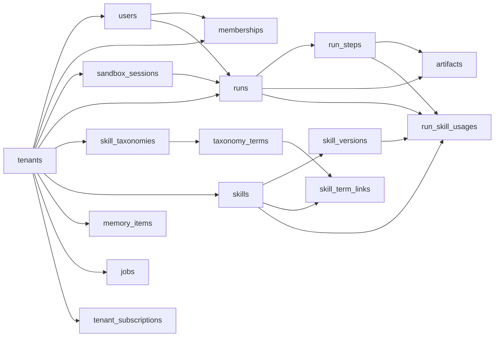

# NeonDB Schema and Lifecycle

This project now persists multi-tenant application state in Neon Postgres.

## Goals

- Use `entra_tenant_id` (`tid`) as canonical tenant claim.
- Use `entra_user_id` (`oid`) as canonical user claim.
- Store run/step/artifact/memory/job state for replay, trace visualization, and queueing.
- Store tenant-scoped skills taxonomy, skill versions, and run-time skill usage.
- Enforce tenant isolation with Postgres Row-Level Security (RLS).

## Core Tables

- `tenants`: tenant identity mirror (`entra_tenant_id` unique).
- `users`: users scoped to a tenant (`unique(tenant_id, entra_user_id)`).
- `memberships`: tenant role assignments (`owner/admin/member/viewer`).
- `sandbox_sessions`: provider session metadata (`modal/daytona/aca_jobs/local`).
- `runs`: run lifecycle records per tenant/user.
- `run_steps`: execution steps (`tool_call/repl_exec/llm_call/retrieval/guardrail/summary/memory/output/status`).
- `artifacts`: generated artifact metadata linked to run/step.
- `memory_items`: scoped memory entries (`user/tenant/run/agent`).
- `jobs`: tenant queue with idempotency and lease semantics.
- `tenant_subscriptions`: marketplace/manual billing readiness.
- `skill_taxonomies`: tenant taxonomy registries keyed by domain (`skills`, etc.).
- `taxonomy_terms`: hierarchical taxonomy tree (parent/child terms + synonyms).
- `skills`: tenant-scoped skill catalog entries with stable keys and status.
- `skill_versions`: immutable skill version records with one current version per skill.
- `skill_term_links`: many-to-many links between skills and taxonomy terms.
- `run_skill_usages`: run/step level skill invocation telemetry.

## Tenant Isolation Strategy (RLS)

RLS is enabled and forced on all tenant-scoped tables.

Policy shape:

```sql
USING (tenant_id = current_setting('app.tenant_id', true)::uuid)
WITH CHECK (tenant_id = current_setting('app.tenant_id', true)::uuid)
```

Repository methods set tenant context transaction-locally:

```sql
SELECT set_config('app.tenant_id', :tenant_id, true)
```

This keeps isolation centralized and avoids per-query tenant mistakes.
As of migration `0002_tenant_fk_hardening`, child tables also use tenant-aware composite foreign keys (for example `(tenant_id, run_id) -> runs(tenant_id, id)`) so RLS and relational constraints provide layered protection.
Migration `0003_skills_taxonomy_and_usage` extends this pattern to all skill/taxonomy tables.

## Indexing Highlights

- `(tenant_id, created_at)` on major tenant-scoped tables.
- `run_steps(run_id)` and `(tenant_id, run_id, step_index)`.
- `jobs(status, available_at)` and `(tenant_id, status, available_at)`.
- `memory_items(tenant_id, scope, scope_id, created_at)` + GIN index on `tags`.
- `taxonomy_terms(tenant_id, taxonomy_id, parent_term_id, sort_order)` + GIN index on `synonyms`.
- `skills(tenant_id, status)` and `(tenant_id, display_name)`.
- `skill_versions(tenant_id, skill_id, version_num)` + partial unique current-version index.
- `run_skill_usages(tenant_id, run_id, started_at)` and `(tenant_id, skill_id, started_at)`.

## Migration Flow

- Alembic config: `alembic.ini`
- Migration scripts: `migrations/versions/`
- Initial migration: `migrations/versions/0001_neon_core_schema.py`
- Hardening migration: `migrations/versions/0002_tenant_fk_hardening.py`
- Skills/taxonomy migration: `migrations/versions/0003_skills_taxonomy_and_usage.py`

Apply migrations:

```bash
# from repo root
uv run python scripts/db_init.py
# or
uv run alembic upgrade head
```

## Smoke Workflow

```bash
# from repo root
uv run python scripts/db_smoke.py
```

## ERD Summary


