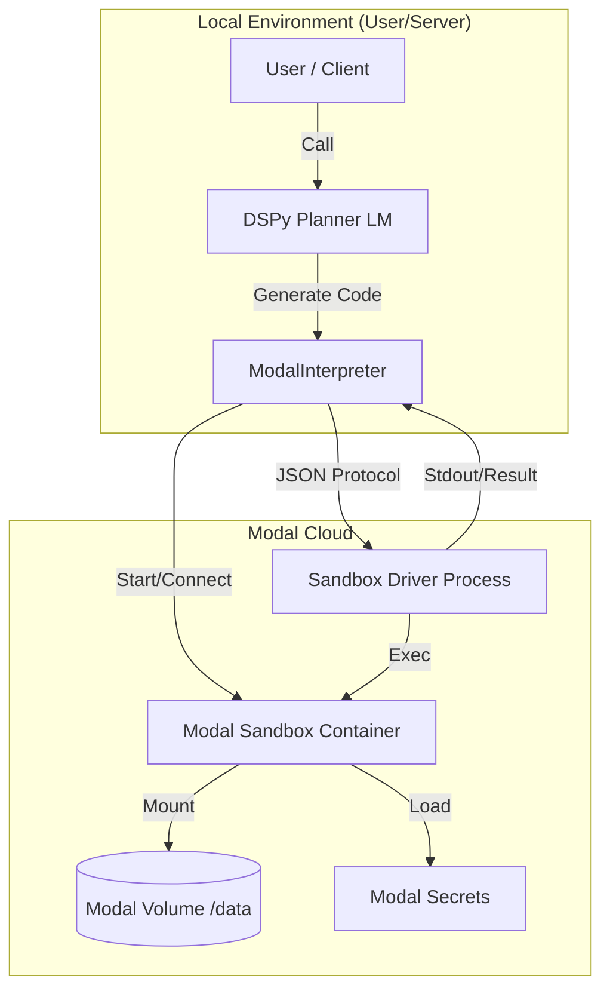
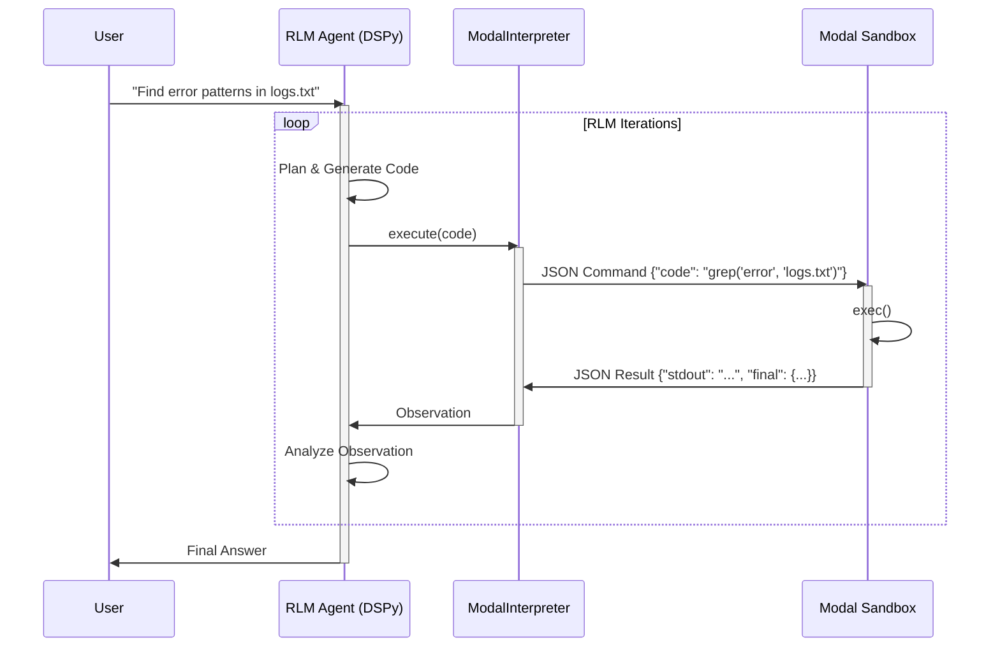

# Architecture

This document explains the architecture of `fleet-rlm`, dissecting how it integrates local orchestration, DSPy logic, and the Modal cloud environment.

## System Overview

`fleet-rlm` follows a client-server architecture where the "client" is the local Python process (or API server) running the **Planner LLM**, and the "server" is an ephemeral **Modal Sandbox** running the **Code Interpreter**.

Key design principles:

1.  **Isolation**: Code generated by the LLM runs in an isolated cloud sandbox, not on the user's machine.
2.  **Statefulness**: The sandbox maintains state (variables, imports) across multiple turns of interaction.
3.  **Bridge Protocol**: A lightweight JSON-over-stdio protocol bridges the local DSPy environment and the remote Python process.

### Architecture Diagram

## Core Components

### 1. ModalInterpreter (`src/fleet_rlm/core/interpreter.py`)

This is the heart of the system. It implements DSPy's `CodeInterpreter` interface but routes execution to the cloud.

- **Responsibility**: Manages the lifecycle of the Modal Sandbox (start, execute, shutdown).
- **Protocol**: Serializes code and variables into JSON messages sent to the sandbox's `stdin`.

### 2. Sandbox Driver (`src/fleet_rlm/core/driver.py`)

A Python script running _inside_ the Modal Sandbox.

- **Responsibility**: Reads JSON commands from `stdin`, executes code using `exec()`, captures `stdout`/`stderr`, and manages tools.
- **Injected Helpers**: It injects helper functions like `peek()`, `grep()`, and `chunk_by_size()` into the global namespace for the LLM to use.

### 3. RLM Module (`dspy.RLM`)

The cognitive engine powered by DSPy.

- **Responsibility**: Takes a high-level task, plans a sequence of actions, and generates the Python code to execute them.

## The RLM Loop

The Recursive Language Model (RLM) operates in a strict feedback loop. The Planner generates code, the Interpreter executes it, and the Planner observes the result to decide the next step.

### Sequence Diagram

## Design Patterns

### Metadata-Only History

To prevent "context window pollution" (overflowing the LLM's memory), `fleet-rlm` implements the **Metadata-Only History** pattern from the [RLM Paper](https://arxiv.org/abs/2501.123).

- If a command produces a massive output (e.g., printing a whole file), the Interpreter intercepts it.
- It returns a summary (e.g., "Output: 50,000 chars. First 200 chars: ...") instead of the full text.
- The LLM must then write code to Inspect the data (e.g., `peek()`) rather than reading it from chat history.

### Tool Call Bridging

When the code inside the sandbox needs to call a "Tool" (like a sub-LLM query), it doesn't just make an HTTP request.

1. The sandbox code calls `llm_query("prompt")`.
2. The Driver pauses and sends a `tool_call` JSON message to the Interpreter.
3. The Interpreter executes the tool locally (calling the LLM API).
4. The Interpreter sends the `tool_result` back to the Driver.
5. The Driver resumes execution.
