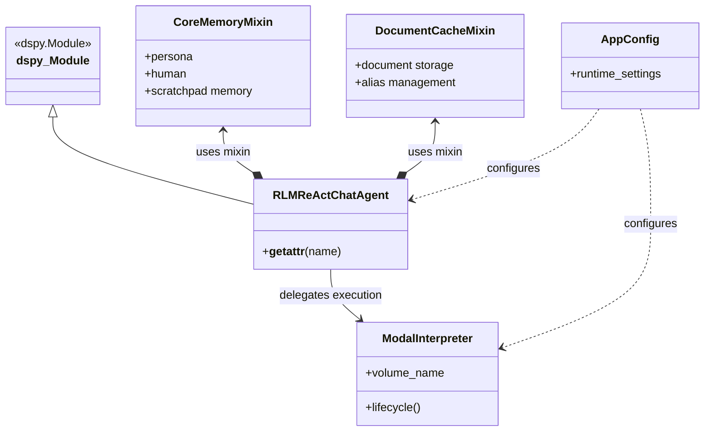

# Component UML

This UML view shows key relationships between agent orchestration, memory/document mixins, and runtime execution.

```mermaid
classDiagram
    class dspy_Module {
        <<dspy.Module>>
    }

    class RLMReActChatAgent {
        +__getattr__(name)
    }

    class CoreMemoryMixin {
        +persona
        +human
        +scratchpad memory
    }

    class DocumentCacheMixin {
        +document storage
        +alias management
    }

    class ModalInterpreter {
        +volume_name
        +lifecycle()
    }

    class AppConfig {
        +runtime_settings
    }

    dspy_Module <|-- RLMReActChatAgent
    CoreMemoryMixin <--* RLMReActChatAgent : uses mixin
    DocumentCacheMixin <--* RLMReActChatAgent : uses mixin
    RLMReActChatAgent --> ModalInterpreter : delegates execution
    AppConfig ..> RLMReActChatAgent : configures
    AppConfig ..> ModalInterpreter : configures
```
