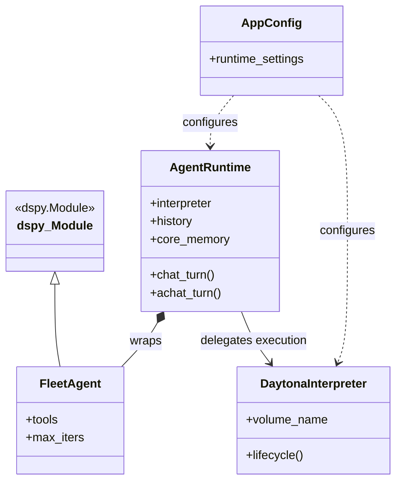

# Component UML

This UML view shows key relationships between agent orchestration, runtime state, and interpreter execution.

```mermaid
classDiagram
    class dspy_Module {
        <<dspy.Module>>
    }

    class FleetAgent {
        +tools
        +max_iters
    }

    class AgentRuntime {
        +interpreter
        +history
        +core_memory
        +chat_turn()
        +achat_turn()
    }

    class DaytonaInterpreter {
        +volume_name
        +lifecycle()
    }

    class AppConfig {
        +runtime_settings
    }

    dspy_Module <|-- FleetAgent
    AgentRuntime *-- FleetAgent : wraps
    AgentRuntime --> DaytonaInterpreter : delegates execution
    AppConfig ..> AgentRuntime : configures
    AppConfig ..> DaytonaInterpreter : configures
```
