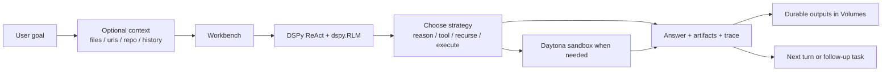

# Adaptive RLM Product Spec

This document describes `fleet-rlm` from a user-product perspective.

The goal is not to describe every internal module. The goal is to define what
the system is for, what a user can expect from it, and what the maintained
product contract is.

## Product Statement

`fleet-rlm` is an adaptive workspace for recursive AI task execution.

Users provide a goal and optional context. The system uses recursive language
models, structured DSPy programs, tools, and a Daytona sandbox to choose an
appropriate reasoning and execution strategy for the task.

The product is centered on adaptable capability, not on repository analysis as
the primary experience.

Repositories are one supported source of context. They are not the product's
identity.

## Product Goals

The product exists to let a user:

- express a task in natural language
- attach useful context in whatever form they have it
- let the runtime adapt its reasoning depth and execution strategy
- inspect what the system did and why
- keep useful outputs and state over time

The product should feel like a single intelligent workspace rather than a
collection of separate tools.

## Who It Is For

Primary users:

- developers solving code, document, and systems tasks
- technical operators who need inspectable task execution
- advanced users who want a programmable AI workspace rather than a one-shot chat

Typical tasks:

- analyze a codebase or a subset of files
- reason over local documents or notes
- combine URLs, staged files, and instructions into one task
- execute code or transformations in a safe environment
- iterate on a task over multiple turns with persistent context
- evaluate or optimize DSPy programs

## Core User Model

The intended user model is:

1. I give the system a task.
2. I optionally attach sources, files, or constraints.
3. The system decides how much reasoning and execution the task needs.
4. I can watch the process, inspect the outputs, and continue the session.

Users should not need to think in terms of runtime backends or provider modes.

## Supported Product Surfaces

The maintained surfaces are:

- `Workbench`
- `Volumes`
- `Optimization`
- `Settings`

### Workbench

`Workbench` is the primary interaction surface.

It is where a user:

- starts or resumes a session
- sends tasks to the adaptive agent
- stages optional sources such as files, URLs, or repositories
- watches live reasoning and execution events
- inspects final answers, artifacts, evidence, and run summaries

### Volumes

`Volumes` is the durable storage browser.

It is where a user:

- inspects persisted files
- retrieves generated artifacts
- understands what survived beyond the live execution session

### Optimization

`Optimization` is the DSPy quality surface.

It is where a user:

- runs evaluation workflows
- triggers optimization or compilation paths
- measures and improves the quality of DSPy programs

### Settings

`Settings` is the runtime configuration and diagnostics surface.

It is where a user:

- validates language-model connectivity
- validates Daytona connectivity
- inspects runtime health and readiness
- adjusts allowed local runtime settings

## Inputs and Sources

The system should accept tasks that start from any of these:

- plain-language instructions
- local files
- staged documents
- pasted text
- URLs
- repository URLs and refs
- existing session history

The maintained product stance is:

- repos are optional context sources
- documents are optional context sources
- URLs are optional context sources
- the task itself is always the primary input

## Capability Model

The runtime is designed to adapt to the task.

Depending on the task, the system may:

- answer directly
- decompose the task into subproblems
- recurse through child reasoning steps
- use tools
- read or stage documents
- inspect or modify files
- execute code in a sandbox
- persist outputs for later reuse
- recover and continue a previous session

This adaptive behavior is the main product value.

## Technical Capability Contract

The current stack is:

- FastAPI as the transport and product backend
- DSPy as the program and reasoning framework
- Daytona as the sandboxed execution backend

### FastAPI

FastAPI owns:

- HTTP routes
- websocket transport
- auth integration
- runtime settings and diagnostics
- app startup and lifecycle wiring

### DSPy

DSPy owns:

- task contracts through `Signature`
- program composition through `Module`
- tool-using task execution through `ReAct`
- recursive reasoning through `dspy.RLM`
- optimization and evaluation through DSPy-native optimizers and evaluators

The maintained implementation direction is to use DSPy-native classes as much as
possible rather than building parallel custom abstractions.

### Daytona

Daytona owns:

- sandbox creation and recovery
- mounted durable storage
- sandbox file operations
- code-interpreter contexts
- idle stop/archive lifecycle
- recoverable execution sessions

The maintained implementation direction is to stay close to the Daytona SDK
instead of building a parallel runtime model above it.

## Session Model

The product distinguishes between live session state and durable workspace state.

### Live State

Live state includes:

- current websocket turn execution
- current sandbox/session binding
- active interpreter context
- in-flight reasoning and tool activity

### Durable State

Durable state includes:

- mounted volume contents
- artifacts
- buffers
- manifests and session metadata

The durable mounted roots are:

- `memory/`
- `artifacts/`
- `buffers/`
- `meta/`

Users should expect durable files to survive runtime sleep/recovery, while raw
in-memory interpreter state is less authoritative than persisted state.

## Adaptive Execution Model

The product should choose execution style based on the task.

Examples:

- a short conceptual question may only need direct DSPy reasoning
- a long document question may require document loading and chunking
- a code or filesystem task may require Daytona sandbox execution
- a broader task may require recursive delegation and multiple tool steps

The system should make these choices with as little user friction as possible.

## Runtime Lifecycle and Cost Model

The maintained backend is Daytona-only and is designed to avoid wasted compute.

The runtime lifecycle should behave like this:

- active sessions refresh activity
- idle sessions auto-stop
- colder sessions may auto-archive
- reconnecting recovers the sandbox when possible
- persistent state is rehydrated from durable sources

This gives users a persistent workspace model without forcing every session to
stay fully hot forever.

## User-Facing Contract

### Main Entry Point

The main product command is:

```bash
# from a uv-managed environment
uv run fleet web
```

### Main Network Surfaces

The user-facing backend contract centers on:

- `/health`
- `/ready`
- `GET /api/v1/auth/me`
- `GET /api/v1/sessions/state`
- `/api/v1/runtime/*`
- `POST /api/v1/traces/feedback`
- `GET /api/v1/optimization/status`
- `POST /api/v1/optimization/run`
- `/api/v1/ws/execution`

`/api/v1/ws/execution` is the canonical live stream for both conversational
turns and execution/workbench events.

## What the User Should Be Able to Observe

The product should remain inspectable.

A user should be able to observe:

- current runtime status
- reasoning and trajectory steps
- tool calls and tool results
- warnings and degraded execution states
- final answers
- persisted artifacts and evidence

The system is not intended to be a black box.

## Non-Goals

The product is not primarily:

- a repository browser
- a stateless chat application
- a multi-backend runtime platform
- a generic framework shell that exposes provider choice as a user concern

Those capabilities may exist internally or as optional inputs, but they are not
the core product promise.

## Product Promise

The product promise is:

Give the system a goal and optional context, and it will adapt its reasoning,
tool use, and sandboxed execution strategy to complete the task in an
inspectable and persistent workspace.

## User Flow


