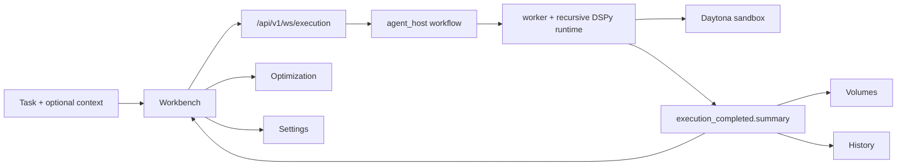

# fleet-rlm Product Spec

This document describes the maintained product contract from the user point of view. It intentionally avoids internal implementation detail except where that detail is part of the public runtime contract.

## Product Statement

`fleet-rlm` is a persistent Daytona-backed recursive DSPy workbench.

Users give the system a task and optional context. The maintained runtime uses a shared `daytona_pilot` path to decide whether to answer directly, recurse, call tools, or execute inside a Daytona sandbox.

Repository analysis is one supported use case, not the product identity. The product is the workbench.

## Maintained Surfaces

The current shell exposes five surfaces:

- `Workbench`
- `Volumes`
- `Optimization`
- `Settings`
- `History`

The first four are the primary maintained product surfaces. `History` is the supporting session browsing and replay surface.

### Workbench

`Workbench` is the primary interaction surface.

It is where a user:

- starts or resumes a session
- sends a task to the runtime
- attaches optional context such as files, URLs, or repo refs
- watches reasoning, tool use, sandbox activity, and HITL state
- inspects the final answer, summary, artifacts, and evidence

### Volumes

`Volumes` is the durable storage browser.

It is where a user:

- inspects persisted files
- retrieves generated artifacts
- understands what survived beyond the live turn

### Optimization

`Optimization` is the offline DSPy quality surface.

It is where a user:

- runs evaluation workflows
- launches optimization or compilation paths
- compares results across modules or datasets

### Settings

`Settings` is the runtime configuration and diagnostics surface.

It is where a user:

- validates model connectivity
- validates Daytona connectivity
- inspects runtime health and readiness
- adjusts allowed local runtime settings

### History

`History` is the session browsing and replay surface.

It is where a user:

- reviews prior sessions
- opens the turn transcript for a session
- replays or inspects session output
- exports session history into durable datasets

## Inputs and Context

The system accepts tasks that begin from:

- plain-language instructions
- local files
- staged documents
- pasted text
- URLs
- repository URLs and refs
- existing session history

The maintained stance is:

- the task itself is the primary input
- repos are optional context sources
- documents are optional context sources
- URLs are optional context sources

## Runtime Contract

The current backend is Daytona-only and is exposed through FastAPI.

Public network surfaces include:

- `/health`
- `/ready`
- `GET /api/v1/auth/me`
- `GET /api/v1/sessions/state`
- `GET /api/v1/sessions`
- `GET /api/v1/sessions/{id}`
- `GET /api/v1/sessions/{id}/turns`
- `DELETE /api/v1/sessions/{id}`
- `GET /api/v1/runtime/status`
- `GET/PATCH /api/v1/runtime/settings`
- `POST /api/v1/runtime/tests/lm`
- `POST /api/v1/runtime/tests/daytona`
- `GET /api/v1/runtime/volume/tree`
- `GET /api/v1/runtime/volume/file`
- `GET /api/v1/optimization/status`
- `POST /api/v1/optimization/run`
- `GET /api/v1/optimization/modules`
- `POST /api/v1/optimization/runs`
- `GET /api/v1/optimization/runs`
- `GET /api/v1/optimization/runs/{run_id}`
- `GET /api/v1/optimization/runs/{run_id}/results`
- `GET /api/v1/optimization/runs/compare`
- `POST /api/v1/optimization/datasets`
- `GET /api/v1/optimization/datasets`
- `GET /api/v1/optimization/datasets/{dataset_id}`
- `POST /api/v1/traces/feedback`
- `/api/v1/ws/execution`
- `/api/v1/ws/execution/events`

## WebSocket Model

The websocket contract is split by purpose:

- `/api/v1/ws/execution` is the canonical conversational turn stream
- `/api/v1/ws/execution/events` is the passive execution/workbench event stream

Current rules:

- identity comes from auth, not client-supplied `workspace_id` or `user_id`
- `session_id` is message-scoped on `/api/v1/ws/execution`
- query `session_id` is required on `/api/v1/ws/execution/events`
- `execution_completed.summary` is the canonical workbench hydration payload
- `execution_mode` is a per-turn hint for the Daytona-backed runtime
- `repo_url`, `repo_ref`, `context_paths`, and `batch_concurrency` are the Daytona request controls

## Durable State

Live state includes the current websocket turn, sandbox binding, and in-flight reasoning/tool activity.

Durable state includes:

- mounted volume contents
- artifacts
- buffers
- manifests and session metadata

The durable mounted roots are:

- `memory/`
- `artifacts/`
- `buffers/`
- `meta/`

Session manifests on durable storage live under:

`meta/workspaces/<workspace_id>/users/<user_id>/react-session-<session_id>.json`

Users should expect durable files to survive runtime sleep or recovery, while in-memory interpreter state is less authoritative than persisted state.

## Runtime Behavior

The runtime adapts to the task.

Examples:

- a short conceptual task may only need direct reasoning
- a long document task may require loading and chunking
- a filesystem task may require Daytona sandbox execution
- a broader task may require recursion and multiple tool steps

The maintained runtime should keep those choices inspectable instead of hiding them behind a black box.

The runtime lifecycle should behave like this:

- active sessions refresh activity
- idle sessions auto-stop
- colder sessions may auto-archive
- reconnecting recovers the sandbox when possible
- persistent state is rehydrated from durable sources

Daytona idle lifecycle uses provider-minute timers:

- `auto_stop_interval=30`
- `auto_archive_interval=60`

## What Users Can Observe

Users should be able to observe:

- current runtime status
- reasoning and trajectory steps
- tool calls and tool results
- warnings and degraded execution states
- final answers
- persisted artifacts and evidence

## Non-Goals

The product is not primarily:

- a repository browser
- a stateless chat app
- a multi-backend runtime platform
- a generic framework shell that exposes provider choice to users

Those capabilities may exist internally or as optional inputs, but they are not the core product promise.

## Product Promise

Give the system a task and optional context, and it will adapt its reasoning, tool use, and sandboxed execution strategy to complete the task in an inspectable and persistent workspace.

## User Flow

