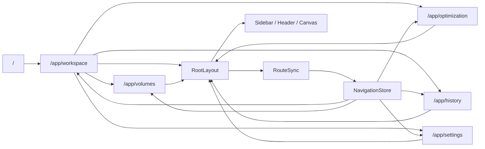
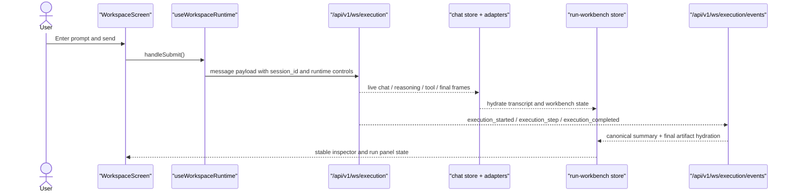

# Frontend User Flows

This document describes the current frontend runtime and navigation flows for
`fleet-rlm`. It reflects the live React/TanStack Router/Zustand shell and the
Daytona-backed workspace runtime.

## Shell And Routing

The URL is the source of truth. TanStack Router owns route selection, while the
shell stores the active nav item and canvas state in Zustand.

Key behavior:

- `/` and `/app/` redirect to `/app/workspace`.
- `RootLayout` renders the sidebar, header, main content, and optional canvas.
- `RouteSync` reads the URL and updates shell state. The reverse direction is
  handled by navigation helpers and route transitions.
- The canvas opens automatically on Volumes, closes on Optimization, History,
  and Settings, and stays available on Workbench.
- Mobile uses a bottom tab bar and a bottom sheet for the canvas. Desktop uses a
  split panel layout.

## Workbench Turn

The workspace is the primary execution flow. The composer submits a task, the
frontend opens a websocket stream, and the transcript plus workbench state are
updated from backend frames.

The important rules are:

- `WorkspaceScreen` owns local task entry, runtime mode initialization, session
  persistence, and follow-up UX.
- `useWorkspace()` owns the runtime lifecycle: submit, stream, cancel, HITL
  resolution, and conversation loading.
- `useChatStore` stores the live transcript state.
- `useRunWorkbenchStore` stores the execution summary, artifacts, iterations,
  callbacks, sources, and completion metadata.
- `run-workbench-hydration.ts` is the canonical reducer for the run panel.

## Secondary Flows

### Volumes

- `VolumesScreen` browses the mounted Daytona volume tree.
- Selecting a file opens the canvas preview.
- Leaving Volumes clears the selected file via `RouteSync`.

### History

- `HistoryScreen` is a first-class route at `/app/history`.
- It shows backend session history and local conversation history.
- Selecting a session opens the detail drawer without leaving the shell.

### Optimization

- `OptimizationScreen` exposes modules, datasets, runs, and compare tabs.
- It is a separate product surface, not part of the live workbench turn flow.

### Settings

- `SettingsScreen` opens as a dialog first and falls back to the routed page.
- Sections are `appearance`, `telemetry`, `litellm`, `runtime`, and
  `optimization`.
- Runtime settings and connectivity checks are handled in the settings feature
  tree, not in the workspace runtime.
