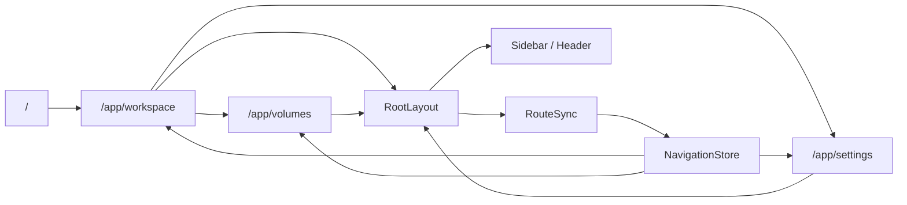
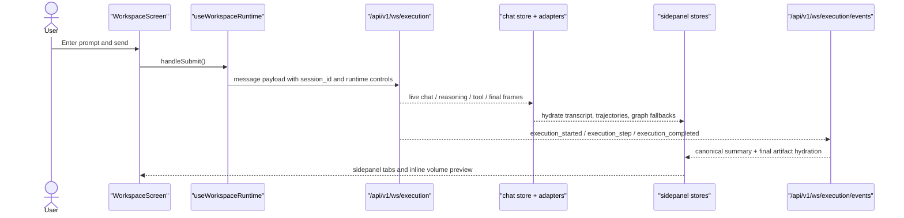

# Frontend User Flows

This document describes the current frontend runtime and navigation flows for
`fleet-rlm`. It reflects the live React/TanStack Router/Zustand shell and the
Daytona-backed workspace runtime.

## Shell And Routing

The URL is the source of truth. TanStack Router owns route selection, while the
shell stores the active nav item in Zustand.

```mermaid
flowchart LR
  A["/"] --> B["/app/workspace"]
  B --> C["/app/volumes"]
  B --> D["/app/settings"]

  B --> G["RootLayout"]
  C --> G
  D --> G

  G --> H["RouteSync"]
  G --> I["Sidebar / Header"]

  H --> J["NavigationStore"]
  J --> B
  J --> C
  J --> D
```

Key behavior:

- `/` and `/app/` redirect to `/app/workspace`.
- `RootLayout` renders the sidebar, header, and main content.
- `RouteSync` reads the URL and updates shell state. The reverse direction is
  handled by navigation helpers and route transitions.
- Workbench owns its own collapsible/resizable sidepanel. `/app/volumes`
  remains a full-page route.
- Mobile uses a bottom tab bar; responsive sidepanel behavior stays inside the
  workspace feature.

## Workbench Turn

The workspace is the primary execution flow. The composer submits a task, the
frontend opens a websocket stream, and the transcript plus workbench state are
updated from backend frames.

```mermaid
sequenceDiagram
  actor User
  participant UI as "WorkspaceScreen"
  participant RT as "useWorkspaceRuntime"
  participant WS as "/api/v1/ws/execution"
  participant CH as "chat store + adapters"
  participant WB as "sidepanel stores"
  participant EVT as "/api/v1/ws/execution/events"

  User->>UI: Enter prompt and send
  UI->>RT: handleSubmit()
  RT->>WS: message payload with session_id and runtime controls
  WS-->>CH: live chat / reasoning / tool / final frames
  CH-->>WB: hydrate transcript, trajectories, graph fallbacks
  WS-->>EVT: execution_started / execution_step / execution_completed
  EVT-->>WB: canonical summary + final artifact hydration
  WB-->>UI: sidepanel tabs and inline volume preview
```

The important rules are:

- `WorkspaceScreen` owns local task entry, runtime mode initialization, session
  persistence, and follow-up UX.
- `useWorkspace()` owns the runtime lifecycle: submit, stream, cancel, HITL
  resolution, and conversation loading.
- `useChatStore` stores the live transcript state.
- `useRunWorkbenchStore` stores the execution summary, artifacts, iterations,
  callbacks, sources, and completion metadata.
- `run-workbench-hydration.ts` is the canonical reducer for the run panel.
- The workspace sidepanel has exactly `Trajectories`, `Graph`, and `Volume`
  tabs. `Trajectories` and `Graph` resolve by durable chat session id or runtime
  `external_session_id`, then fall back to live transcript/artifact state if
  MLflow traces are unavailable.
- The `Volume` tab uses Daytona volume APIs with inline preview and a resizable
  tree/preview split.

## Secondary Flows

### Volumes

- `VolumesScreen` browses the mounted Daytona volume tree.
- Selecting a file opens the full-page preview region.
- Leaving Volumes clears the selected file via `RouteSync`.
- `/app/volumes` remains the full-page durable storage browser; it is not
  replaced by the workspace `Volume` sidepanel tab.

### Settings

- `SettingsScreen` opens as a dialog first and falls back to the routed page.
- Sections are `appearance`, `telemetry`, `litellm`, `runtime`, and `about`.
- Runtime settings and connectivity checks are handled in the settings feature
  tree, not in the workspace runtime.
