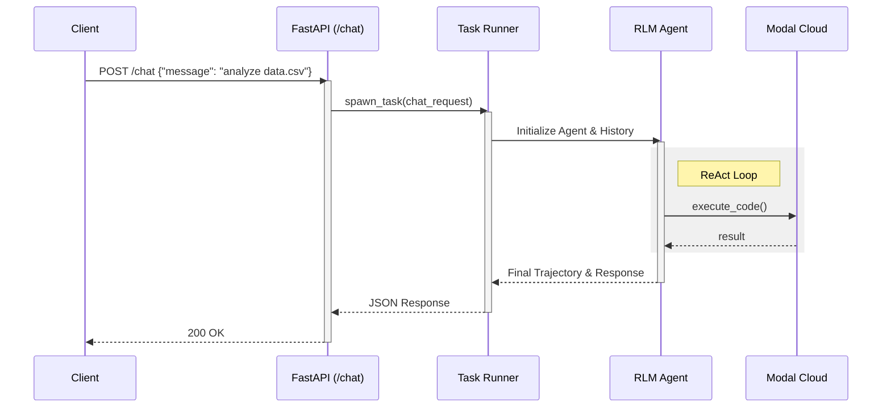

# Deploying the API Server

`fleet-rlm` includes a production-ready **FastAPI** server that exposes RLM capabilities via HTTP and WebSockets. This guide explains how to deploy and interact with it.

## Running the Server

Use the CLI to start the server:

```bash
uv run fleet-rlm serve-api --port 8000 --host 0.0.0.0
```

Once running, you can access the interactive API usage documentation (Scalar) at:
`http://localhost:8000/scalar`

## Request Lifecycle

The server handles requests by spinning up an isolated RLM agent for each conversation turn.



## Key Endpoints

### `POST /chat`

Stateless chat endpoint. Checks for RLM completion in a single turn.

**Request:**

```json
{
  "message": "Calculate pi to 10 digits",
  "session_id": "optional-session-id"
}
```

**Response:**

```json
{
  "response": "The value of pi is 3.1415926535",
  "trajectory": [ ... ]
}
```

### `GET /health`

Kubernetes-style health check. Returns `200 OK` if the server and Modal connection are healthy.

### `WS /ws/chat`

WebSocket endpoint for real-time streaming of agent thoughts and tool outputs.

## Configuration

The server is configured via environment variables:

- `DSPY_LM_MODEL`: The LLM to use.
- `RLM_SERVER_TIMEOUT`: Request timeout in seconds.
- `RLM_MAX_STEPS`: Maximum ReAct steps per request.
