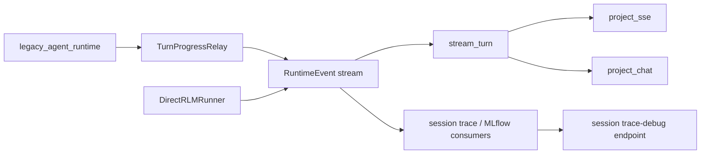

# Phase 6 observability surface and implementation evidence

**Date:** 2026-07-10
**Baseline:** `bdd38f8978ac6bc775a844641d8bc784ecffd822`
**Status:** Task 1 observability foundation implemented. Task 2 direct-RLM
promotion remains deferred. No public route is removed by Phase 6.

## Scope and invariants

Phase 6 must add one provider-neutral recording path around the existing
`RuntimeEvent` stream. It must retain `POST /api/chat`, WebSocket controls,
existing SSE/WebSocket projectors, session trace schemas and routes, Skills,
attachments, artifacts, and Daytona state. MLflow remains optional: ordinary
unit tests must not require an MLflow server, Daytona, or an LLM credential.

The canonical event vocabulary is already `RuntimeEventKind` in
`src/fleet_rlm/runtime/events.py:67-83`. In particular,
`RuntimeEvent.mlflow_span()` (`:284-346`) is the existing, public-compatible
MLflow-span payload shape. Phase 6 must consume it, not introduce another
event enum or wire protocol.

## Current execution and trace flow

| Surface | Current source | Observed behavior | Phase 6 action |
| --- | --- | --- | --- |
| Canonical events | `runtime/events.py:67-379` | One enum and typed event model; `MLFLOW_SPAN` is already projected. | Keep unchanged; consume from a recorder. |
| Legacy execution | `runtime/agent/turn_progress_relay.py`; `runtime/agent/runtime_helpers.py` | Relay translates legacy callbacks, including MLflow span callbacks, into runtime events. | Continue to project unchanged through the new transport-neutral recorder. |
| Direct execution | `rlm/runner.py:84-141`; `rlm/trajectory.py:12-66` | Emits status, inputs, trajectory, text, and terminal events, but no MLflow span event. | Record its common event stream, emit a redacted local post-turn span, and export it to MLflow only when enabled. |
| Shared dispatch seam | `api/runtime_services/stream_turn.py:131-218` | Selects legacy or direct backend, then yields raw events directly. | Create one recorder before the branch and observe/sanitize every yielded event without changing this function's signature. |
| SSE / WebSocket transport | `api/events/project_sse.py:39-340`; `api/events/project_chat.py:1-102` | Both consume `RuntimeEvent`; SSE maps `MLFLOW_SPAN` to `data-span`. | Keep routes/projectors. Give them already-redacted recorded events. |
| Session debug | `api/runtime_services/session_trace_debug.py:151-541`; `api/schemas/sessions.py:182-296` | Classifier, token extraction, and performance aggregation are private compatibility helpers. | Extract pure classifier/performance modules and leave the service as a compatibility adapter. |
| MLflow lifecycle | `integrations/observability/config.py:48-124`; `mlflow_context.py:19-697`; `mlflow_runtime.py:84+` | Request context and trajectory spans exist; MLflow configuration defaults to enabled. | Preserve context and adapters, lazy-import MLflow, default it to disabled, and add a recorder adapter. |
| Trace feedback | `api/runtime_services/trace_service.py:78-191` | Feedback routes preserve ownership/persistence but include external exception text in HTTP details. | Keep API and storage; return stable sanitized details while logging raw failures server-side. |
| Quality consumers | `quality/trace_bundles.py` and optimization routes | Existing quality lane consumes persisted trace evidence. | Keep it outside chat execution; Phase 8 hardens this lane rather than replacing it. |

## Verified parity gap

The legacy path can emit live `RuntimeEventKind.MLFLOW_SPAN` through
`TurnProgressRelay`. `DirectRLMRunner` replays the RLM trajectory and finishes
with `DONE`, but emits no `MLFLOW_SPAN` (`rlm/runner.py:84-141`). Therefore
transport parity exists for event kinds both paths emit, while direct-RLM
trace-span parity is absent. The Phase 6 target is a redacted post-turn span
event and a common recorder; it does **not** claim live relay parity or change
the existing deferred cancellation semantics.

There is also a request-context asymmetry: the WebSocket turn runner wraps a
turn in `mlflow_request_context` (`api/routers/ws/turn_runner.py:273-298`),
while the SSE chat router reaches `stream_turn()` directly
(`api/routers/chat.py:126-165`, `:275-308`). The Phase 6 adapter must make
both transports safe when MLflow is disabled and must not depend on a live
relay to produce the direct-RLM post-turn observability record.

## Baseline unsafe client-facing error paths

The following were the pre-Phase-6 findings. The implementation evidence below
records their redaction and error-contract remediation.

1. `DirectRLMRunner` caught an arbitrary runtime exception and passed
   `str(exc)` to `direct_rlm_error_event` (`rlm/runner.py:119-123`). That
   helper places it in `payload.error` and in visible event text
   (`rlm/errors.py:57-70`). Provider messages, paths, and credential-adjacent
   diagnostics can therefore reach the stream.
2. `TraceService.create_trace_feedback()` interpolates raw MLflow exceptions
   into HTTP `detail` values at `trace_service.py:105-109` and `:151-155`.
3. Session trace-debug previews are intentionally compact but currently derive
   from raw MLflow inputs, outputs, and attributes
   (`session_trace_debug.py:85-149`, `:511-520`). New projections must redact
   known secret-shaped fields before constructing client models.

## Compatibility contract for the implementation

- Do not duplicate `RuntimeEventKind` or alter `RuntimeEvent.mlflow_span()`'s
  public payload keys.
- Do not remove session trace routes or old `mapped_render_kind` values.
  Add `artifact`, `task`, `performance`, and `mlflow_span`; retain
  `non_rendered` as a debug-only classification, never as transcript content.
- Do not make MLflow import or initialize during module import. A disabled
  MLflow configuration must be a no-op.
- Record raw operational failures only to server logs. Client responses carry
  stable messages and codes.
- Do not run optimization from chat; the existing quality/optimization path
  remains the only execution route for Phase 8.

## Acceptance test seams

| Seam | Required proof |
| --- | --- |
| `RuntimeEvent` → `RuntimeTraceRecorder` | Incremental observation, terminal finalization, and recursive secret/error redaction preserve safe event semantics. |
| Raw provider span → `SessionTraceDebugResponse` | Redacted previews and additive render classification without changing old classifications. |
| Legacy/direct fixture turns → recorder | The same render classifications and performance aggregates for equivalent fixture streams. |
| MLflow disabled → direct/legacy turn | No import, server, credential, or event-stream dependency. |
| Trace feedback failure | Stable HTTP detail, raw exception retained only in logs. |

## Deferred by design

- Live `TurnProgressRelay` behavior for direct RLM.
- Automatic fallback or replay from direct RLM to legacy runtime.
- Session-storage schema replacement or public route removal.
- MLflow-required default test execution.

## Task 1 implementation evidence

The Task 1 focused observability suite passed on 2026-07-10, along with
`make api-sync && make api-check` after regenerating the additive OpenAPI
artifacts. See the tracked [Task 1 validation record](evidence-task-1-validation.md)
for commands, results, and follow-up safety evidence.

- Disabled MLflow request contexts are now a no-op for both transports: they
  preserve internal context scoping without importing MLflow, opening a span,
  or flushing a trace. Direct RLM creates the shared request context only when
  explicitly enabled; its completion event carries an established trace ID
  when MLflow makes one active, while optional trajectory/finalization work
  runs off the async event loop with copied trace context.
- Generic runtime errors, camel-case credentials, and arbitrary absolute paths
  are redacted before transport projection. Trace-debug performance summaries
  derive all client-visible names and selected skills from sanitized spans;
  raw spans contribute only fixed fallback-category counts.
