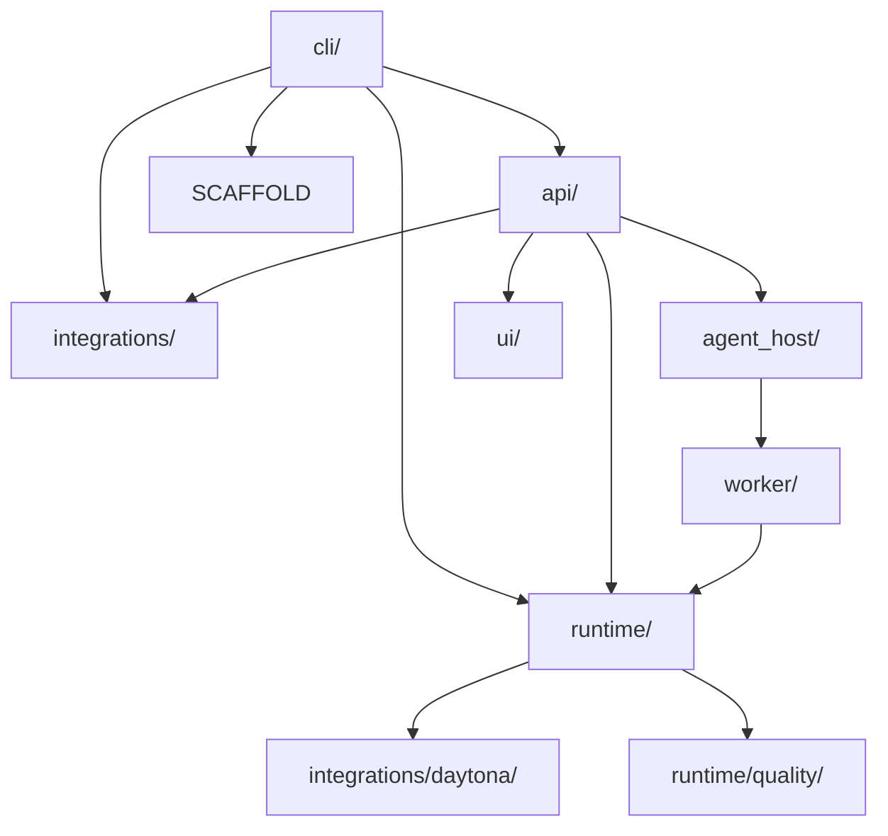

# Backend Codebase Map

This document summarizes the current backend package layout with the live runtime core first and the transport shell called out explicitly.

## Top-Level Areas

| Path | Role | Notes |
| --- | --- | --- |
| `src/fleet_rlm/worker/` | worker boundary | task contracts and the stream adapter that hands work into the runtime agent |
| `src/fleet_rlm/runtime/` | runtime core | shared chat logic, recursive execution, execution helpers, runtime models, tools, content helpers, and offline quality |
| `src/fleet_rlm/integrations/daytona/` | Daytona substrate | interpreter, runtime/session lifecycle, workspace helpers, diagnostics, and volume access |
| `src/fleet_rlm/agent_host/` | hosted policy layer | Agent Framework workflow, HITL, checkpointing, terminal ordering, and startup/repl bridges |
| `src/fleet_rlm/api/` | transport shell | FastAPI app factory, auth, routers, schemas, websocket transport, runtime services, and event shaping |
| `src/fleet_rlm/cli/` | operator surface | `fleet` / `fleet-rlm` entrypoints, command registration, and terminal UX |
| `src/fleet_rlm/scaffold/` | packaged guidance | init assets, agent prompts, skills, hooks, and team templates |
| `src/fleet_rlm/ui/` | packaged UI assets | built frontend artifacts for installed distributions |
| `src/fleet_rlm/utils/` | shared helpers | small reusable utilities |

## Layer Map

## Current Dependency Boundaries

### `src/fleet_rlm/api/`

- Incoming:
  - CLI server entrypoints
  - frontend HTTP and websocket clients
  - tests
- Outgoing:
  - `src/fleet_rlm/agent_host/*`
  - `src/fleet_rlm/runtime/*`
  - `src/fleet_rlm/integrations/*`

Key files:

- `api/main.py` owns app factory, lifespan, route registration, and SPA mounting
- `api/bootstrap.py` handles startup wiring, critical state, and optional warmup
- `api/routers/ws/endpoint.py` owns the two websocket surfaces
- `api/runtime_services/chat_runtime.py` prepares execution turns and runtime context
- `api/runtime_services/chat_persistence.py` writes turn/session lifecycle data
- `api/events/events.py` shapes execution-event payloads for passive subscribers

### `src/fleet_rlm/agent_host/`

- Incoming:
  - `api/routers/ws/*`
  - tests
- Outgoing:
  - `src/fleet_rlm/worker/*`

Key files:

- `agent_host/workflow.py` is the hosted Agent Framework workflow around the worker seam
- `agent_host/hitl_flow.py` owns HITL checkpointing policy
- `agent_host/terminal_flow.py` owns terminal ordering/completion policy
- `agent_host/sessions.py` owns session continuation and restore helpers
- `agent_host/execution_events.py` normalizes execution events for the host layer

### `src/fleet_rlm/worker/`, `src/fleet_rlm/runtime/`, and `src/fleet_rlm/integrations/daytona/`

- Incoming:
  - `api/*`
  - `agent_host/*`
  - `cli/runners.py`
  - `integrations/mcp/server.py`
- Outgoing:
  - `src/fleet_rlm/integrations/database/*`
  - external Daytona SDK and provider systems

Key files:

- `worker/streaming.py` is the boundary that streams a prepared request through the runtime agent
- `runtime/factory.py` builds the canonical Daytona-backed chat agent
- `runtime/agent/chat_agent.py` and `runtime/agent/recursive_runtime.py` contain the main cognition loop
- `runtime/execution/*` contains execution helpers and streaming context
- `runtime/models/*` contains runtime model assembly and registry code
- `runtime/quality/*` is the offline evaluation and optimization layer
- `integrations/daytona/interpreter.py` and `integrations/daytona/runtime.py` are the sandbox and durable-workspace substrate

### `src/fleet_rlm/cli/`

- Incoming:
  - package entrypoints
  - tests
- Outgoing:
  - `api/*`
  - `runtime/*`
  - `integrations/*`
  - `scaffold/*`

Key files:

- `cli/main.py` is the lightweight `fleet` launcher
- `cli/fleet_cli.py` defines the `fleet-rlm` surface
- `cli/runners.py` assembles shared runtime helpers
- `cli/runtime_factory.py` remains a compatibility re-export only

## Read First by Task

| Task | Read first |
| --- | --- |
| Websocket or runtime contract change | `api/main.py`, `api/routers/ws/endpoint.py`, `api/runtime_services/chat_runtime.py`, `agent_host/workflow.py`, `worker/streaming.py` |
| Session/history change | `api/routers/sessions.py`, `integrations/local_store.py`, `api/runtime_services/chat_persistence.py` |
| Runtime settings or diagnostics | `api/routers/runtime.py`, `api/runtime_services/settings.py`, `api/runtime_services/diagnostics.py` |
| Daytona execution change | `runtime/factory.py`, `runtime/agent/chat_agent.py`, `integrations/daytona/interpreter.py`, `integrations/daytona/runtime.py` |
| Offline optimization change | `runtime/quality/module_registry.py`, `runtime/quality/optimization_runner.py` |

## Historical Note

Older docs may still refer to bridge packages that are no longer present in the tree. Treat those references as historical context only; do not use them as current ownership labels.
