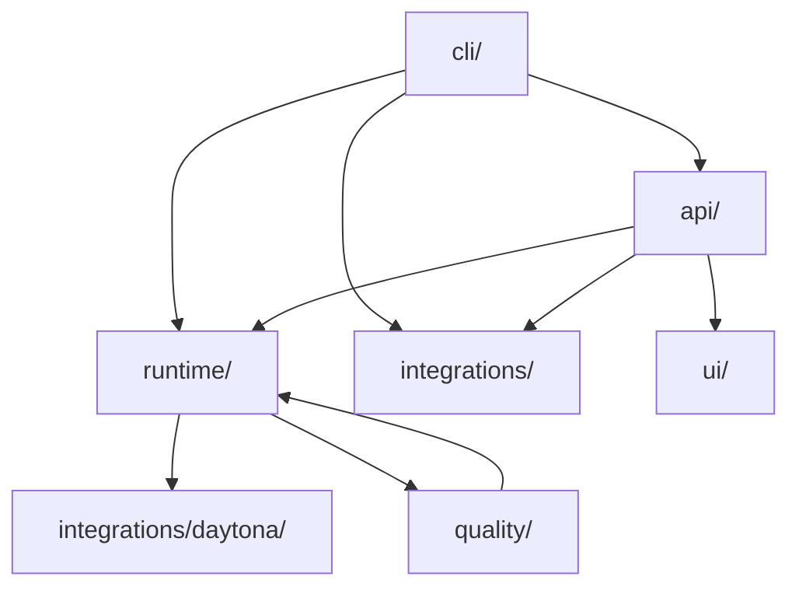

# Backend Codebase Map

This document summarizes the current backend package layout with the live runtime core first and the transport shell called out explicitly.

## Top-Level Areas

| Path | Role | Notes |
| --- | --- | --- |
| `src/fleet_rlm/runtime/` | runtime core | shared chat logic, recursive execution, execution helpers, tools, and content helpers |
| `src/fleet_rlm/quality/` | offline optimization | GEPA/DSPy evaluation and optimization (not on live request path) |
| `src/fleet_rlm/integrations/daytona/` | Daytona substrate | interpreter, runtime/session lifecycle, filesystem helpers, diagnostics, and volume access |
| `src/fleet_rlm/api/` | transport shell | FastAPI app factory, auth, routers, schemas, websocket transport, runtime services, and event shaping |
| `src/fleet_rlm/cli/` | operator surface | `fleet` / `fleet-rlm` entrypoints, command registration, and terminal UX |
| `src/fleet_rlm/ui/` | packaged UI assets | built frontend artifacts for installed distributions |
| `src/fleet_rlm/utils/` | shared helpers | small reusable utilities |

## Layer Map

```mermaid
graph TB
    CLI["cli/"] --> API
    CLI --> RUNTIME
    CLI --> INTEGRATIONS

    API["api/"] --> RUNTIME["runtime/"]
    API --> INTEGRATIONS["integrations/"]
    API --> UI["ui/"]

    RUNTIME --> DAYTONA["integrations/daytona/"]
    RUNTIME --> QUALITY["quality/"]
    QUALITY --> RUNTIME
```

## Current Dependency Boundaries

### `src/fleet_rlm/api/`

- Incoming:
  - CLI server entrypoints
  - frontend HTTP and websocket clients
  - tests
- Outgoing:
  - `src/fleet_rlm/runtime/*`
  - `src/fleet_rlm/integrations/*`

Key files:

- `api/main.py` owns app factory, lifespan, route registration, and SPA mounting
- `api/bootstrap.py` handles startup wiring, critical state, and optional warmup
- `api/routers/ws/endpoint.py` owns the two websocket surfaces
- `api/routers/ws/connection_loop.py`, `turn_setup.py`, `turn_runner.py`, and `stream_loop.py` coordinate websocket chat turns
- `api/runtime_services/chat_runtime.py` prepares execution turns and runtime context
- `api/runtime_services/chat_persistence.py` writes turn/session lifecycle data
- `api/events/events.py` shapes execution-event payloads for passive subscribers

### `src/fleet_rlm/runtime/` and `src/fleet_rlm/integrations/daytona/`

- Incoming:
  - `api/*`
  - `cli/runners.py`

- Outgoing:
  - `src/fleet_rlm/integrations/database/*`
  - external Daytona SDK and provider systems

Key files:

- `runtime/factory.py` builds the canonical Daytona-backed chat agent
- `runtime/agent/agent.py` and `runtime/agent/runtime.py` contain the main cognition loop
- `runtime/agent/runtime_helpers.py`, `runtime_mcp.py`, `runtime_history.py`, and `runtime_streaming.py` hold extracted runtime concerns
- `runtime/execution/*` contains execution helpers and streaming event construction
- `runtime/modules/*` contains escalation, workspace, and module registry code
- `quality/module_registry.py` and `quality/optimization_runner.py` own offline optimization
- `integrations/daytona/interpreter.py` is the public Daytona interpreter facade
- `integrations/daytona/workspace_manager.py`, `sandbox_executor.py`, and `isolation.py` own workspace/session state, sandbox execution, and recursive child/evidence/context policy behind that facade
- `integrations/daytona/runtime.py`, `workspace_runtime.py`, and `sdk_ops.py` own workspace bootstrap, repo/session reconciliation, and Daytona SDK runtime helpers

See also: [dspy-daytona-interpreter-boundary.md](./dspy-daytona-interpreter-boundary.md)

### `src/fleet_rlm/cli/`

- Incoming:
  - package entrypoints
  - tests
- Outgoing:
  - `api/*`
  - `runtime/*`
  - `integrations/*`

Key files:

- `cli/main.py` is the lightweight `fleet` launcher
- `cli/fleet_cli.py` defines the `fleet-rlm` surface
- `cli/runners.py` assembles shared runtime helpers
- Runtime construction is shared through `cli/runners.py` and `runtime/factory.py`; there is no
  separate CLI runtime-factory module in the current tree

## Read First by Task

| Task | Read first |
| --- | --- |
| Websocket or runtime contract change | `api/main.py`, `api/routers/ws/endpoint.py`, `api/runtime_services/chat_runtime.py`, `api/routers/ws/turn_runner.py` |
| Session/history change | `api/routers/sessions.py`, `integrations/local_store.py`, `api/runtime_services/chat_persistence.py` |
| Runtime settings or diagnostics | `api/routers/runtime.py`, `api/runtime_services/settings.py`, `api/runtime_services/diagnostics.py` |
| Daytona execution change | `runtime/factory.py`, `runtime/agent/agent.py`, `integrations/daytona/interpreter.py`, `integrations/daytona/sandbox_executor.py`, `integrations/daytona/runtime.py` |
| Daytona workspace/session change | `integrations/daytona/interpreter.py`, `integrations/daytona/workspace_manager.py`, `integrations/daytona/models.py` |
| Recursive child sandbox change | `runtime/tools/rlm_delegate.py`, `integrations/daytona/isolation.py` |
| Offline optimization change | `quality/module_registry.py`, `quality/optimization_runner.py` |
| DSPy RLM + Daytona async boundary | `docs/reference/dspy-daytona-interpreter-boundary.md`, `runtime/agent/runtime.py` |

## Historical Note

Older transition notes may still refer to retired websocket or runtime-quality ownership paths. The websocket loop is split across `connection_loop.py`, `turn_setup.py`, `turn_runner.py`, and `stream_loop.py`; offline optimization lives under top-level `quality/`.

Older docs may still refer to bridge packages that are no longer present in the tree. Treat those references as historical context only; do not use them as current ownership labels.
