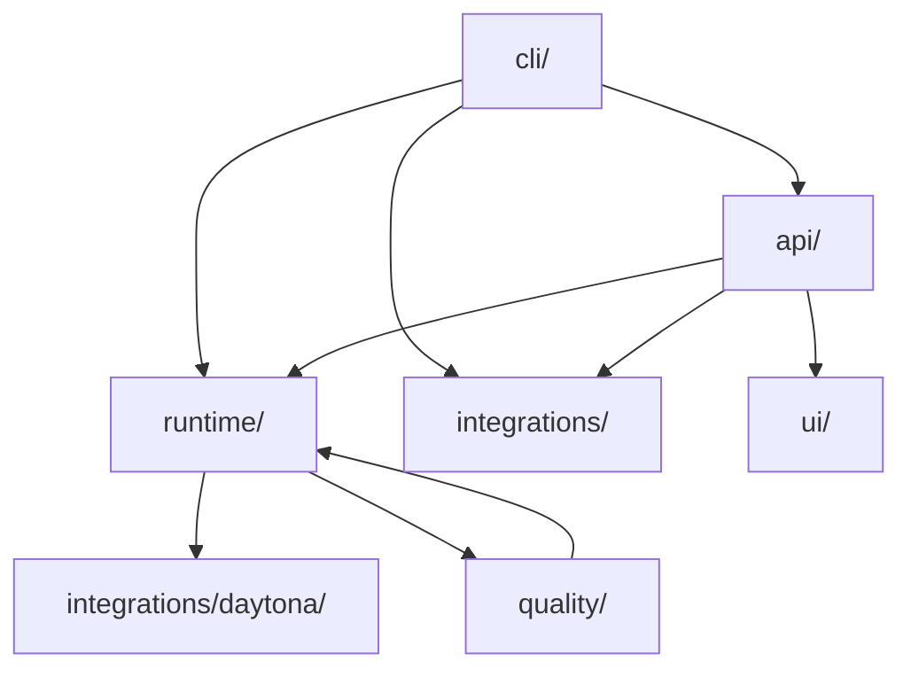

# Backend Codebase Map

This document summarizes the current backend and frontend package layout with ownership, public exports, allowed importers, and off-limits imports for each package.

## Backend Packages (8 canonical + extras)

The backend lives under `src/fleet_rlm/` and consists of eight canonical packages plus additional utility packages.

### Canonical Backend Packages

| Package | Ownership | Public Exports | Allowed Importers | Off-Limits Imports |
| --- | --- | --- | --- | --- |
| `api/` | FastAPI transport shell: app factory, auth, routers, schemas, websocket transport, runtime services, event shaping | `main.py`, `bootstrap.py`, `routers/`, `runtime_services/`, `schemas/`, `events/`, `config.py`, `dependencies.py` | `cli/`, tests | None (top-level transport) |
| `runtime/` | Runtime core: DSPy agent, execution helpers, tools, streaming events, content helpers | `events.py`, `factory.py`, `agent/`, `execution/`, `modules/`, `tools/`, `lm.py`, `config.py` | `api/`, `cli/`, `quality/`, tests | `api.routers` (may import `api.events`, `api.config` but not routers) |
| `integrations/` | External integrations: Daytona substrate, database, LLM profiles, observability, config, local store | `daytona/`, `database/`, `llm_profiles/`, `observability/`, `config/`, `local_store.py`, `persistence_protocol.py` | `api/`, `runtime/`, `cli/`, `quality/`, tests | None (shared integration layer) |
| `config/` | Centralized constants and configuration | `constants.py` | All packages | None (leaf package) |
| `quality/` | Offline DSPy evaluation and optimization (not on live request path); includes `eval/` subpackage for MLflow GenAI evaluation | `eval/` (judges, metrics, evaluate, report, trace_record), `optimization_runner.py`, `module_registry.py`, `scorers.py`, `datasets.py`, `gepa_evidence.py`, `mlflow_evaluation.py` | `cli/`, `api/runtime_services/`, tests | `api.routers`, `api.runtime_services` (may import `api.schemas` for data structures and may import `runtime/` and `integrations/` but not `api/` business logic) |
| `cli/` | Operator surface: `fleet` and `fleet-rlm` entrypoints, command registration, terminal UX | `main.py`, `fleet_cli.py`, `runners.py`, `commands/`, `terminal/`, `api_client/` | Tests, package entrypoints | None (top-level operator surface) |
| `migrations/` | Alembic migrations (lives at repo-root `migrations/`, not `src/fleet_rlm/migrations/`) | `env.py`, `versions/`, `script.py.mako` | Alembic tooling only | No intra-backend imports (vendored/build tooling) |
| `ui/` | Packaged UI assets: built frontend artifacts for installed distributions | `build.py`, `dist/` | `api/spa.py` (mounts UI), build tooling | No intra-backend imports (vendored/build tooling) |

### Additional Backend Packages (not in canonical 8)

| Package | Role | Notes |
| --- | --- | --- |
| `utils/` | Shared helpers: identity, logging, marker search, paths, preview, sandbox ownership, session titles, time, volume tree | Imported by multiple packages; not a primary boundary but a utility layer |
| `scaffold/` | Scaffold skills and skill authoring reference | Contains `skills/` with DSPy/MLflow/Daytona skill definitions; used by runtime and CLI but not a primary package boundary |

## Frontend Packages (6 canonical + extras)

The frontend lives under `src/frontend/src/` and consists of six canonical packages plus additional utility and component packages.

### Canonical Frontend Packages

| Package | Ownership | Public Exports | Allowed Importers | Off-Limits Imports |
| --- | --- | --- | --- | --- |
| `features/` | Feature modules: workspace, optimization, volumes, settings, layout | `workspace/`, `optimization/`, `volumes/`, `settings/`, `layout/` | `routes/`, `app/`, tests | Direct imports into `src/fleet_rlm/**` (must use `lib/rlm-api/` for backend types); may import from `components/`, `lib/`, `hooks/`, `stores/` |
| `components/agent-elements/` | Agent Elements design system: chat UI, tool renderers, input bar, message list, markdown, icons | `agent-chat.tsx`, `input-bar.tsx`, `message-list.tsx`, `tools/`, `input/`, `icons/`, `utils/`, `types.ts` | `features/`, `routes/`, tests | Direct imports into `src/fleet_rlm/**` (must use `lib/rlm-api/` for backend types); may import from `lib/`, `hooks/`, `stores/` |
| `lib/workspace/` | Workspace runtime: WS adapter, tool parts, step router, artifact store, chat store, session turns | `backend-chat-event-adapter.ts`, `backend-chat-event-tool-parts.ts`, `agent-tool-parts.ts`, `backend-chat-event-step-router.ts`, `chat-store.ts`, `workspace-types.ts`, `use-workspace-runtime.ts` | `features/workspace/`, `components/agent-elements/`, tests | Direct imports into `src/fleet_rlm/**`; may import from `lib/rlm-api/`, `lib/utils/`, `hooks/`, `stores/` |
| `routes/` | TanStack Router route tree (generated `routeTree.gen.ts` plus hand-written route files) | `routeTree.gen.ts`, `__root.tsx`, `app.tsx`, `app/`, `$.tsx`, `404.tsx`, `login.tsx`, `signup.tsx` | `app/`, TanStack Router tooling | Direct imports into `src/fleet_rlm/**`; may import from `features/`, `components/`, `lib/` |
| `lib/rlm-api/` | OpenAPI-generated client for backend HTTP and WebSocket APIs | `generated/openapi.ts`, `client.ts`, `types.ts`, `use-rlm-api.ts` | `features/`, `components/`, `lib/workspace/`, tests | None (backend API gateway); this is the ONLY path for frontend to import backend types |
| `config/` | Frontend configuration and environment variables | `env.ts`, `constants.ts` | All packages | None (leaf package) |

### Additional Frontend Packages (not in canonical 6)

| Package | Role | Notes |
| --- | --- | --- |
| `app/` | App shell: `App.tsx`, `providers.tsx` | Thin wrapper mounting routes and providers; imports from `routes/`, `components/`, `lib/` |
| `hooks/` | Shared React hooks: `use-app-navigate.ts`, `runtime/`, `ui/` | Imported by `features/`, `components/`, `lib/` |
| `stores/` | Zustand stores: `navigation-store.ts`, `theme-store.ts`, `navigation-types.ts` | Imported by `features/`, `components/`, `lib/`, `routes/` |
| `styles/` | Global CSS: `globals.css` | Imported by `app/`, `main.tsx` |
| `test/` | Test setup: `setup.ts` | Imported by test files only |
| `lib/auth/` | Auth utilities: Neon Auth integration, JWT handling | Imported by `features/`, `routes/`, `lib/workspace/` |
| `lib/utils/` | Shared utilities: formatting, validation, helpers | Imported by all packages |
| `lib/mlflow/` | MLflow trace formatting and display helpers | Imported by `features/workspace/`, `components/agent-elements/tools/` |
| `lib/telemetry/` | Telemetry and analytics helpers | Imported by `features/`, `lib/workspace/` |
| `lib/data/` | Data transformation and normalization helpers | Imported by `features/`, `lib/workspace/` |
| `components/product/` | Product-specific UI components (non-agent-elements) | Imported by `features/`, `routes/` |
| `components/ui/` | Vendored shadcn/ui components | Imported by `features/`, `components/agent-elements/`, `components/product/` |

## Layer Map

```mermaid
graph TB
    CLI["cli/"] --> API
    CLI --> RUNTIME
    CLI --> INTEGRATIONS

    API["api/"] --> RUNTIME["runtime/"]
    API --> INTEGRATIONS["integrations/"]
    API --> UI["ui/"]

    RUNTIME --> DAYTONA["integrations/daytona/"]
    RUNTIME --> QUALITY["quality/"]
    QUALITY --> RUNTIME
```

## Current Dependency Boundaries

### `src/fleet_rlm/api/`

- Incoming:
  - CLI server entrypoints
  - frontend HTTP and websocket clients
  - tests
- Outgoing:
  - `src/fleet_rlm/runtime/*`
  - `src/fleet_rlm/integrations/*`

Key files:

- `api/main.py` owns app factory, lifespan, route registration, and SPA mounting
- `api/bootstrap.py` handles startup wiring, critical state, and optional warmup
- `api/routers/ws/endpoint.py` owns the two websocket surfaces
- `api/routers/ws/connection_loop.py`, `turn_setup.py`, `turn_runner.py`, and `stream_loop.py` coordinate websocket chat turns
- `api/runtime_services/chat_runtime.py` prepares execution turns and runtime context
- `api/runtime_services/chat_persistence.py` writes turn/session lifecycle data
- `api/events/events.py` shapes execution-event payloads for passive subscribers

### `src/fleet_rlm/runtime/` and `src/fleet_rlm/integrations/daytona/`

- Incoming:
  - `api/*`
  - `cli/runners.py`

- Outgoing:
  - `src/fleet_rlm/integrations/database/*`
  - external Daytona SDK and provider systems

Key files:

- `runtime/factory.py` builds the canonical Daytona-backed chat agent
- `runtime/agent/agent.py` and `runtime/agent/runtime.py` contain the main cognition loop
- `runtime/agent/runtime_helpers.py`, `runtime_mcp.py`, `runtime_history.py`, and `runtime_streaming.py` hold extracted runtime concerns
- `runtime/execution/*` contains execution helpers and streaming event construction
- `runtime/modules/*` contains escalation, workspace, and module registry code
- `quality/module_registry.py` and `quality/optimization_runner.py` own offline optimization
- `integrations/daytona/interpreter.py` is the public Daytona interpreter facade
- `integrations/daytona/workspace_manager.py`, `sandbox_executor.py`, and `isolation.py` own workspace/session state, sandbox execution, and recursive child/evidence/context policy behind that facade
- `integrations/daytona/runtime.py`, `workspace_runtime.py`, and `sdk_ops.py` own workspace bootstrap, repo/session reconciliation, and Daytona SDK runtime helpers

See also: [dspy-daytona-interpreter-boundary.md](./dspy-daytona-interpreter-boundary.md)

### `src/fleet_rlm/cli/`

- Incoming:
  - package entrypoints
  - tests
- Outgoing:
  - `api/*`
  - `runtime/*`
  - `integrations/*`

Key files:

- `cli/main.py` is the lightweight `fleet` launcher
- `cli/fleet_cli.py` defines the `fleet-rlm` surface
- `cli/runners.py` assembles shared runtime helpers
- Runtime construction is shared through `cli/runners.py` and `runtime/factory.py`; there is no
  separate CLI runtime-factory module in the current tree

## Read First by Task

| Task | Read first |
| --- | --- |
| Websocket or runtime contract change | `api/main.py`, `api/routers/ws/endpoint.py`, `api/runtime_services/chat_runtime.py`, `api/routers/ws/turn_runner.py` |
| Session/history change | `api/routers/sessions.py`, `integrations/local_store.py`, `api/runtime_services/chat_persistence.py` |
| Runtime settings or diagnostics | `api/routers/runtime.py`, `api/runtime_services/settings.py`, `api/runtime_services/diagnostics.py` |
| Daytona execution change | `runtime/factory.py`, `runtime/agent/agent.py`, `integrations/daytona/interpreter.py`, `integrations/daytona/sandbox_executor.py`, `integrations/daytona/runtime.py` |
| Daytona workspace/session change | `integrations/daytona/interpreter.py`, `integrations/daytona/workspace_manager.py`, `integrations/daytona/models.py` |
| Recursive child sandbox change | `runtime/tools/rlm_delegate.py`, `integrations/daytona/isolation.py` |
| Offline optimization change | `quality/module_registry.py`, `quality/optimization_runner.py` |
| DSPy RLM + Daytona async boundary | `docs/reference/dspy-daytona-interpreter-boundary.md`, `runtime/agent/runtime.py` |

## Historical Note

Older transition notes may still refer to retired websocket or runtime-quality ownership paths. The websocket loop is split across `connection_loop.py`, `turn_setup.py`, `turn_runner.py`, and `stream_loop.py`; offline optimization lives under top-level `quality/`.

Older docs may still refer to bridge packages that are no longer present in the tree. Treat those references as historical context only; do not use them as current ownership labels.
