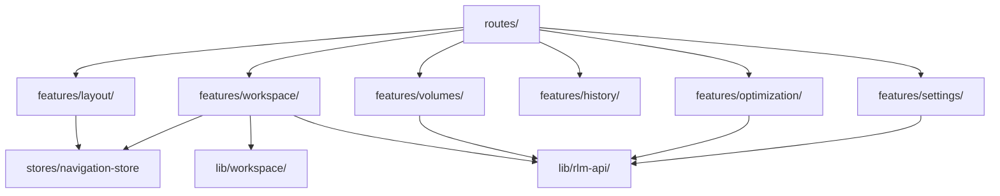

# Frontend Architecture

This document describes the maintained frontend architecture under
`src/frontend/src/`.

The frontend is a React 19 + TypeScript + TanStack Router + TanStack Query +
Zustand application. The current codebase is organized around route files,
feature modules, and shared `lib/` state adapters.

## Architecture Stack



## Current Source Ownership

```text
src/frontend/src/
├── routes/              # TanStack Router file tree and not-found/login/logout/signup routes
├── features/
│   ├── layout/          # Shell chrome, route sync, sidebar, header, dialogs, canvas host
│   ├── workspace/       # Chat-first execution workbench, transcript, inspector, run panel
│   ├── volumes/         # Mounted Daytona volume browser and file preview flow
│   ├── history/         # Session history list/detail and replay views
│   ├── optimization/    # GEPA prompt optimization UI
│   └── settings/        # Settings dialog/page and runtime settings forms
├── lib/
│   ├── workspace/       # Zustand stores, adapters, runtime hydration, transcript shaping
│   └── rlm-api/         # REST and websocket clients plus generated API types
├── stores/              # Shell/navigation state shared across the app
├── components/ui/       # shadcn/Base UI primitives and thin local extensions
├── components/ai-elements/  # AI Elements rendering primitives
├── components/product/  # App-owned reusable composition built from registry layers
└── app/                 # App bootstrap/providers
```

Route wrappers should point at `features/*` modules directly.

## Route Tree

The live route tree is intentionally small and explicit:

- `/` redirects to `/app/workspace`
- `/app` mounts the shell layout
- `/app/workspace` is the main workbench
- `/app/volumes` is the mounted storage browser
- `/app/history` is the session history surface
- `/app/optimization` is the optimization surface
- `/app/settings` is the settings dialog/page fallback
- `/login`, `/logout`, `/signup`, and `/404` remain standalone routes
- `src/routes/$.tsx` is the catchall for unsupported paths

The shell route files are thin wrappers only:

- `src/routes/app.tsx` mounts `RootLayout`
- `src/routes/app/workspace.tsx` lazy-loads `features/workspace/workspace-screen`
- `src/routes/app/volumes.tsx` lazy-loads `features/volumes/volumes-screen`
- `src/routes/app/history.tsx` lazy-loads `features/history/history-screen`
- `src/routes/app/optimization.tsx` lazy-loads `features/optimization/optimization-screen`
- `src/routes/app/settings.tsx` lazy-loads `features/settings/settings-screen`

## Shell And Layout Behavior

`RootLayout` in `features/layout/root-layout.tsx` owns:

- `AppProviders`
- the sidebar, header, and route outlet
- the desktop resizable split between content and canvas
- the mobile bottom sheet canvas
- login and settings dialogs
- the command palette
- the toast host

`RouteSync` is the URL-to-state bridge. It keeps the shell state in sync with
the current route, and it clears the selected volume file when leaving Volumes.
The reverse direction is handled by navigation helpers and route-triggered
actions.

Important shell behavior:

- Workbench keeps the inspector/canvas available.
- Volumes opens the canvas automatically so the file preview stays adjacent to
  the browser.
- Optimization, History, and Settings close the canvas.
- Mobile and desktop share the same route ownership, but the canvas is rendered
  as a bottom sheet on mobile.

## State And Runtime Model

The frontend uses three main state layers:

1. TanStack Router for route selection and route params.
2. Zustand for local session, navigation, shell, transcript, and workbench
   state.
3. TanStack Query for backend-backed reads, settings, and status queries.

Key stores and adapters:

- `src/stores/navigation-store.ts` owns active nav and canvas state.
- `src/features/workspace/use-workspace.ts` owns workspace session history,
  backend streaming, and runtime orchestration.
- `src/lib/workspace/chat-store.ts` owns the live transcript and session id.
- `src/lib/workspace/run-workbench-store.ts` owns execution summary state and
  artifact hydration.
- `src/lib/workspace/backend-chat-event-adapter.ts` turns websocket chat frames
  into transcript rows.
- `src/lib/workspace/backend-artifact-event-adapter.ts` turns execution steps
  into artifact graph state.
- `src/lib/workspace/run-workbench-hydration.ts` normalizes execution summaries
  and final artifacts into the canonical run panel state.

## Frontend File Ownership Rules

- Keep route files thin. They should only connect TanStack Router to the owning
  feature module.
- Keep shell behavior in `features/layout/*`.
- Keep workbench logic in `features/workspace/*` and `lib/workspace/*`.
- Keep mounted-storage behavior in `features/volumes/*`.
- Keep session history in `features/history/*`.
- Keep optimization and settings logic in their own feature trees.
- Keep websocket and REST transport details in `lib/rlm-api/*`.
- Keep generated API files and router output out of hand-edited docs and code.

## Validation And Change Discipline

When frontend route, shell, runtime, or API contract changes, validate against
the current contracts rather than the old screen-based architecture.

Useful checks from `src/frontend/`:

- `pnpm install --frozen-lockfile`
- `pnpm run api:check`
- `pnpm run type-check`
- `pnpm run lint:robustness`
- `pnpm run test:unit`
- `pnpm run build`
- `pnpm run check`
