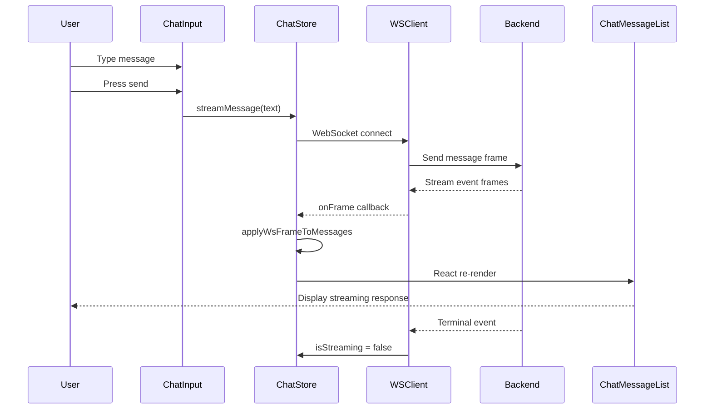
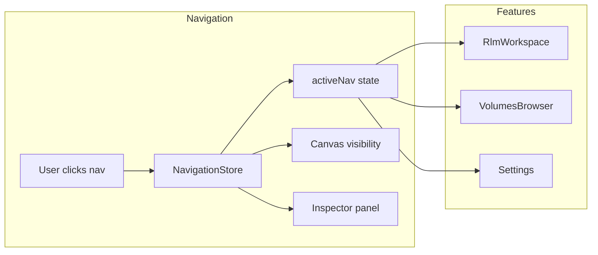

# Frontend Architecture

This document describes the component architecture of the Fleet-RLM frontend (`src/frontend/src/`), built with React, TypeScript, Vite, and Zustand for state management.

## Directory Structure Overview

```
src/frontend/src/
├── app/                    # Application shell and routing
│   ├── layout/             # Layout components (DesktopShell, MobileShell)
│   ├── pages/              # Route-level page components
│   ├── providers/          # React context providers
│   └── routes.ts           # Route definitions
├── components/             # Shared UI components
│   ├── ai-elements/        # AI chat interface components
│   ├── chat/               # Chat input components
│   ├── domain/             # Domain-specific components (artifacts)
│   ├── shared/             # Reusable UI primitives
│   └── ui/                 # shadcn/ui components
├── features/               # Feature-based modules
│   ├── artifacts/          # Code artifact display
│   ├── rlm-workspace/      # Main chat workspace
│   ├── settings/           # Settings dialog and panes
│   ├── shell/              # Shell components (CommandPalette, UserMenu)
│   └── volumes/            # Volume browser
├── hooks/                  # Custom React hooks
├── lib/                    # Utilities and API clients
│   ├── auth/               # Authentication utilities
│   ├── config/             # Configuration
│   ├── data/               # Data types and mock data
│   ├── perf/               # Performance utilities
│   ├── rlm-api/            # Backend API client
│   ├── telemetry/          # Analytics/telemetry
│   └── utils/              # General utilities
├── stores/                 # Zustand state stores
└── styles/                 # Global styles
```

---

## Feature Modules

### `features/rlm-workspace/`

The primary chat interface for DSPy.RLM runtime. This is the main user-facing feature.

| File | Purpose |
|------|---------|
| `RlmWorkspace.tsx` | Root workspace component; orchestrates chat input, message list, and conversation history |
| `ChatMessageList.tsx` | Renders the scrollable list of chat messages with streaming support |
| `ConversationHistory.tsx` | Sidebar showing saved conversation history |
| `ClarificationCard.tsx` | UI for handling clarification requests from the agent |
| `useBackendChatRuntime.ts` | Hook managing WebSocket-based chat runtime state |
| `backendChatEventAdapter.ts` | Transforms WebSocket frames into React state updates |
| `backendChatEventReferences.ts` | Reference handling for tool outputs and citations |
| `backendChatEventToolParts.ts` | Tool result rendering utilities |
| `chatDisplayItems.ts` | Display item model for message rendering |
| `runtime-types.ts` | TypeScript types for runtime messages |

#### `assistant-content/` Subdirectory

Components for rendering assistant responses with rich content:

| File | Purpose |
|------|---------|
| `AssistantTurnContent.tsx` | Main container for assistant response rendering |
| `AssistantAnswerBlock.tsx` | Renders the primary answer section |
| `AssistantPreviewSections.tsx` | Preview sections for tool outputs |
| `AssistantSummaryBar.tsx` | Summary bar with execution metadata |
| `EvidenceGroup.tsx` | Groups evidence/citations |
| `ExecutionDetailsGroup.tsx` | Detailed execution trace display |
| `ExecutionHighlightsGroup.tsx` | Highlighted execution steps |
| `TrajectoryTimeline.tsx` | Timeline visualization of agent trajectory |
| `buildAssistantContentModel.ts` | Data model builder for assistant content |
| `runtimeBadges.tsx` | Status badges for runtime states |
| `types.ts` | TypeScript types for assistant content |

#### `message-inspector/` Subdirectory

| File | Purpose |
|------|---------|
| `MessageInspectorPanel.tsx` | Inspect message details, tool calls, and execution traces |

### `features/settings/`

Settings dialog with multiple panes for runtime configuration.

| File | Purpose |
|------|---------|
| `SettingsDialog.tsx` | Root settings dialog container |
| `GroupedSettingsPane.tsx` | Settings pane with grouped sections |
| `RuntimePane.tsx` | Runtime model configuration (DSPY_LM_MODEL, etc.) |
| `useRuntimeSettings.ts` | Hook for fetching and updating runtime settings |
| `SettingsPaneContent.tsx` | Generic settings pane layout |
| `SettingsToggleRow.tsx` | Toggle switch row component |
| `types.ts` | Settings-related types |
| `runtimePaneHydration.ts` | Hydration utilities for runtime settings |

### `features/shell/`

Shell-level components shared across the application.

| File | Purpose |
|------|---------|
| `CommandPalette.tsx` | Keyboard-accessible command palette (Cmd+K) |
| `UserMenu.tsx` | User dropdown menu with profile and logout |
| `LoginDialog.tsx` | Login modal for authentication |
| `IntegrationsDialog.tsx` | Integration configuration dialog |
| `PricingDialog.tsx` | Pricing/plans display |
| `MobileTabBar.tsx` | Bottom navigation for mobile |
| `NavTab.tsx` | Individual navigation tab |

### `features/artifacts/`

Code and file artifact display components.

| File | Purpose |
|------|---------|
| `CodeArtifact.tsx` | Syntax-highlighted code display with copy actions |
| `FileDetail.tsx` | File content viewer with metadata |
| `CanvasSwitcher.tsx` | Switch between artifact views |
| `PanelHeaderChip.tsx` | Header chip for artifact panels |
| `parsers/` | Parsers for artifact content |

### `features/volumes/`

Modal volume browser for persistent storage.

| File | Purpose |
|------|---------|
| `VolumesBrowser.tsx` | Main volume browser component |
| `VolumesBrowserSections.tsx` | Sectioned volume content display |

---

## Shared Components

### `components/ui/`

shadcn/ui components styled for the application. These are Radix UI primitives with Tailwind styling.

Key components include:
- `button.tsx`, `icon-button.tsx` - Button variants
- `dialog.tsx`, `drawer.tsx`, `sheet.tsx` - Modal surfaces
- `sidebar.tsx` - Sidebar navigation
- `tabs.tsx`, `animated-tabs.tsx` - Tab navigation
- `input.tsx`, `textarea.tsx` - Form inputs
- `select.tsx`, `command.tsx` - Select and command menus
- `popover.tsx`, `dropdown-menu.tsx` - Popup menus
- `scroll-area.tsx` - Scrollable containers
- `skeleton.tsx`, `spinner.tsx` - Loading states
- `progress.tsx` - Progress indicators
- `carousel.tsx` - Carousel/slider
- `queue.tsx` - Queue visualization

### `components/ai-elements/`

AI chat interface components from the ai-elements library. These provide specialized UI for chat applications.

| Component | Purpose |
|-----------|---------|
| `prompt-input.tsx` | Rich text input with attachment support |
| `message.tsx` | Chat message container |
| `agent.tsx` | Agent avatar and status |
| `reasoning.tsx` | Chain-of-thought display |
| `chain-of-thought.tsx` | Thinking process visualization |
| `tool.tsx` | Tool call display |
| `code-block.tsx` | Syntax-highlighted code blocks |
| `terminal.tsx` | Terminal output display |
| `test-results.tsx` | Test result visualization |
| `file-tree.tsx` | File tree navigation |
| `commit.tsx` | Git commit display |
| `schema-display.tsx` | JSON schema visualization |
| `attachments.tsx` | File attachment display |
| `voice-selector.tsx`, `mic-selector.tsx` | Voice input components |
| `speech-input.tsx`, `audio-player.tsx` | Audio handling |

### `components/shared/`

Application-specific shared components.

| Component | Purpose |
|-----------|---------|
| `ErrorBoundary.tsx` | React error boundary with fallback UI |
| `BrandMark.tsx` | Logo/brand mark |
| `LargeTitleHeader.tsx` | Page header component |
| `SkillMarkdown.tsx` | Markdown renderer for skill documentation |
| `SettingsRow.tsx`, `SettingsNavItem.tsx` | Settings layout components |
| `ListRow.tsx` | Generic list row |
| `SectionHeader.tsx` | Section header with title |
| `ToggleSwitch.tsx` | Toggle switch component |
| `ResolvedChip.tsx` | Status chip for resolved items |
| `SuggestionIcons.tsx` | Icon set for suggestions |
| `ImageWithFallback.tsx` | Image with fallback |
| `SkillCardSkeleton.tsx` | Skeleton loader for skill cards |
| `PageSkeleton.tsx` | Page-level skeleton loader |

### `components/chat/`

Chat-specific components.

| Component | Purpose |
|-----------|---------|
| `ChatInput.tsx` | Main chat input component with attachment support |

#### `chat/input/` Subdirectory

| Component | Purpose |
|-----------|---------|
| `AgentDropdown.tsx` | Agent selection dropdown |
| `AttachmentChip.tsx` | Attached file chip display |
| `AttachmentDropdown.tsx` | Attachment management dropdown |
| `ExecutionModeDropdown.tsx` | Execution mode selector (auto/step/repl) |
| `SendButton.tsx` | Send message button |
| `SettingsDropdown.tsx` | Quick settings access |
| `ThinkButton.tsx` | Toggle thinking mode |
| `composerActionStyles.ts` | Shared styles for composer actions |

### `components/domain/artifacts/`

Domain-specific artifact display.

| Component | Purpose |
|-----------|---------|
| `CodeArtifact.tsx` | Code display with syntax highlighting |
| `FileDetail.tsx` | File content viewer |
| `CanvasSwitcher.tsx` | Artifact view switcher |

---

## Custom Hooks

Located in `hooks/`. These provide reusable stateful logic.

| Hook | Purpose |
|------|---------|
| `AuthProvider.tsx` | Context provider for authentication state |
| `useAuth.ts` | Access authentication state and actions |
| `useAppNavigate.ts` | Type-safe navigation hook |
| `useCodeMirror.ts` | CodeMirror editor setup and configuration |
| `useFilesystem.ts` | File system operations (virtual or real) |
| `useIsMobile.ts` | Responsive mobile detection |
| `useStickToBottom.ts` | Auto-scroll to bottom for chat lists |

### Auth Types

| Type | Purpose |
|------|---------|
| `auth-context.ts` | Auth context type definitions |
| `auth-types.ts` | User profile types |
| `auth-mock-user.ts` | Mock user for development |

---

## Utilities (`lib/`)

### `lib/rlm-api/`

Backend API client for communicating with the Fleet-RLM server.

| File | Purpose |
|------|---------|
| `client.ts` | HTTP client with auth token injection |
| `wsClient.ts` | WebSocket client for real-time chat |
| `wsReconnecting.ts` | Auto-reconnecting WebSocket wrapper |
| `wsFrameParser.ts` | Parse WebSocket frames into typed events |
| `wsTypes.ts` | TypeScript types for WebSocket messages |
| `adapters.ts` | Response adapters for API calls |
| `auth.ts` | Auth endpoints (login, logout, me) |
| `capabilities.ts` | Feature capability checks |
| `config.ts` | API configuration (base URL, timeouts) |
| `messages.ts` | Message-related utilities |
| `runtime.ts` | Runtime settings API |
| `types.ts` | Shared API types |

### `lib/auth/`

Authentication utilities for Microsoft Entra ID.

| File | Purpose |
|------|---------|
| `entra.ts` | Entra ID authentication flow |
| `tokenStore.ts` | Secure token storage |
| `types.ts` | Auth-related types |

### `lib/data/`

Data types and mock data for development.

| File | Purpose |
|------|---------|
| `types.ts` | Core data types (ChatMessage, FsNode, etc.) |
| `codemirror-modules.ts` | CodeMirror module loading |
| `codemirror-theme.ts` | CodeMirror theme configuration |
| `mock/` | Mock data generators |

### `lib/telemetry/`

PostHog analytics integration.

| File | Purpose |
|------|---------|
| `client.ts` | PostHog client initialization |
| `useTelemetry.ts` | Hook for capturing analytics events |

### `lib/utils/`

General utilities.

| File | Purpose |
|------|---------|
| `cn.ts` | Class name utility (clsx + tailwind-merge) |

### `lib/perf/`

Performance monitoring utilities.

---

## State Management (`stores/`)

Zustand stores for global state. Each store is a standalone module with typed actions and selectors.

### `chatStore.ts`

Core chat state for the active conversation.

```typescript
interface ChatStore {
  // State
  messages: ChatMessage[];
  turnArtifactsByMessageId: Record<string, ExecutionStep[]>;
  isStreaming: boolean;
  sessionId: string;
  error: string | null;

  // Actions
  setSessionId: (id: string) => void;
  resetSession: () => void;
  setMessages: (messages: ChatMessage[] | ((prev: ChatMessage[]) => ChatMessage[])) => void;
  addMessage: (message: ChatMessage) => void;
  clearMessages: () => void;

  // Streaming
  streamMessage: (text: string, onFrameCallback?, queryClient?, options?) => Promise<void>;
  stopStreaming: () => void;
}
```

### `navigationStore.ts`

Global navigation and session state.

```typescript
interface NavigationState {
  // Navigation
  activeNav: NavItem;
  setActiveNav: (nav: NavItem) => void;

  // Canvas
  isCanvasOpen: boolean;
  openCanvas: () => void;
  closeCanvas: () => void;
  toggleCanvas: () => void;

  // Workspace inspector
  selectedAssistantTurnId: string | null;
  activeInspectorTab: InspectorTab;
  openInspector: (turnId?, tab?) => void;
  selectInspectorTurn: (turnId: string, tab?: InspectorTab) => void;
  setInspectorTab: (tab: InspectorTab) => void;

  // File selection
  selectedFileNode: FsNode | null;
  selectFile: (node: FsNode | null) => void;

  // Session
  sessionId: number;
  newSession: () => void;

  // Features
  activeFeatures: Set<PromptFeature>;
  toggleFeature: (feature: PromptFeature) => void;

  // Prompt mode
  promptMode: PromptMode;
  setPromptMode: (mode: PromptMode) => void;

  // Skills
  selectedPromptSkills: string[];
  togglePromptSkill: (skillId: string) => void;
}
```

### `chatHistoryStore.ts`

LocalStorage-backed conversation history.

```typescript
interface ChatHistoryState {
  conversations: Conversation[];
  saveConversation: (messages, phase, conversationId?, turnArtifacts?) => string;
  loadConversation: (id: string) => Conversation | null;
  deleteConversation: (id: string) => void;
  clearHistory: () => void;
}
```

### `themeStore.ts`

Dark mode toggle with localStorage persistence.

```typescript
interface ThemeState {
  isDark: boolean;
  toggle: () => void;
  setDark: (dark: boolean) => void;
}
```

### `artifactStore.ts`

Execution step tracking for visualization.

```typescript
interface ArtifactState {
  steps: ExecutionStep[];
  activeStepId?: string;
  addStep: (step: ExecutionStep) => void;
  setSteps: (steps: ExecutionStep[]) => void;
  upsertStep: (step: ExecutionStep) => void;
  setActiveStepId: (id?: string) => void;
  clear: () => void;
}
```

### `mockStateStore.ts`

State for mock/demo mode.

---

## Application Shell

### `app/`

Root application structure.

| File | Purpose |
|------|---------|
| `App.tsx` | Root component |
| `routes.ts` | Route definitions with react-router |

### `app/layout/`

Layout components for different contexts.

| Component | Purpose |
|-----------|---------|
| `RootLayout.tsx` | Root layout wrapper |
| `DesktopShell.tsx` | Desktop layout with sidebar |
| `MobileShell.tsx` | Mobile layout with bottom nav |
| `TopHeader.tsx` | Top header bar |
| `BuilderPanel.tsx` | Panel for builder/workspace mode |
| `ChatPanel.tsx` | Chat panel container |
| `RouteSync.tsx` | Syncs URL with navigation state |

### `app/pages/`

Route-level page components.

| Page | Route | Purpose |
|------|-------|---------|
| `RlmWorkspacePage.tsx` | `/` | Main chat workspace |
| `SettingsPage.tsx` | `/settings` | Settings page |
| `VolumesPage.tsx` | `/volumes` | Volume browser |
| `LoginPage.tsx` | `/login` | Login page |
| `LogoutPage.tsx` | `/logout` | Logout page |
| `SignupPage.tsx` | `/signup` | Signup page |
| `NotFoundPage.tsx` | `*` | 404 page |
| `RouteErrorPage.tsx` | - | Error boundary page |

### `app/providers/`

React context providers.

| Provider | Purpose |
|----------|---------|
| `AppProviders.tsx` | Root provider wrapper |
| `QueryProvider.tsx` | TanStack Query provider |

---

## Component Relationship Diagram

```mermaid
graph TB
    subgraph App["Application Shell"]
        AppRoot["App.tsx"]
        Routes["routes.ts"]
        RootLayout["RootLayout"]
        DesktopShell["DesktopShell"]
        MobileShell["MobileShell"]
        TopHeader["TopHeader"]
    end

    subgraph Pages["Pages"]
        RlmPage["RlmWorkspacePage"]
        SettingsPage["SettingsPage"]
        VolumesPage["VolumesPage"]
        LoginPage["LoginPage"]
    end

    subgraph Features["Features"]
        RlmWorkspace["RlmWorkspace"]
        SettingsDialog["SettingsDialog"]
        VolumesBrowser["VolumesBrowser"]
        CommandPalette["CommandPalette"]
        UserMenu["UserMenu"]
    end

    subgraph RlmComponents["RLM Workspace Components"]
        ChatMessageList["ChatMessageList"]
        ChatInput["ChatInput"]
        ConversationHistory["ConversationHistory"]
        MessageInspector["MessageInspectorPanel"]
        AssistantContent["AssistantTurnContent"]
    end

    subgraph UIComponents["Shared UI"]
        UIShared["components/ui/*"]
        SharedComponents["components/shared/*"]
        AIElements["components/ai-elements/*"]
        ChatComponents["components/chat/*"]
    end

    subgraph State["State Management"]
        ChatStore["chatStore"]
        NavStore["navigationStore"]
        HistoryStore["chatHistoryStore"]
        ThemeStore["themeStore"]
        ArtifactStore["artifactStore"]
    end

    subgraph Hooks["Hooks"]
        AuthProvider["AuthProvider"]
        UseBackendRuntime["useBackendChatRuntime"]
        UseAppNavigate["useAppNavigate"]
        UseStickToBottom["useStickToBottom"]
    end

    subgraph Lib["Utilities"]
        RlmApiClient["lib/rlm-api"]
        AuthLib["lib/auth"]
        Telemetry["lib/telemetry"]
    end

    %% App shell connections
    AppRoot --> RootLayout
    RootLayout --> DesktopShell
    RootLayout --> MobileShell
    DesktopShell --> TopHeader
    MobileShell --> TopHeader

    %% Page connections
    Routes --> RlmPage
    Routes --> SettingsPage
    Routes --> VolumesPage
    Routes --> LoginPage

    %% Page to feature connections
    RlmPage --> RlmWorkspace
    SettingsPage --> SettingsDialog
    VolumesPage --> VolumesBrowser

    %% Shell connections
    DesktopShell --> CommandPalette
    DesktopShell --> UserMenu
    TopHeader --> UserMenu

    %% RLM workspace internal
    RlmWorkspace --> ChatMessageList
    RlmWorkspace --> ChatInput
    RlmWorkspace --> ConversationHistory
    RlmWorkspace --> MessageInspector
    ChatMessageList --> AssistantContent

    %% Feature to UI connections
    ChatInput --> ChatComponents
    ChatInput --> AIElements
    AssistantContent --> AIElements
    SettingsDialog --> UIShared
    SettingsDialog --> SharedComponents

    %% State connections
    RlmWorkspace --> ChatStore
    RlmWorkspace --> NavStore
    RlmWorkspace --> HistoryStore
    ChatMessageList --> ArtifactStore
    UserMenu --> ThemeStore
    SettingsDialog --> ThemeStore

    %% Hook connections
    RlmWorkspace --> UseBackendRuntime
    RlmWorkspace --> UseStickToBottom
    AppRoot --> AuthProvider
    UseBackendRuntime --> RlmApiClient

    %% Lib connections
    UseBackendRuntime --> RlmApiClient
    RlmApiClient --> AuthLib
    RlmWorkspace --> Telemetry

    %% Styles
    classDef app fill:#e1f5fe
    classDef feature fill:#f3e5f5
    classDef ui fill:#e8f5e9
    classDef state fill:#fff3e0
    classDef hook fill:#fce4ec
    classDef lib fill:#f5f5f5

    class AppRoot,Routes,RootLayout,DesktopShell,MobileShell,TopHeader app
    class RlmWorkspace,SettingsDialog,VolumesBrowser,CommandPalette,UserMenu feature
    class UIShared,SharedComponents,AIElements,ChatComponents ui
    class ChatStore,NavStore,HistoryStore,ThemeStore,ArtifactStore state
    class AuthProvider,UseBackendRuntime,UseAppNavigate,UseStickToBottom hook
    class RlmApiClient,AuthLib,Telemetry lib
```



---

## Data Flow

### Chat Message Flow



### Navigation State Flow



---

## Testing Structure

Tests are colocated with components in `__tests__/` subdirectories:

- `features/rlm-workspace/__tests__/` - Workspace tests
- `features/settings/__tests__/` - Settings tests
- `components/**/__tests__/` - Component tests
- `hooks/__tests__/` - Hook tests
- `stores/__tests__/` - Store tests

Run tests with:
```bash
cd src/frontend
bun run test:unit           # Unit tests
bun run test:e2e            # E2E tests
bun run check               # Full check (type, lint, test, build)
```

---

## Key Design Patterns

1. **Feature-based organization**: Features are self-contained modules with their own components, hooks, and sometimes state.

2. **Zustand for state**: Global state uses Zustand stores with typed actions. Local state uses React hooks.

3. **WebSocket streaming**: Real-time chat uses WebSocket with automatic reconnection and frame parsing.

4. **shadcn/ui components**: UI primitives are from shadcn/ui (Radix + Tailwind), ensuring accessibility and consistency.

5. **Type-safe routing**: Routes are defined in `routes.ts` with type-checked navigation via `useAppNavigate`.

6. **Provider composition**: App-level providers are composed in `AppProviders.tsx` for clean dependency injection.

7. **Responsive design**: Separate `DesktopShell` and `MobileShell` layouts with `useIsMobile` hook for adaptive UI.
