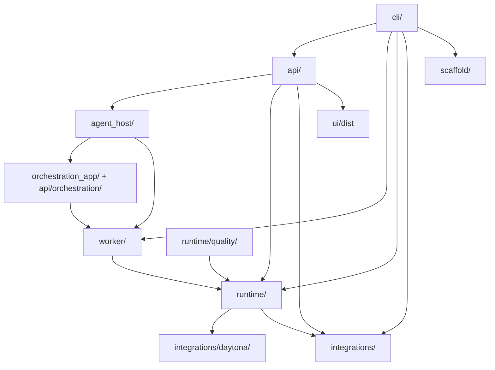
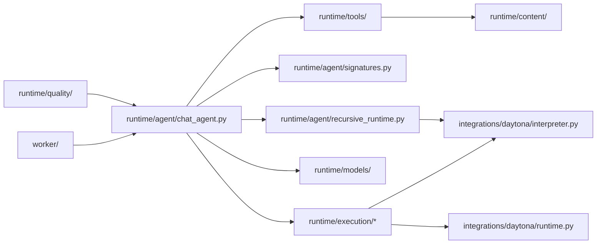
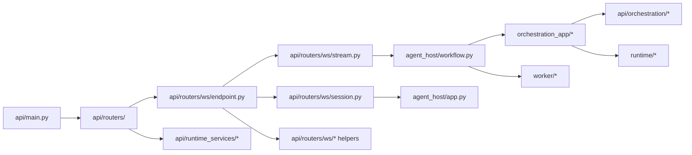

# Python Backend Module Map

This document maps the current module relationships within `src/fleet_rlm/` with the runtime core centered explicitly.

## Layered Overview



## Runtime Surfaces

| Surface | Entry point | Primary dependencies |
| --- | --- | --- |
| `fleet` | `cli/main.py` | `cli/fleet_cli.py`, `cli/terminal/*` |
| `fleet-rlm` | `cli/fleet_cli.py` | `cli/commands/*`, `cli/runners.py`, `integrations/config/*` |
| FastAPI server | `api/main.py:create_app` | `api/routers/*`, `api/auth/*`, `agent_host/*`, `integrations/database/*`, `integrations/observability/*` |
| FastMCP server | `integrations/mcp/server.py:create_mcp_server` | `cli/runners.py`, `runtime/agent/*`, `runtime/config.py` |

## Core Runtime Map



### Key dependencies

| From | To | Purpose |
| --- | --- | --- |
| `worker/*` | `runtime/agent/*` | Worker boundary feeding the shared runtime core |
| `runtime/agent/chat_agent.py` | `runtime/tools/*` | Tool list assembly and tool dispatch |
| `runtime/agent/chat_agent.py` | `runtime/execution/*` | Streaming turn execution and interpreter support |
| `runtime/agent/recursive_runtime.py` | `integrations/daytona/*` | Recursive child execution over the Daytona substrate |
| `runtime/execution/*` | `integrations/daytona/interpreter.py`, `integrations/daytona/runtime.py` | Stateful interpreter/session backend integration |
| `runtime/models/*` | `runtime/agent/*` | Builder, registry, and runtime-model exports |
| `runtime/quality/*` | `runtime/agent/*`, `runtime/models/*` | Offline evaluation and optimization against the live runtime graph |

## API, Host, and Transition Map



### Key dependencies

| From | To | Purpose |
| --- | --- | --- |
| `api/main.py` | `api/bootstrap.py` | Runtime bootstrap lifecycle, critical startup, and optional warmup scheduling |
| `api/routers/ws/*` | `agent_host/*` | Hosted execution, HITL policy, execution events, and startup/repl bridging |
| `agent_host/workflow.py` | `orchestration_app/*`, `worker/*` | Host policy around the worker seam |
| `api/orchestration/*` | `agent_host/*`, `orchestration_app/*` | Compatibility shims that preserve older orchestration call sites |
| `api/runtime_services/settings.py` | `integrations/config/*` | Runtime settings mutation and env/config synchronization |
| `api/runtime_services/diagnostics.py` | `integrations/config/*`, `integrations/daytona/*` | Runtime diagnostics, status, and provider connectivity tests |
| `api/runtime_services/volumes.py` | `integrations/daytona/volumes.py` | Volume browsing |

## Integration Packages

| Package | Role | Notable files |
| --- | --- | --- |
| `integrations/config/` | App/env/runtime settings | `env.py`, `runtime_settings.py`, `_env_utils.py`, `config.yaml` |
| `integrations/database/` | Persistence boundary | `engine.py`, `models.py`, `repository.py`, `types.py` |
| `integrations/mcp/` | FastMCP server surface | `server.py` |
| `integrations/observability/` | Telemetry and tracing | `posthog_callback.py`, `mlflow_runtime.py`, `mlflow_traces.py`, `trace_context.py` |
| `integrations/daytona/` | Daytona execution and workspace substrate | `interpreter.py`, `runtime.py`, `volumes.py`, `config.py`, `diagnostics.py`, `types.py`, `bridge.py`, `runtime_helpers.py` |
| `runtime/quality/` | DSPy evaluation and optimization | `dspy_evaluation.py`, `gepa_optimization.py`, `mlflow_evaluation.py`, `mlflow_optimization.py`, `workspace_metrics.py`, `scorers.py` |

## Verification

The package graph above was checked against the live tree with:

```bash
# from repo root
find src/fleet_rlm -maxdepth 2 -type d | sort
rg --files src/fleet_rlm
rg -n "^from fleet_rlm\\.|^import fleet_rlm\\." src/fleet_rlm
```
